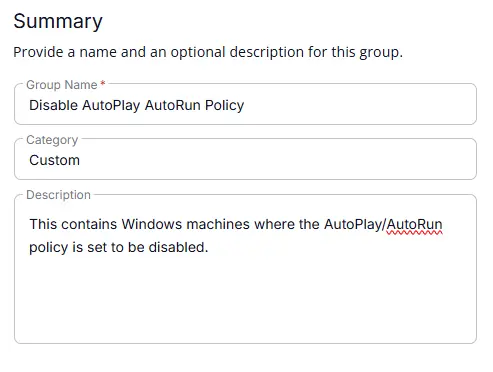
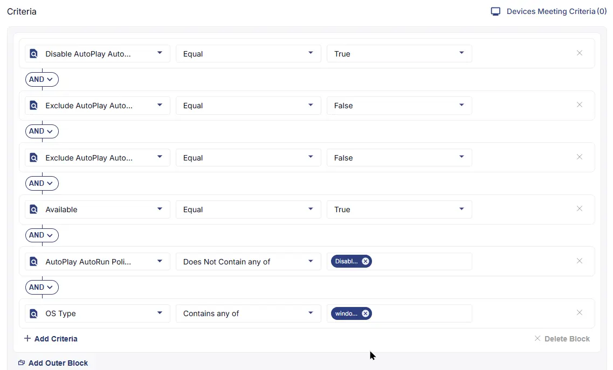
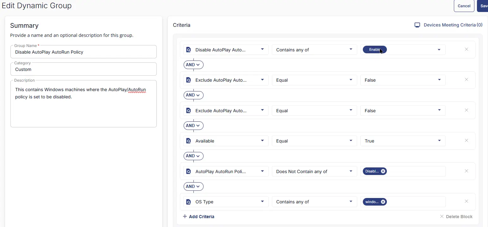

## Summary

This contains Windows machines where the AutoPlay/AutoRun policy is set to be disabled.

## Dependencies

- [Solution - Disable AutoRun AutoPlay policies](/docs/4bfb0532-45a1-41b8-8e69-d552bae1d12d) 

## Group Setup Location

- **Group Path:** `ENDPOINTS` ➞ `Groups`  
- **Group Type:** `Dynamic Group`

## Group Summary

- **Group Name:** `Disable AutoPlay/AutoRun Policy`  
- **Description:** `This contains Windows machines where the AutoPlay/AutoRun policy is set to be disabled.`

## Group Criteria

The group is defined by the following **criteria block**. Each block uses **AND** logic between its conditions.

| Block | Criteria Name          | Operator        | Value(s)                                 |
|-------|-----------------------|-----------------|-------------------------------------------|
| 1     | Disable AutoPlay AutoRun Policy  | Equal       | `True` |
| 1     | Exclude AutoPlay AutoRun Disable   | Equal  | `False` |
| 1     | Exclude AutoPlay AutoRun Disable   | Equal  | `False` |
| 1     | Available           | Equal           | `True` |
| 1     | AutoPlay AutoRun Policies     | Does Not Contain any of  | `Disabled` |
| 1     | OS Type                | Equal           | `Windows` |

- **Block 1:** Targets Windows machines (Both Servers and Workstations).

**Logic:**  
A machine matches the group if it meets ALL criteria in Block 1.

## Completed Group

## Changelog

### 2026-06-25

- Initial version of the document
