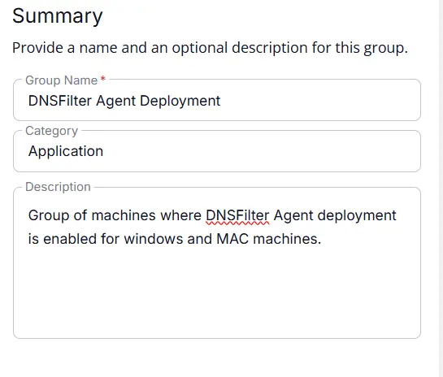
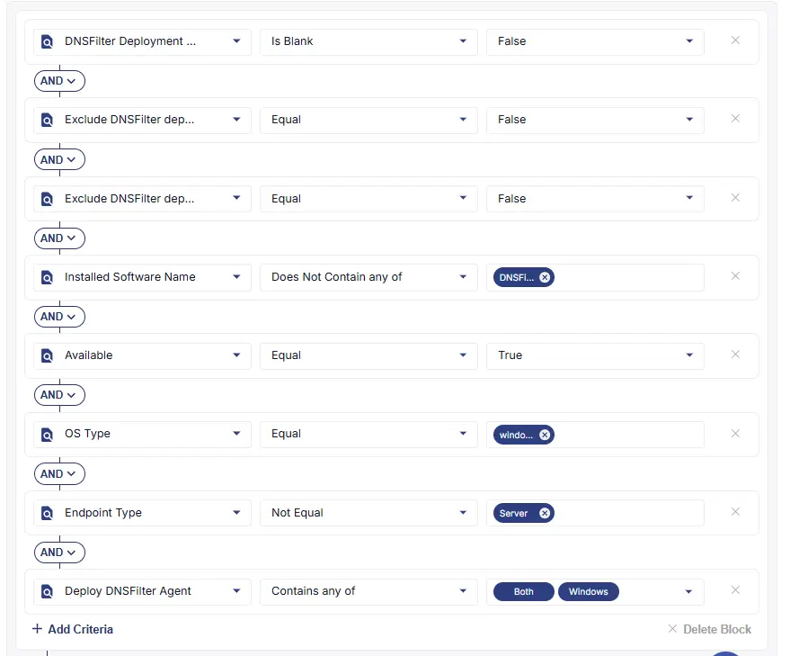
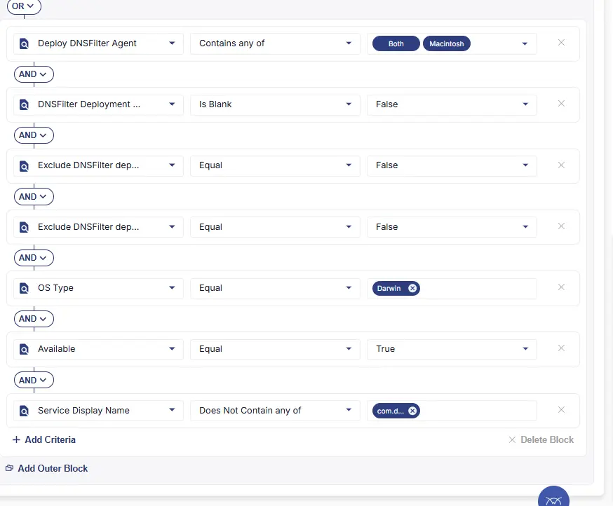
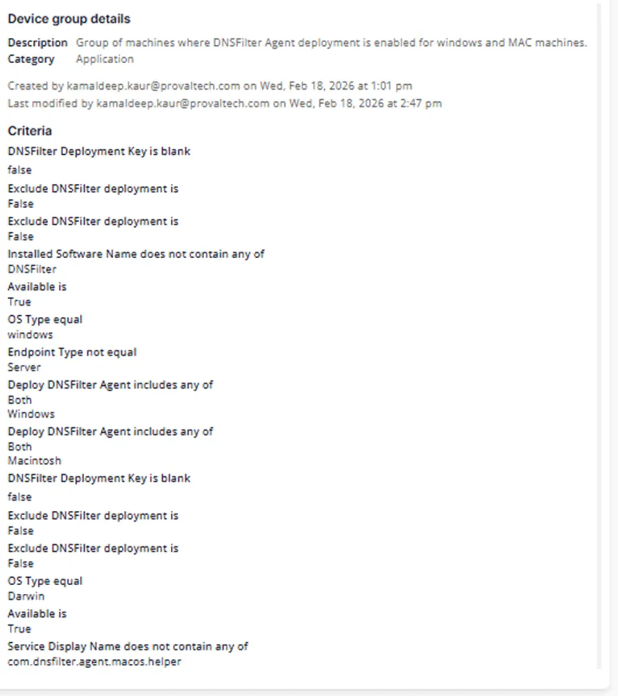

## Summary
Group of machines where DNSFilter Agent deployment is enabled for Windows and MAC machines.

## Dependencies

- [Solution - DNS Filter Agent Deployment](/docs/fd6fcda6-9a87-4275-b6eb-1a8f8f63099d)
- [Custom Field - Deploy DNSFilter Agent](/docs/501dcdec-33ab-45de-8a5d-4f35839762d4)
- [Custom Field - DNSFilter Deployment Key](/docs/b4038e72-ef58-4e35-8b7b-cfe0e2536c87) 
- [Custom Field - Exclude DNSFilter deployment](/docs/7c9e982b-6081-4a03-a8dd-b44d079118ca)  

## Group Setup Location

- **Group Path:** `ENDPOINTS` ➞ `Groups`  
- **Group Type:** `Dynamic Group`

## Group Summary

- **Group Name:** `DNSFilter Agent Deployment`  
- **Category:** `Application`  
- **Description:** `Group of machines where DNSFilter Agent deployment is enabled for Windows and MAC machines.`

## Group Criteria

The group is defined by the following **criteria blocks**, joined by an **OR**. Each block uses **AND** logic between its conditions.

| Block | Criteria Name          | Operator        | Value(s)                                 |
|-------|-----------------------|-----------------|-------------------------------------------|
| 1     | DNSFilter Deployment Key     | IsBlank                | `False` |
| 1     | Deploy DNSFilter Agent       | Contains any of        | `Both`, `Windows` |
| 1     | Exclude DNSFilter deployment      | Equal     | `False` |
| 1     | Exclude DNSFilter deployment      | Equal     | `False` |
| 1     | Installed Software Name      | Does Not Contain any of    | `DNSFilter Agent` |
| 1     | Available   | Equal    | `True` |
| 1     | OS Type  | Equal    | `Windows` |
| 1     | Endpoint Type  | Not Equal    | `Server` |
| 2     | DNSFilter Deployment Key     | IsBlank                | `False` |
| 2     | Deploy DNSFilter Agent       | Contains any of        | `Both`,`Macintosh` |
| 2    | Exclude DNSFilter deployment      | Equal     | `False` |
| 2    | Exclude DNSFilter deployment      | Equal     | `False` |
| 2    | Service Display Name     | Does Not Contain any of    | `com.dnsfilter.agent.macos.helper` |
| 2     | Available   | Equal    | `True` |
| 2    | OS Type  | Equal    | `Darwin` |

- **Block 1:** Targets Windows Workstations (not servers)
- **Block 2:** Targets Mac devices

**Logic:**  
A machine matches the group if it meets ALL criteria in Block 1 OR ALL criteria in Block 2 OR ALL criteria in Block 3.

**Block 1:**

**Block 2:**

## Completed Group

