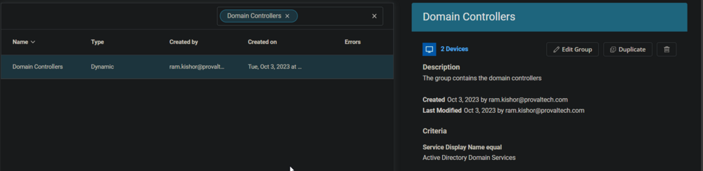
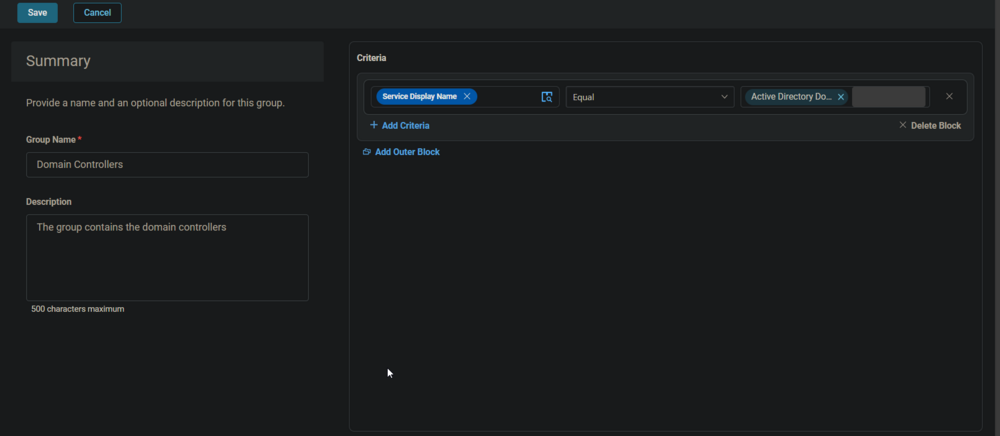

## Summary

This document outlines the steps to set up a dynamic group for Domain Controllers in Active Directory.

## Screenshot

  
  

## Group Details

- **Group Type:** Dynamic  
- **Group Name:** Domain Controllers  
- **Description:** Contains Domain Controllers  
- **Criteria Selection:** Select `Service Display Name` as the criteria, `Equal` as the comparator, and type `Active Directory Domain Services` in the condition box.  
- **Creation:** Click the `Save` button at the top left to create the group.  

