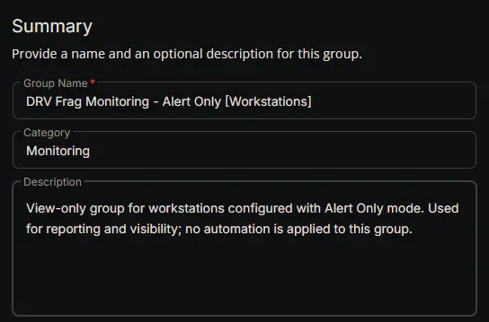
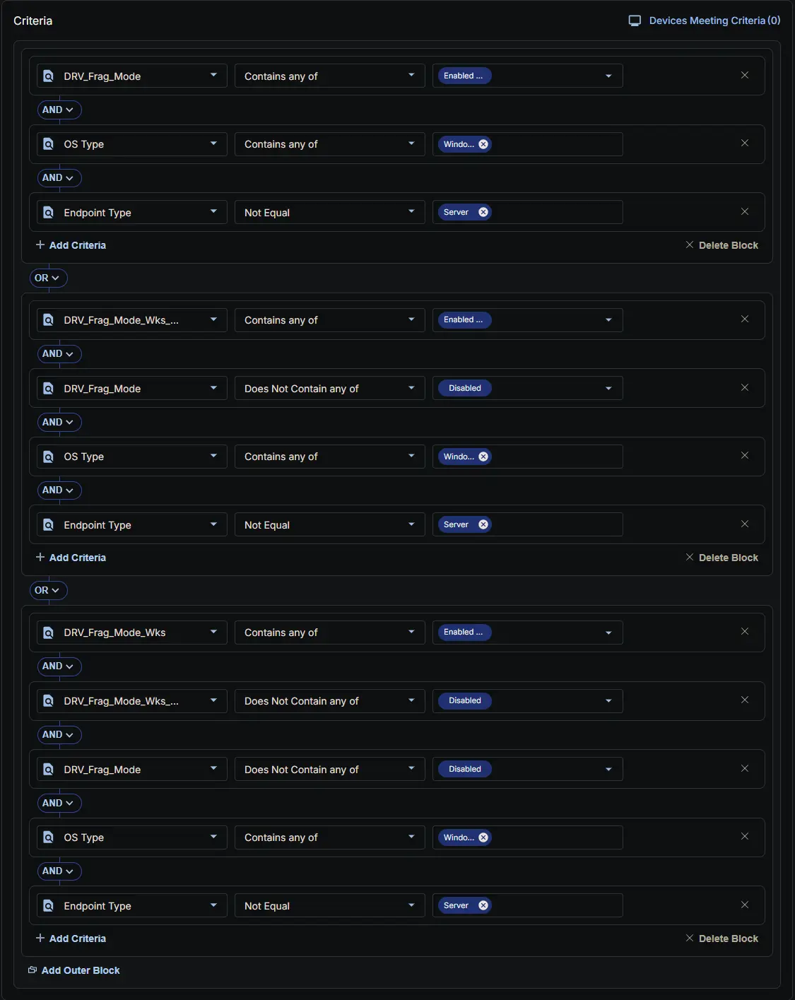
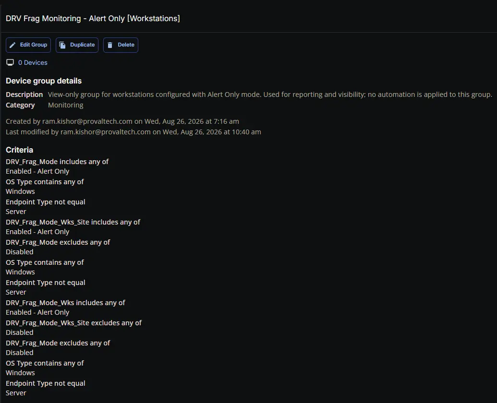

## Summary

View-only group for workstations configured with **Alert Only** mode in the DRV Fragmentation Monitoring solution. This group is intended for reporting and visibility only; it does **not** receive the [DRV Frag Monitoring Configuration Writer](/docs/cb957f04-2261-465c-babf-4fc6106d7039) task, the [DRV - Frag Monitoring](/docs/95c3fc7f-750f-4941-a088-d73eafdc60dc) monitor, or the [DRV Frag Autofix](/docs/bfa10078-375c-44ee-8741-2e11fa2a2031) automation task. Because Alert Only mode never triggers automatic remediation, no suspension policy is applied to this group. Its sole purpose is to provide a filtered view of workstations that are in Alert Only mode, regardless of whether the setting comes from the endpoint, site, or company level.

## Dependencies

- [Custom Field: DRV_Frag_Mode](/docs/563f1ad1-79df-47c7-ac99-b56566cd8634)
- [Custom Field: DRV_Frag_Mode_Wks_Site](/docs/1f925f10-61f7-4db7-824f-f955d252342b)
- [Custom Field: DRV_Frag_Mode_Wks](/docs/07b326ab-b7b1-4a31-b91b-22119dd41ec8)
- [Solution: Drive Fragmentation Monitoring](/docs/fb923e51-3cca-4b32-9066-51fbef06953f)

## Group Setup Location

- **Group Path:** `ENDPOINTS` ➞ `Groups`  
- **Group Type:** `Dynamic Group`

## Group Summary

- **Group Name:** `DRV Frag Monitoring - Alert Only [Workstations]`  
- **Category:** `Monitoring`  
- **Description:** `View-only group for workstations configured with Alert Only mode. Used for reporting and visibility; no automation is applied to this group.`  

## Criteria

The group is defined by the following **criteria blocks**, joined by an **OR**. Each block uses **AND** logic between its conditions.

| Block | Criteria Name          | Operator        | Value(s)                                 |
|-------|-----------------------|-----------------|-------------------------------------------|
| 1     | DRV_Frag_Mode | Contains any of           | `Enabled - Alert Only`                                     |
| 1     | OS Type                | Contains any of           | `Windows`                                   |
| 1     | Endpoint Type          | Not Equal       | `Server`                                    |
| 2     | DRV_Frag_Mode_Wks_Site | Contains any of           | `Enabled - Alert Only`                                    |
| 2     | DRV_Frag_Mode | Does Not Contain any of           | `Disabled`                                     |
| 2     | OS Type                | Contains any of           | `Windows`                                   |
| 2     | Endpoint Type          | Not Equal       | `Server`                                    |
| 3     | DRV_Frag_Mode_Wks         | Contains any of | `Enabled - Alert Only` |
| 3     | DRV_Frag_Mode_Wks_Site | Does Not Contain any of           | `Disabled`                                     |
| 3     | DRV_Frag_Mode | Does Not Contain any of           | `Disabled`                                     |
| 3     | OS Type                | Contains any of           | `Windows`                                   |
| 3     | Endpoint Type          | Not Equal       | `Server`                                    |

- **Block 1:** Targets Windows **Workstations** (devices not equal to "Server") where the feature is explicitly set to `Enabled - Alert Only` directly at the individual endpoint level (**DRV_Frag_Mode**).  
- **Block 2:** Targets Windows **Workstations** where the site-level workstation setting (**DRV_Frag_Mode_Wks_Site**) is explicitly set to `Enabled - Alert Only`, provided that it has not been overridden and disabled at the individual endpoint level (**DRV_Frag_Mode**).  
- **Block 3:** Targets Windows **Workstations** where the primary workstation setting (**DRV_Frag_Mode_Wks**) is set to `Enabled - Alert Only`, provided that the feature has not been explicitly disabled at the site level (**DRV_Frag_Mode_Wks_Site**) or the individual endpoint level (**DRV_Frag_Mode**).

**Logic:**  
A machine matches the group if it meets **ALL** criteria in **Block 1**, **OR** **ALL** criteria in **Block 2**, **OR** **ALL** criteria in **Block 3**.

## Completed Group

## Changelog

### 2026-08-26

- Initial version of the document
