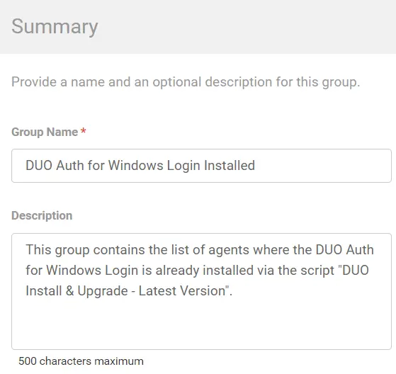
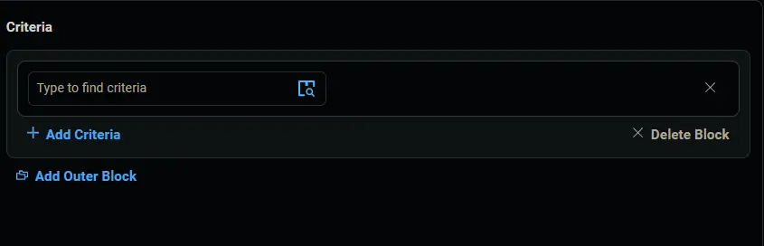
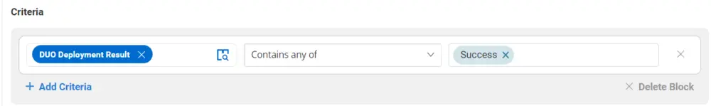

## Summary

This group contains the list of agents where the DUO Auth for Windows Login is already installed via the script "DUO Install & Upgrade - Latest Version." It is built for auditing purposes.

## Dependencies

[CW RMM Custom Fields - Duo Authentication for Windows Logon Deployment](/docs/a9578dd1-1f6b-4932-a614-5ed823656416)

## Details

| Field Name                           | Type of Field (Machine or Organization) | Description                                                                                                                |
|--------------------------------------|-----------------------------------------|----------------------------------------------------------------------------------------------------------------------------|
| DUO Auth for Windows Login Installed  | Dynamic                                 | This group contains the list of agents where the DUO Auth for Windows Login is already installed via the script "DUO Install & Upgrade - Latest Version." |

## Group Creation

1. Navigate to `Devices` > `Device Groups`.
   

2. Create a new dynamic group by clicking the `Dynamic Group` button.  
     
   This page will appear after clicking on the `Dynamic Group` button:  
   

3. Set the group name to `DUO Auth for Windows Login Installed`.  
   Description: `This group contains the list of agents where the DUO Auth for Windows Login is already installed via the script "DUO Install & Upgrade - Latest Version."`  
   

4. Click the `+ Add Criteria` in the `Criteria` section of the group.  
     
   This search box will appear.  
   

5. - Search and select the `Duo Deployment Result` custom field from the search box.
   - Set `Success` in the comparison condition.  
     
   **Condition:** `Duo Deployment Result` `Contain any of` `Success`
