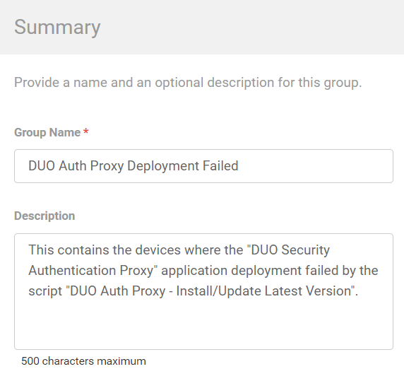
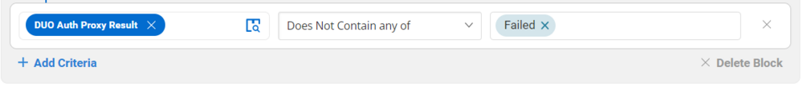

## Summary

This document contains the devices where the "DUO Security Authentication Proxy" application deployment failed due to the script "DUO Auth Proxy - Install/Update Latest Version." It is built for auditing purposes.

## Dependencies

[CW RMM Custom Fields - DUO Auth Proxy Deployment](/docs/94f21e35-d184-4fb5-9215-898bb367a0e9)

## Details

| Field Name                          | Type of Field (Machine or Organization) | Description                                                                                                                                             |
|-------------------------------------|-----------------------------------------|---------------------------------------------------------------------------------------------------------------------------------------------------------|
| DUO Auth Proxy Deployment Failed     | Dynamic                                 | This contains the devices where the "DUO Security Authentication Proxy" application deployment failed due to the script "DUO Auth Proxy - Install/Update Latest Version." It is built for auditing purposes. |

## Group Creation

1. Navigate to `Devices` > `Device Groups`.  
   

2. Create a new dynamic group by clicking the `Dynamic Group` button.  
     
   This page will appear after clicking on the `Dynamic Group` button:  
   

3. Set the group name to `DUO Auth Proxy Deployment Failed`.  
   Description: `This contains the devices where the "DUO Security Authentication Proxy" application deployment failed due to the script "DUO Auth Proxy - Install/Update Latest Version."`  
   

4. Click the `+ Add Criteria` in the `Criteria` section of the group.  
     
   This search box will appear.  
   

5. - Search and select the `Duo Auth Proxy Result` custom field from the search box.
   - Set `Failed` in the comparison condition.  
     
   **Condition:** `Duo Auth Proxy Result` `Does Not Contain any of` `Failed`

