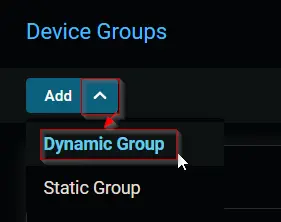
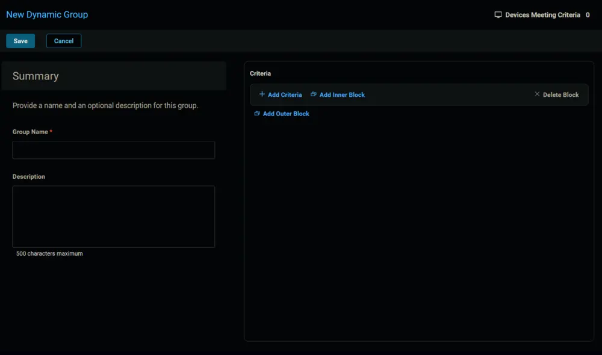
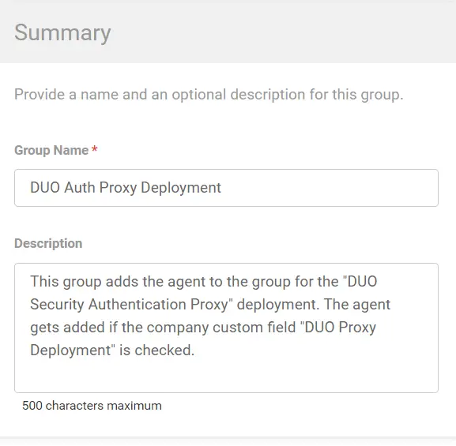
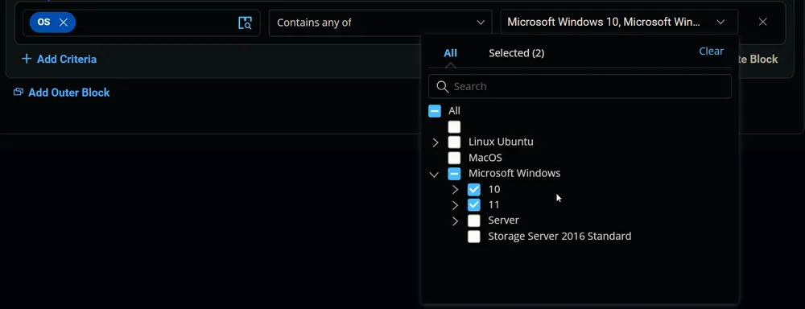
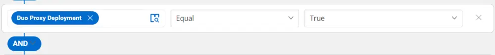
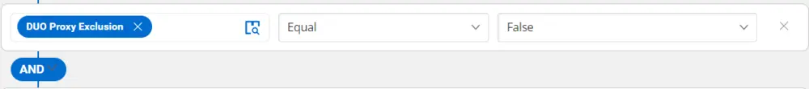
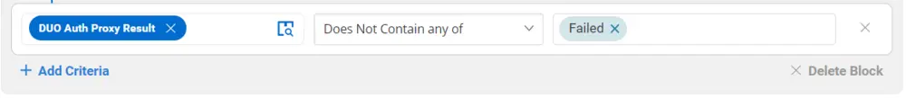

## Summary

This group adds the agent to the group for the "DUO Security Authentication Proxy" deployment. The agent gets added if the company custom field "DUO Proxy Deployment" is checked.

## Dependencies

[CW RMM Custom Fields - DUO Auth Proxy Deployment](/docs/94f21e35-d184-4fb5-9215-898bb367a0e9)

## Details

| Field Name                     | Type of Field (Machine or Organization) | Description                                                                                                                                                   |
|--------------------------------|-----------------------------------------|---------------------------------------------------------------------------------------------------------------------------------------------------------------|
| DUO Auth Proxy Deployment       | Dynamic                                 | This group adds the agent to the group for the "DUO Security Authentication Proxy" deployment. The agent gets added if the company custom field "DUO Proxy Deployment" is checked. |

## Group Creation

1. Navigate to `Devices` > `Device Groups`.  
   

2. Create a new dynamic group by clicking the `Dynamic Group` button.  
     
   This page will appear after clicking on the `Dynamic Group` button:  
   

3. Set the group name to `DUO Auth Proxy Deployment`.  
   Description: `This group adds the agent to the group for the "DUO Security Authentication Proxy" deployment. The agent gets added if the company custom field "DUO Proxy Deployment" is checked.`  
   

4. Click the `+ Add Criteria` in the `Criteria` section of the group.  
     
   This search box will appear.  
   

5. - Search and select the `OS` from the search box.  
   - Mark and select `Microsoft Windows 10` and `Microsoft Windows 11` in the comparison field.  
     
   **Condition:** `OS` `Contains any of` `Microsoft Windows 10, Microsoft Windows 11`

6. - Search and select the `Duo Proxy Deployment` custom field from the search box.  
   - Set `True` in the comparison condition.  
     
   **Condition:** `Duo Proxy Deployment` `Equal` `True`

7. - Search and select the `Duo Proxy Exclusion` custom field from the search box.  
   - Set `False` in the comparison condition.  
     
   **Condition:** `Duo Proxy Exclusion` `Equal` `False`

8. - Search and select the `Duo Auth Proxy Result` custom field from the search box.  
   - Set `Failed` in the comparison condition.  
     
   **Condition:** `Duo Auth Proxy Result` `Does Not Contain any of` `Failed`

