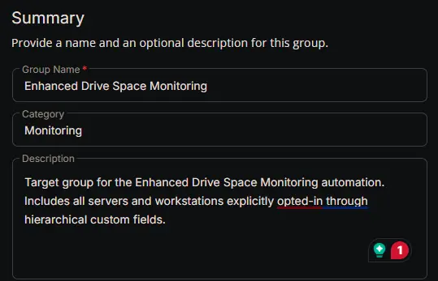
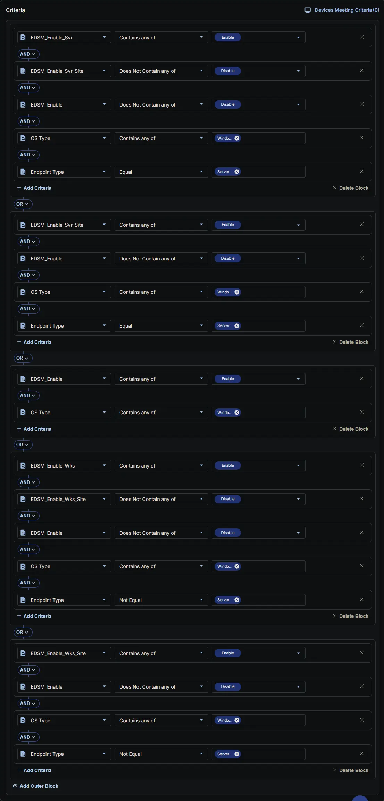
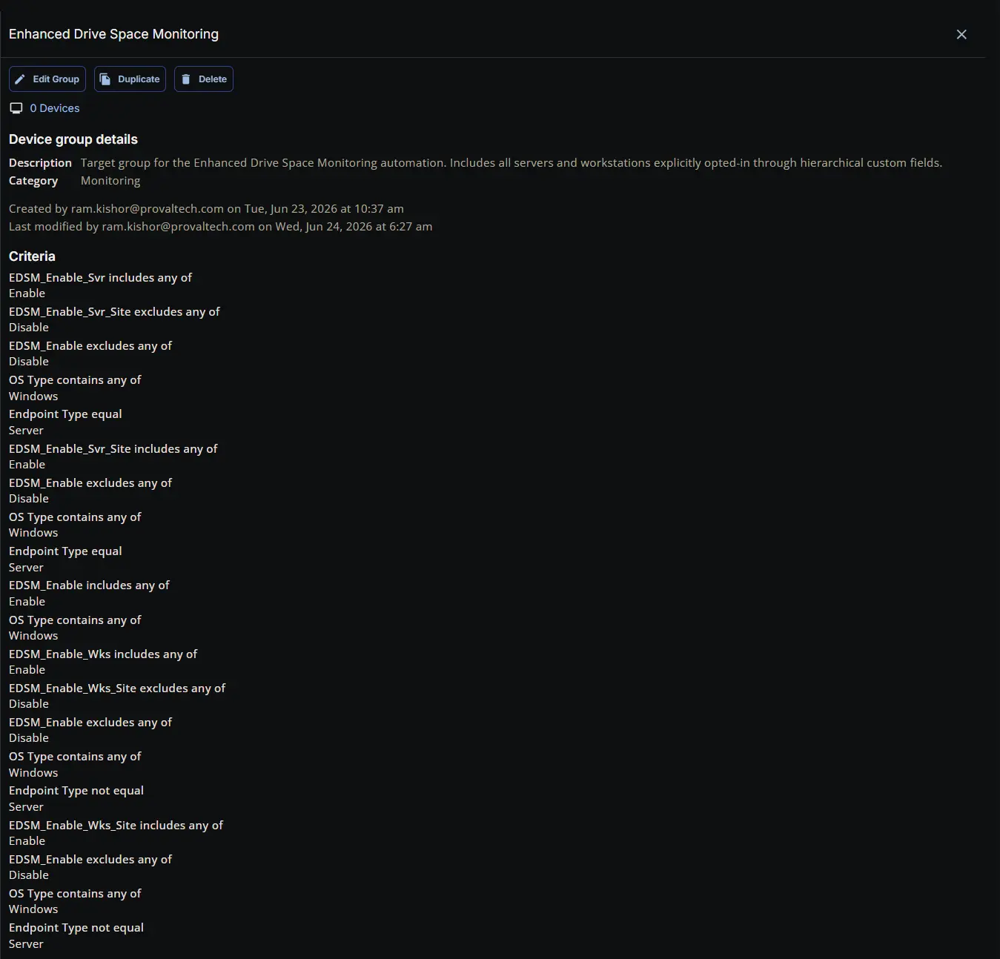

## Summary

Target group for the Enhanced Drive Space Monitoring automation. Includes all servers and workstations explicitly opted-in through hierarchical custom fields.

## Dependencies

- [Custom Field: EDSM_Enable_Svr](/docs/0f5b9f59-98da-4cdd-bd21-8fa67ba81c76)
- [Custom Field: EDSM_Enable_Wks](/docs/079802b6-3820-4b72-a92f-f22052ce6360)
- [Custom Field: EDSM_Enable_Svr_Site](/docs/e003efff-e26c-4077-9f6c-b9d3287ace6e)
- [Custom Field: EDSM_Enable_Wks_Site](/docs/8b27ab38-a281-4d4a-9108-e0fbfb076266)
- [Custom Field: EDSM_Enable](/docs/82dfc50d-1a44-47dc-b719-4ac0e25e7010)
- [Solution: Enhanced Drive Space Monitoring](/docs/e9cf4ff0-4413-447b-97dd-b8b2abd59597)

## Group Setup Location

- **Group Path:** `ENDPOINTS` ➞ `Groups`  
- **Group Type:** `Dynamic Group`

## Group Summary

- **Group Name:** `Enhanced Drive Space Monitoring`  
- **Category:** `Monitoring`   
- **Description:** `Target group for the Enhanced Drive Space Monitoring automation. Includes all servers and workstations explicitly opted-in through hierarchical custom fields.`  

## Criteria

The group is defined by the following **criteria blocks**, joined by an **OR**. Each block uses **AND** logic between its conditions.

| Block | Criteria Name          | Operator        | Value(s)                                 |
|-------|-----------------------|-----------------|-------------------------------------------|
| 1     | EDSM_Enable_Svr         | Contains any of | `Enable` |
| 1     | EDSM_Enable_Svr_Site | Does Not Contain any of           | `Disable`                                     |
| 1     | EDSM_Enable | Does Not Contain any of           | `Disable`                                     |
| 1     | OS Type                | Contains any of           | `Windows`                                   |
| 1     | Endpoint Type          | Equal       | `Server`                                    |
| 2     | EDSM_Enable_Svr_Site | Contains any of          | `Enable`                                     |
| 2     | EDSM_Enable | Does Not Contain any of           | `Disable`                                     |
| 2     | OS Type                | Contains any of           | `Windows`                                   |
| 2     | Endpoint Type          | Equal       | `Server`                                    |
| 3     | EDSM_Enable | Contains any of           | `Enable`                                     |
| 3     | OS Type                | Contains any of           | `Windows`                                   |
| 4     | EDSM_Enable_Wks        | Contains any of | `Enable` |
| 4     | EDSM_Enable_Wks_Site | Does Not Contain any of           | `Disable`                                     |
| 4     | EDSM_Enable | Does Not Contain any of           | `Disable`                                     |
| 4     | OS Type                | Contains any of           | `Windows`                                   |
| 4     | Endpoint Type          | Not Equal       | `Server`                                    |
| 5     | EDSM_Enable_Wks_Site | Contains any of           | `Enable`                                     |
| 5     | EDSM_Enable | Does Not Contain any of           | `Disable`                                     |
| 5     | OS Type                | Contains any of           | `Windows`                                   |
| 5     | Endpoint Type          | Not Equal       | `Server`                                    |

- **Block 1:** Targets Windows Servers where the primary **server** setting (**EDSM_Enable_Svr**) is enabled, provided that the feature has not been explicitly disabled at the site level (**EDSM_Enable_Svr_Site**) or the individual endpoint level (**EDSM_Enable**).  
- **Block 2:** Targets Windows Servers where the site-level **server** setting (**EDSM_Enable_Svr_Site**) is explicitly enabled, provided that it has not been overridden and disabled at the individual endpoint level (**EDSM_Enable**).  
- **Block 3:** Targets Any Windows Device (**Server or Workstation**) where the feature is explicitly enabled directly at the individual endpoint level (**EDSM_Enable**).  
- **Block 4:** Targets Windows **Workstations** (devices not equal to "Server") where the primary workstation setting (**EDSM_Enable_Wks**) is enabled, provided that the feature has not been explicitly disabled at the site level (**EDSM_Enable_Wks_Site**) or the individual endpoint level (**EDSM_Enable**).  
- **Block 5:** Targets Windows **Workstations** (devices not equal to "Server") where the site-level workstation setting (**EDSM_Enable_Wks_Site**) is explicitly enabled, provided that it has not been overridden and disabled at the individual endpoint level (**EDSM_Enable**).

**Logic:**  
A machine matches the group if it meets **ALL** criteria in **Block 1**, **OR** **ALL** criteria in **Block 2**, **OR** **ALL** criteria in **Block 3**, **OR** **ALL** criteria in **Block 4**, **OR** **ALL** criteria in **Block 5**.

## Completed Group

## Changelog

### 2026-06-24

- Initial version of the document
