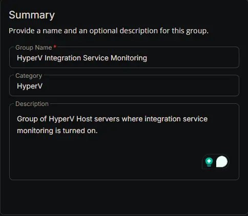
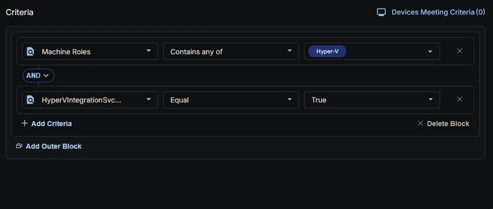
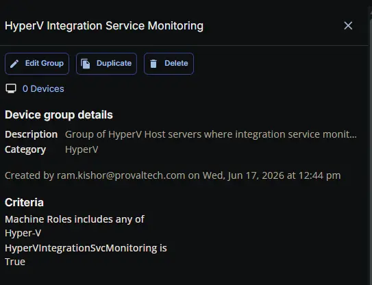

## Summary

Group of HyperV Host servers where integration service monitoring is turned on.

## Dependencies

- [Custom Field: HyperVIntegrationSvcMonitoring](/docs/85741409-f7cd-4ec2-b8cc-fefd6f8f2e0b)
- [Solution: HyperV - Integration Service Monitoring](/docs/08acb7b4-3513-4231-9372-3dbd05e2f43f)

## Group Setup Location

- **Group Path:** `ENDPOINTS` -> `Groups`
- **Group Type:** `Dynamic Group`

## Group Summary

- **Group Name:** `HyperV Integration Service Monitoring`
- **Category:** `HyperV`
- **Description:** `Group of HyperV Host servers where integration service monitoring is turned on.`

## Group Criteria

The group is defined by the following **conditions**, joined by an **AND** logic.

| Condition | Operator | Value(s) |
|-----------|----------|----------|
| Machine Roles | Contains any of | `Hyper-v` |
| HyperVIntegrationSvcMonitoring | Equal | `True` |

**Logic:** Detects HyperV Host servers where HyperVIntegrationSvcMonitoring is enabled.

## Completed Group

## Changelog

### 2026-06-17

- Initial version of the document
