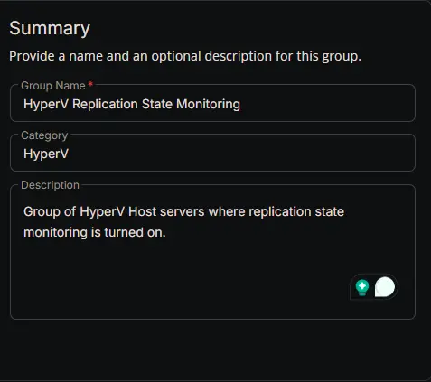
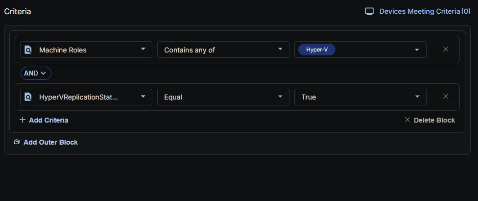
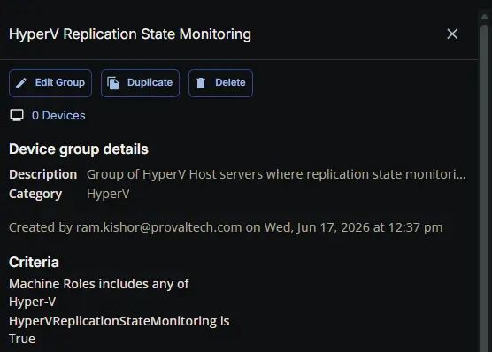

## Summary

Group of HyperV Host servers where replication state monitoring is turned on.

## Dependencies

- [Custom Field: HyperVReplicationStateMonitoring](/docs/6e2b0d4f-9a4d-4b10-9628-cf7be6a7ab44)
- [Solution: HyperV - Replication State Monitoring](/docs/9f3f0b27-3b3b-4c3e-91b1-6d82d9480f52)

## Group Setup Location

- **Group Path:** `ENDPOINTS` -> `Groups`
- **Group Type:** `Dynamic Group`

## Group Summary

- **Group Name:** `HyperV Replication State Monitoring`
- **Category:** `HyperV`
- **Description:** `Group of HyperV Host servers where replication state monitoring is turned on.`

## Group Criteria

The group is defined by the following **conditions**, joined by an **AND** logic.

| Condition | Operator | Value(s) |
|-----------|----------|----------|
| Machine Roles | Contains any of | `Hyper-v` |
| HyperVReplicationStateMonitoring | Equal | `True` |

**Logic:** Detects HyperV Host servers where HyperVReplicationStateMonitoring is enabled.

## Completed Group

## Changelog

### 2026-06-17

- Initial version of the document
