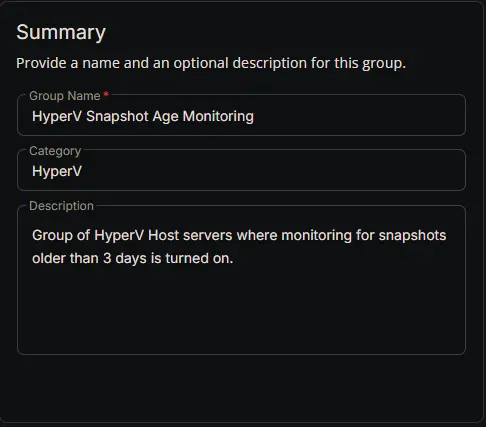
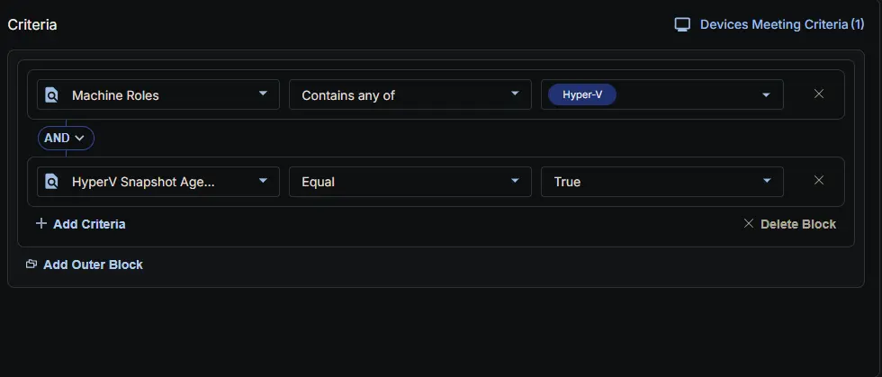
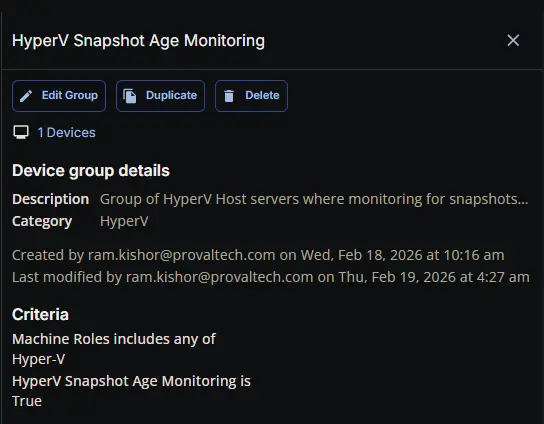

## Summary

Group of SQL Servers.

## Dependencies

- [Custom Field: HyperV Snapshot Age Monitoring](/docs/e0a288ec-c323-45bb-94b0-02071635ce45)
- [Solution: HyperV - Snapshot Age > 3 Days Monitoring](/docs/73e61957-b973-4c64-8c48-70c45f2d400a)

## Group Setup Location

**Group Path:** `ENDPOINTS` ➞ `Groups`  
**Group Type:** `Dynamic Group`

## Group Summary

**Group Name:** `HyperV Snapshot Age Monitoring`  
**Category:** `HyperV`  
**Description:** `Group of HyperV Host servers where monitoring for snapshots older than 3 days is turned on.`

## Group Criteria

The group is defined by the following **conditions**, joined by an **AND** logic.

| Condition             | Operator        | Value(s)                                 |
|-----------------------|-----------------|------------------------------------------|
| Machine Roles  | Contains any of | `Hyper-v` |
| HyperV Snapshot Age Monitoring               | Equal           | `True`    |

**Logic:** Detects HyperV Host servers where HyperV Snapshot Age Monitoring is enabled.

## Completed Group

