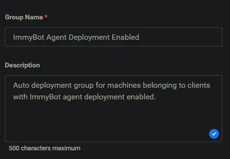
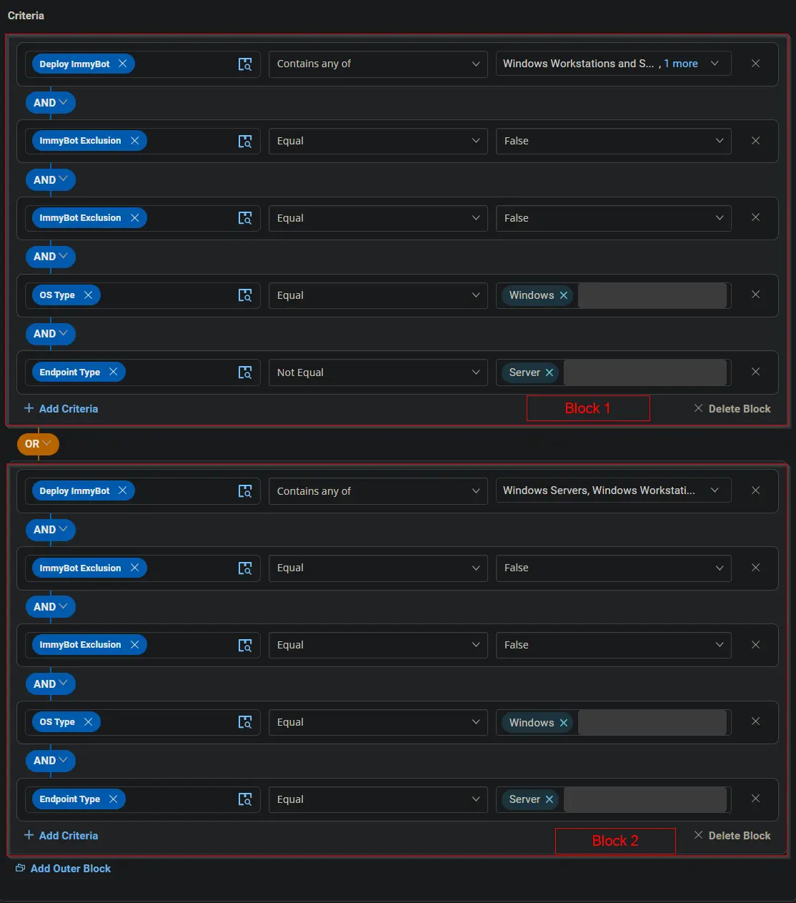
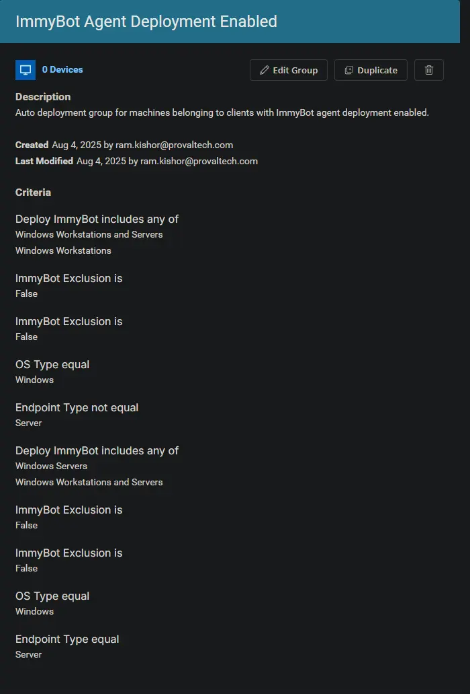

## Summary

Auto deployment group for machines belonging to clients with ImmyBot agent deployment enabled.

## Dependencies

- [Deploy ImmyBot](/docs/415511bb-26c0-4c9f-ac34-d395f29b223e)
- [ImmyBot Exclusion](/docs/5e44ed99-db67-41d3-b718-532395f2ac11)
- [ImmyBot Exclusion](/docs/77b89b50-c343-48a4-b8a0-9e80ceab78ed)
- [ImmyBot Agent Deployment](/docs/d0a57d05-71c0-495e-a055-803ad7a728ad)

## Group Setup Location

**Group Path:** `ENDPOINTS` ➞ `Groups`  
**Group Type:** `Dynamic Group`

## Group Summary

**Group Name:** `ImmyBot Agent Deployment Enabled`  
**Description:** `Auto deployment group for machines belonging to clients with ImmyBot agent deployment enabled.`

## Group Criteria

The group is defined by the following **criteria blocks**, joined by an **OR**. Each block uses **AND** logic between its conditions.

| Block | Criteria Name          | Operator        | Value(s)                                 |
|-------|-----------------------|-----------------|-------------------------------------------|
| 1     | Deploy ImmyBot         | Contains any of | `Windows Workstations and Servers`, `Windows Workstations` |
| 1     | ImmyBot Exclusion (SITE) | Equal           | `False`                                     |
| 1     | ImmyBot Exclusion (ENDPOINT) | Equal           | `False`                                     |
| 1     | OS Type                | Equal           | `Windows`                                   |
| 1     | Endpoint Type          | Not Equal       | `Server`                                    |
| 2     | Deploy ImmyBot         | Contains any of | `Windows Workstations and Servers`, `Windows Servers` |
| 2     | ImmyBot Exclusion (SITE) | Equal           | `False`                                     |
| 2     | ImmyBot Exclusion (ENDPOINT) | Equal           | `False`                                     |
| 2     | OS Type                | Equal           | `Windows`                                   |
| 2     | Endpoint Type          | Equal           | `Server`                                    |

- **Block 1:** Targets Windows Workstations (not servers)
- **Block 2:** Targets Windows Servers

**Logic:**  
A machine matches the group if it meets ALL criteria in Block 1 OR ALL criteria in Block 2.

## Completed Group

