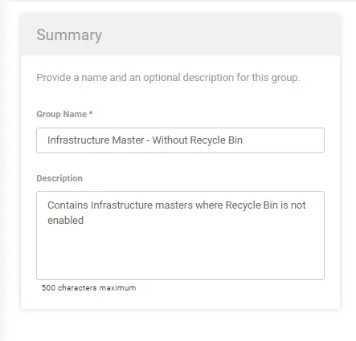
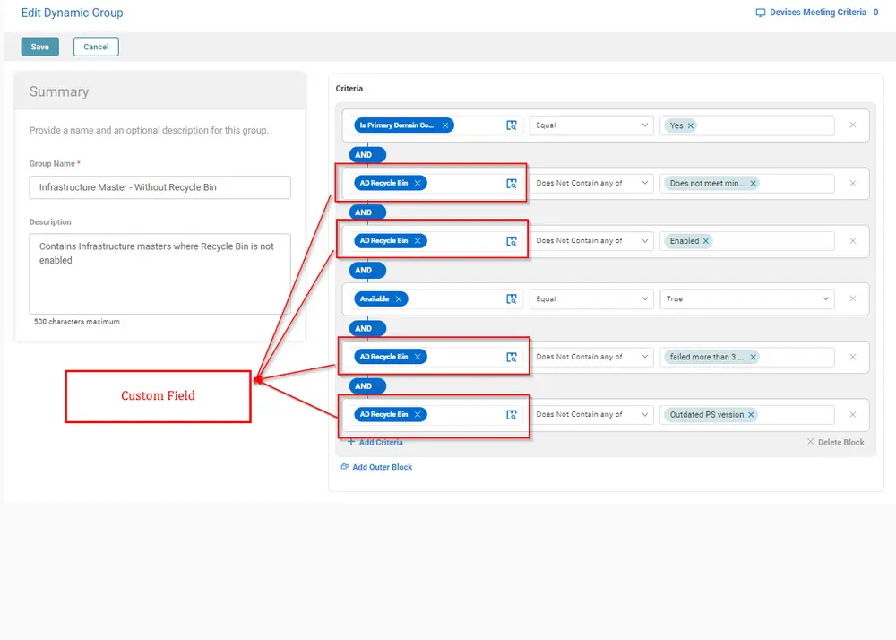
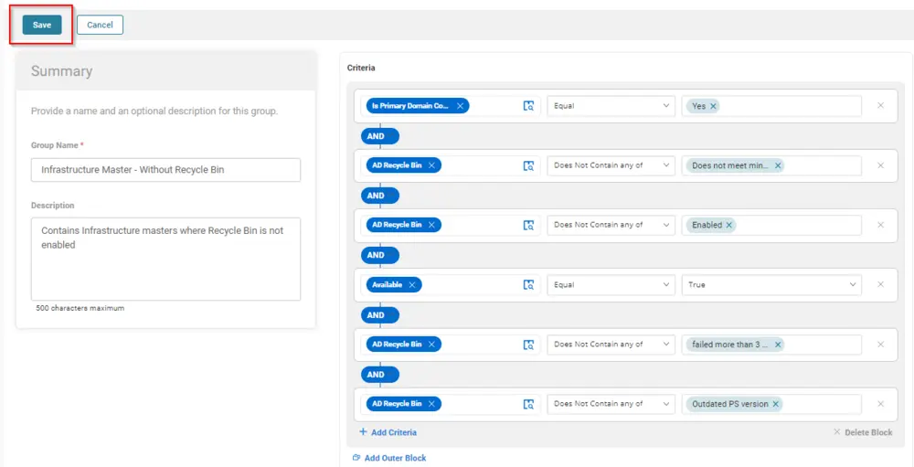
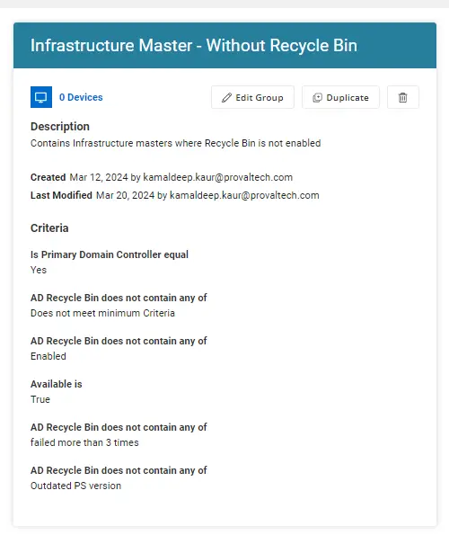

## Summary

The purpose of this group is to filter Windows Infrastructure Masters where the Recycle Bin is not enabled.

## Dependencies

[CW RMM - Task - Enable AD Recycle Bin](/docs/bb53445d-532a-4ec4-b4c5-3f8d0610d6f7)

## Group Details

**Group Type:** Dynamic  
**Group Name:** Infrastructure Master - Without Recycle Bin  
**Description:** Contains Infrastructure Masters where the Recycle Bin is not enabled  

### Criteria

- Is Primary Domain Controller should be equal to `Yes`
- AD Recycle Bin does not contain any of `Does not meet minimum Criteria`
- AD Recycle Bin does not contain any of `Enabled`
- Available should be True.
- AD Recycle Bin does not contain any of `failed more than 3 times`
- AD Recycle Bin does not contain any of `Outdated PS version`

## Group Creation

Once you have added the above criteria, click the Save button to save the group.  

