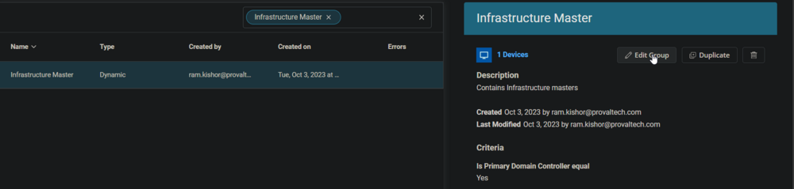
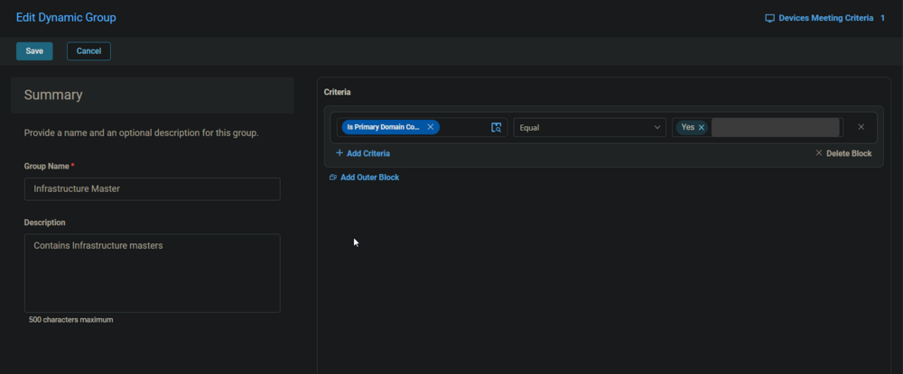

## Summary

The group contains the Infrastructure Masters.

## Dependencies

- [CW RMM - Machine Group - Domain Controllers](/docs/eeeb4ee0-d683-44fd-81cf-7f8872b71c68)
- [CW RMM - Custom Field - Is Primary Domain Controller](/docs/b6a7c804-693c-4cf5-a60e-61dcb10ddcae)
- [CW RMM - Task - Validate Primary Domain Controller](/docs/7bc6ac21-322d-4630-836f-f00e93b94168)

## Screenshots

## Group

- **Group Name:** Infrastructure Master
- **Description:** Contains Infrastructure Masters
- Select the `Is Primary Domain Controller` custom field for criteria, `Equal` for comparator, and type `Yes` in the condition box.
- Click the `Save` button at the top left to create the group.

