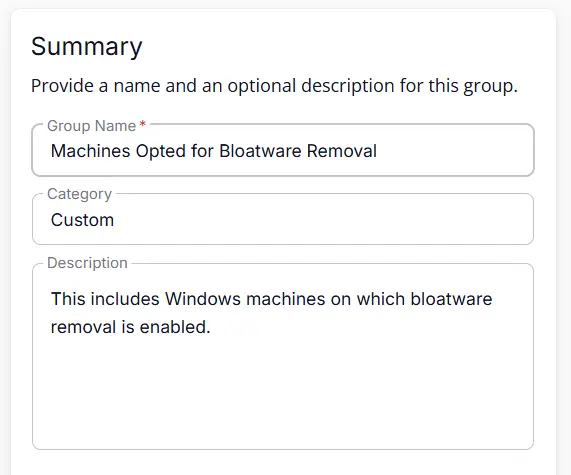
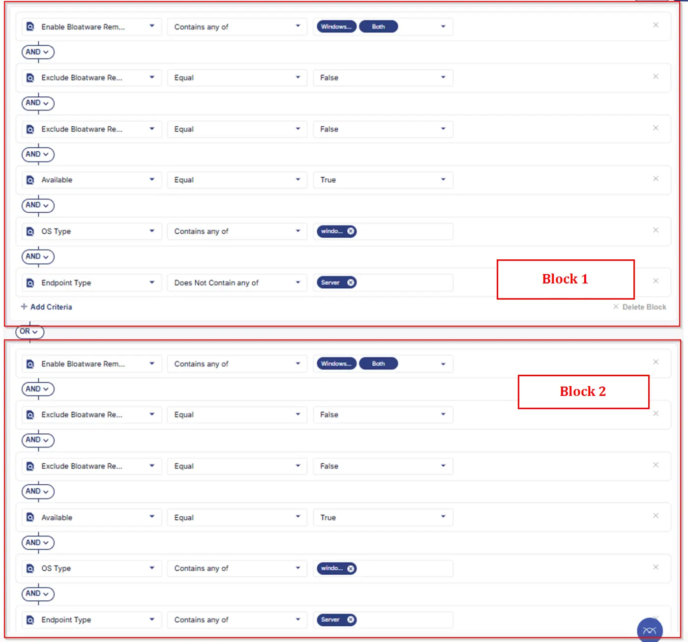
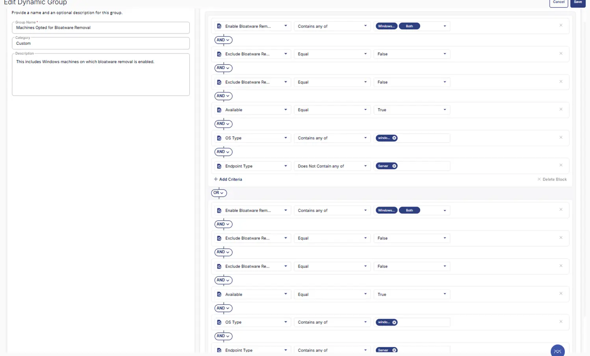

## Summary
This includes Windows machines on which bloatware removal is enabled.

## Dependencies

- [Solution - Remove Bloatware](/docs/0b1f4077-1cf3-43ea-9c9d-93e2db94e24f)

## Group Setup Location

- **Group Path:** `ENDPOINTS` ➞ `Groups`  
- **Group Type:** `Dynamic Group`

## Group Summary

- **Group Name:** `Machines Opted for Bloatware Removal`  
- **Description:** `This includes Windows machines on which bloatware removal is enabled.`

## Group Criteria

The group is defined by the following **criteria blocks**, joined by an **OR**. Each block uses **AND** logic between its conditions.

| Block | Criteria Name          | Operator        | Value(s)                                 |
|-------|-----------------------|-----------------|-------------------------------------------|
| 1     | Enable Bloatware Removal | Contains any of | `Windows Workstations`, `Both`|
| 1     | Exclude Bloatware Removal (Site) | Equal           | `False`              |
| 1     | Exclude Bloatware Removal (Endpoint) | Equal           | `False`              |
| 1     | OS Type                | Equal           | `Windows`       |
| 1     | Endpoint Type          | Not Equal       | `Server`        |
| 1     | Available        | Equals     | `True`        |
| 2     | Enable Bloatware Removal | Contains any of | `Windows Servers`, `Both` |
| 2     | Exclude Bloatware Removal  (Site) | Equal           | `False`     |
| 2     | Exclude Bloatware Removal (Endpoint) | Equal           | `False`     |
| 2     | OS Type                | Equal           | `Windows`     |
| 2     | Endpoint Type          | Equal           | `Server`      |
| 2     | Available        | Equals     | `True`        |

- **Block 1:** Targets Windows Workstations
- **Block 2:** Targets Windows Servers

**Logic:**  
A machine joins the group if it meets ALL criteria in Block 1 OR ALL criteria in Block 2.

## Completed Group

## Changelog

### 2026-03-30

- Initial version of the document
