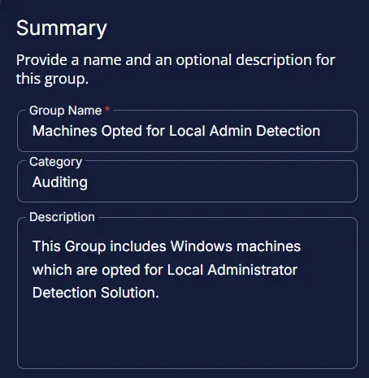
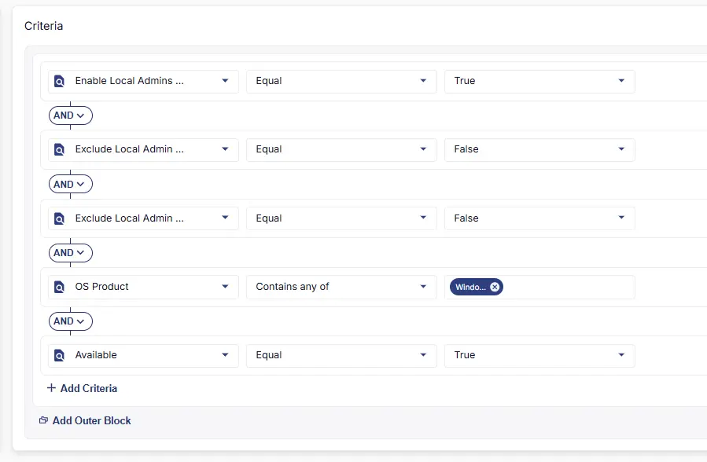
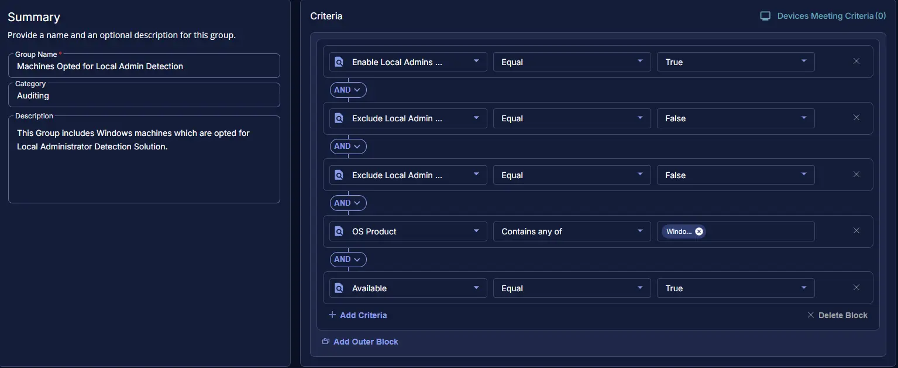

## Summary
This group includes Windows machines which are opted for Local Administrator Detection Solution.

## Dependencies
- [Custom Field - Enable Local Admins Detection  ](/docs/219923f8-62e6-401a-9693-678b44325708) 
- [Custom Field - Exclude Local Admin Detection ](/docs/e988aefc-1f5d-4d10-a66b-cf22e084ae72)  
- [Custom Field - Exclude Local Admin Detection ](/docs/18aa25e5-61cd-429d-ab09-44b7cf6eb10e) 
- [Solution - Local Administrator Detection](/docs/7e3f8472-2908-4491-b495-b87bd7ad0fe6)

## Group Creation

### Step 1

Navigate to `ENDPOINTS` ➞ `Groups`  

### Step 2

Create a new dynamic group by clicking the `Dynamic Group` button.  

This page will appear after clicking on the `Dynamic Group` button:  

### Step 3

- **Group Name:** `Machines Opted for Local Admin Detection`  
- **Description:** `This Group includes Windows machines which are opted for Local Administrator Detection Solution.`

### Step 4

Click the `+ Add Criteria` in the `Criteria` section of the group.  

This search box will appear:  

- `Enable Local Admins Detection` equals `True`
- `Exclude Local Admin Detection` equals `False` (For site Custom Field)
- `Exclude Local Admin Detection` equals `False` (For Endpoint Custom Field)
- `OS Product` contains `Windows`
- `Available` should be `True`.

## Completed Group

## Changelog

### 2026-01-30

- Initial version of the document
