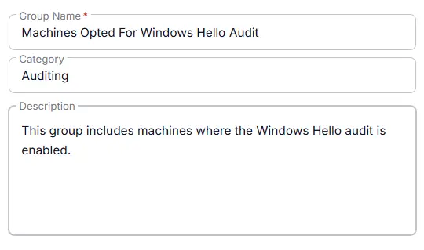
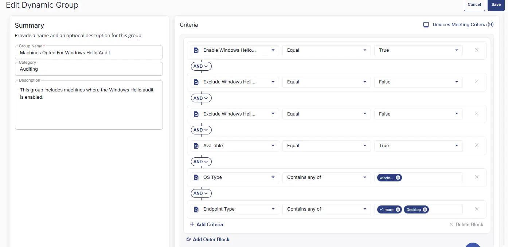

## Summary
This group includes machines where the Windows Hello audit is enabled.

## Dependencies

- [Solution - Windows Hello Audit](/docs/1ec129b5-f607-41ab-b451-b54a2078950c)

## Group Setup Location

- **Group Path:** `ENDPOINTS` ➞ `Groups`  
- **Group Type:** `Dynamic Group`

## Group Summary

- **Group Name:** `Machines Opted For Windows Hello Audit`  
- **Category:** `Auditing`  
- **Description:** `This group includes machines where the Windows Hello audit is enabled.`

## Group Criteria

The group is defined by the following **criteria**

| Criteria Name          | Operator        | Value(s)                                 |
|-----------------------|-----------------|-------------------------------------------|
| Enable Windows Hello Audit    | Equal               | `True` |
| Exclude Windows Hello Audit      | Equal     | `False` |
| Exclude DNSFilter deployment      | Equal     | `False` |
| Available   | Equal    | `True` |
| OS Type  | Equal    | `Windows` |
| Endpoint Type  | Not Equal    | `Laptop` |

## Completed Group

