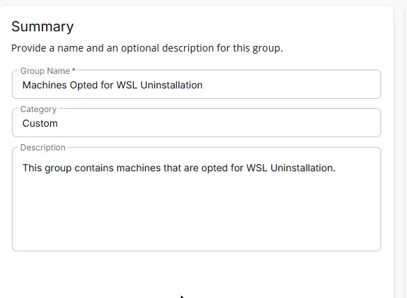
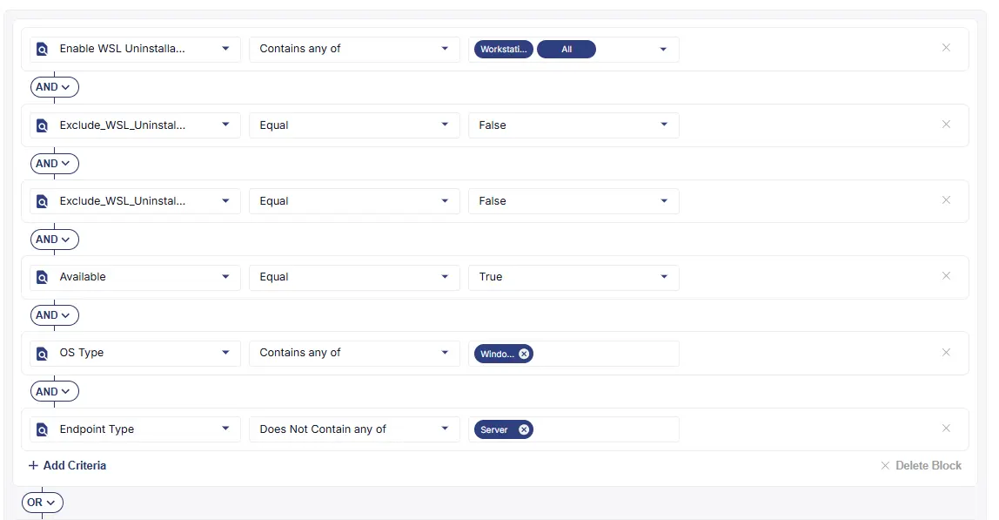
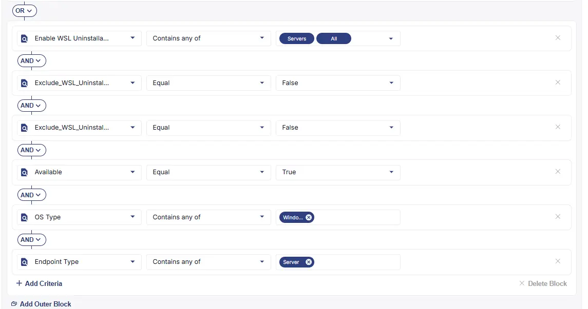
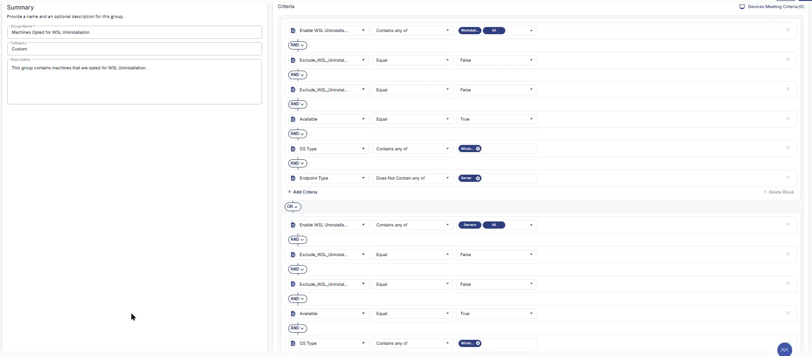

## Summary

This group contains machines that are opted for WSL Uninstallation.

## Dependencies

- [Solution - CVE-2025-24084 - WSL Uninstall](/docs/cc418b50-c30e-4319-950e-ffa6347dd74e)  

## Group Setup Location

- **Group Path:** `ENDPOINTS` ➞ `Groups`  
- **Group Type:** `Dynamic Group`

## Group Summary

- **Group Name:** `Machines Opted for WSL Uninstallation`  
- **Category:** `Custom`  
- **Description:** `This group contains machines that are opted for WSL Uninstallation.`  

## Criteria

The group is defined by the following **criteria blocks**, joined by an **OR**. Each block uses **AND** logic between its conditions.

| Block | Criteria Name                  | Operator                | Value(s)             |
|-------|--------------------------------|-------------------------|----------------------|
| 1     | Enable WSL Uninstallation      | Contains any of         | `All`,`Workstations` |
| 1     | Exclude_WSL_Uninstall_Site     | Equal | `False`              |
| 1     | Exclude_WSL_Uninstall_Endpoint | Equal | `False`              |
| 1     | OS Type                        | Contains any of         | `Windows`            |
| 1     | Endpoint Type                  | Does Not Contain any of | `Server`             |
| 1     | Available                      | Equal                   | `True`               |
| 2     | Enable WSL Uninstallation      | Contains any of         | `All`,`Servers`      |
| 2     | Exclude_WSL_Uninstall_Site     | Equal | `False`              |
| 2     | Exclude_WSL_Uninstall_Endpoint | Equal | `False`              |
| 2     | OS Type                        | Contains any of         | `Windows`            |
| 2     | Endpoint Type                  | Contains any of         | `Server`             |
| 2     | Available                      | Equal                   | `True`               |

- ****Block 1:**** Targets **workstations* where the primary setting (****Enable WSL Uninstallation****) is enabled for **All** or **Workstations**, provided that the uninstallation has not been explicitly disabled at the site level (****Exclude_WSL_Uninstall_Site****) or the individual endpoint level (****Exclude_WSL_Uninstall_Endpoint****). The device must be a Windows workstation and available.
- ****Block 2:**** Targets **servers** where the primary setting (****Enable WSL Uninstallation****) is enabled for **All** or **Servers**, provided that the uninstallation has not been explicitly disabled at the site level (****Exclude_WSL_Uninstall_Site****) or the individual endpoint level (****Exclude_WSL_Uninstall_Endpoint****). The device must be a Windows server and available.

****Logic:****
A machine matches the group if it meets ****ALL**** criteria in ****Block 1****, ****OR**** ****ALL**** criteria in ****Block 2****.

**Block 1**

**Block 2**

## Completed Group

## Changelog

### 2026-09-16

- Initial version of the document
