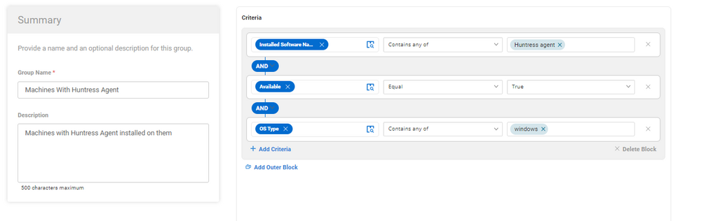
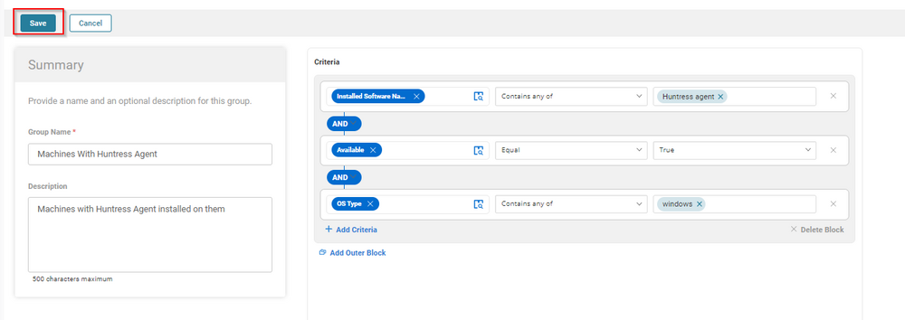
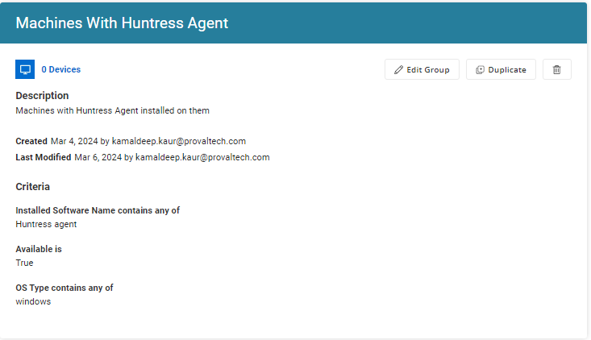

## Summary

This group filters Windows machines with the Huntress Agent installed on them.

**Group Type:** Dynamic  
**Group Name:** Machines With Huntress Agent  
**Description:** Machines with Huntress Agent installed on them  

## Criteria

- Installed Software contains any of `Huntress Agent`
- OS Product contains `Windows`
- Available should be True.

## Group

After adding the above criteria, click the Save button to save the group.  

