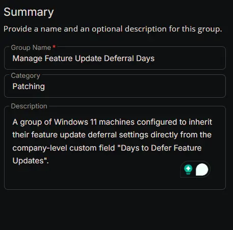
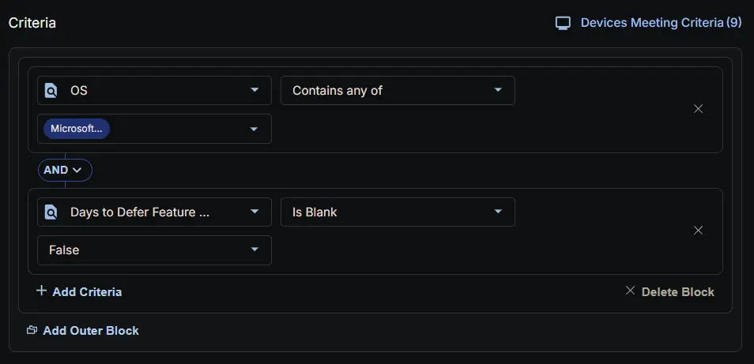
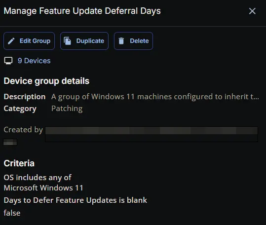

## Summary

A group of Windows 11 machines configured to inherit their feature update deferral settings directly from the company-level custom field [Days to Defer Feature Updates](/docs/f09876a6-5d87-446a-8b07-dc3f30f3a285).

## Dependencies

- [Custom Field: Days to Defer Feature Updates](/docs/f09876a6-5d87-446a-8b07-dc3f30f3a285)
- [Solution: Manage Feature Update Deferral](/docs/800f96cd-5e64-48dd-bb9a-f17822db38e8)

## Group Setup Location

- **Group Path:** `ENDPOINTS` ➞ `Groups`  
- **Group Type:** `Dynamic Group`

## Group Summary

- **Group Name:** `Manage Feature Update Deferral Days`  
- **Category:** `Patching`  
- **Description:** `A group of Windows 11 machines configured to inherit their feature update deferral settings directly from the company-level custom field "Days to Defer Feature Updates".`

## Group Criteria

The group is defined by the following **criteria block**.

| Block | Criteria Name          | Operator        | Value(s)                                 |
|-------|-----------------------|-----------------|-------------------------------------------|
| 1     | OS         | Contains any of | `Microsoft Windows 11` |
| 1     | Days to Defer Feature Updates | Is Blank | `False` |

- **Block 1:** Targets Windows 11

**Logic:**  
A machine matches the group if it meets ALL criteria in Block 1.

## Completed Group

## Changelog

### 2026-03-11

- Initial version of the document
