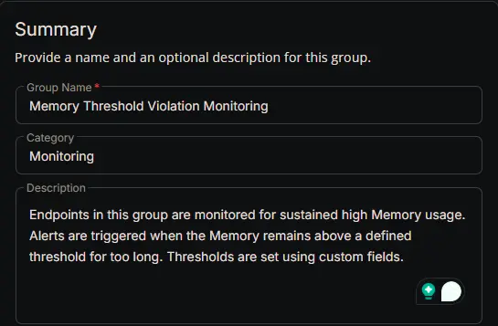
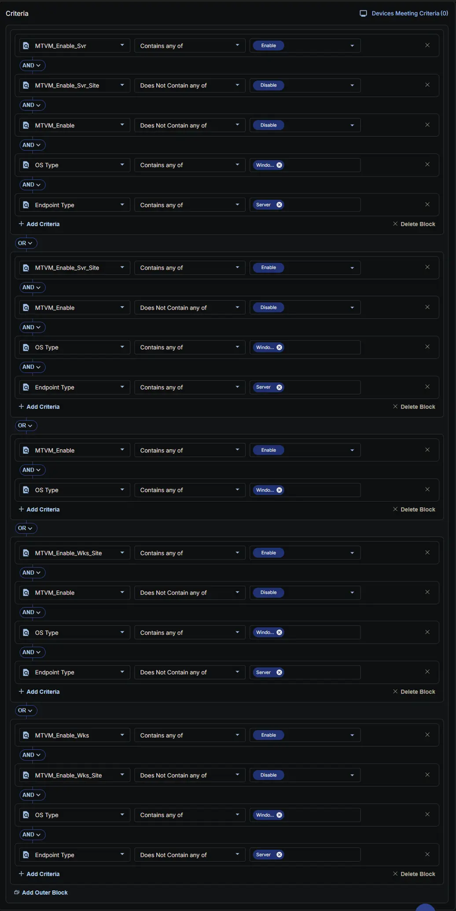
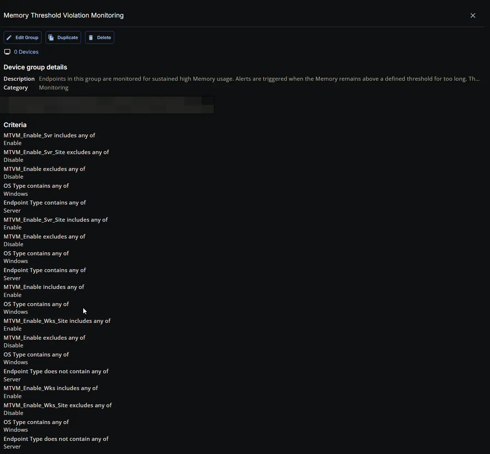

## Summary

Endpoints in this group are monitored for sustained high Memory usage. Alerts are triggered when the Memory remains above a defined threshold for too long. Thresholds are set using custom fields.

## Dependencies

- [Custom Field: MTVM_Enable_Svr](/docs/2fae464f-4fe6-4c42-9957-664365c25fe0)
- [Custom Field: MTVM_Enable_Wks](/docs/f00277da-77b2-4f63-9f06-438b5f3800c8)
- [Custom Field: MTVM_Enable_Svr_Site](/docs/46461e0d-19a9-415f-998f-fc9b6d2a6112)
- [Custom Field: MTVM_Enable_Wks_Site](/docs/61e68b73-3a6e-4e43-ac03-188a29a9b446)
- [Custom Field: MTVM_Enable](/docs/cdbbb3d0-31a3-4ac7-816c-f381c8c94c7d)
- [Solution: Memory Threshold Violation Monitoring](/docs/cda6ee21-e70f-45c3-868c-1800d4aa26d7)

## Group Setup Location

- **Group Path:** `ENDPOINTS` ➞ `Groups`  
- **Group Type:** `Dynamic Group`

## Group Summary

- **Group Name:** `Memory Threshold Violation Monitoring`  
- **Category:** `Monitoring`  
- **Description:** `Endpoints in this group are monitored for sustained high Memory usage. Alerts are triggered when the Memory remains above a defined threshold for too long. Thresholds are set using custom fields.`  

## Criteria

The group is defined by the following **criteria blocks**, joined by an **OR**. Each block uses **AND** logic between its conditions.

| Block | Criteria Name            | Operator             | Value(s)   |
|-------|--------------------------|----------------------|------------|
| 1     | MTVM_Enable_Svr          | Contains any of      | `Enable`   |
| 1     | MTVM_Enable_Svr_Site     | Does Not Contain any of | `Disable`  |
| 1     | MTVM_Enable              | Does Not Contain any of | `Disable`  |
| 1     | OS Type                  | Contains any of      | `Windows`  |
| 1     | Endpoint Type            | Equal                | `Server`   |
| 2     | MTVM_Enable_Svr_Site     | Contains any of      | `Enable`   |
| 2     | MTVM_Enable              | Does Not Contain any of | `Disable`  |
| 2     | OS Type                  | Contains any of      | `Windows`  |
| 2     | Endpoint Type            | Equal                | `Server`   |
| 3     | MTVM_Enable              | Contains any of      | `Enable`   |
| 3     | OS Type                  | Contains any of      | `Windows`  |
| 4     | MTVM_Enable_Wks          | Contains any of      | `Enable`   |
| 4     | MTVM_Enable_Wks_Site     | Does Not Contain any of | `Disable`  |
| 4     | MTVM_Enable              | Does Not Contain any of | `Disable`  |
| 4     | OS Type                  | Contains any of      | `Windows`  |
| 4     | Endpoint Type            | Not Equal            | `Server`   |
| 5     | MTVM_Enable_Wks_Site     | Contains any of      | `Enable`   |
| 5     | MTVM_Enable              | Does Not Contain any of | `Disable`  |
| 5     | OS Type                  | Contains any of      | `Windows`  |
| 5     | Endpoint Type            | Not Equal            | `Server`   |

- **Block 1:** Targets Windows Servers where the primary **server** setting (**MTVM_Enable_Svr**) is enabled, provided that the feature has not been explicitly disabled at the site level (**MTVM_Enable_Svr_Site**) or the individual endpoint level (**MTVM_Enable**).  
- **Block 2:** Targets Windows Servers where the site‑level **server** setting (**MTVM_Enable_Svr_Site**) is explicitly enabled, provided that it has not been overridden and disabled at the individual endpoint level (**MTVM_Enable**).  
- **Block 3:** Targets **Any Windows Device** (Server or Workstation) where the feature is explicitly enabled directly at the individual endpoint level (**MTVM_Enable**).  
- **Block 4:** Targets Windows **Workstations** (devices not equal to "Server") where the primary workstation setting (**MTVM_Enable_Wks**) is enabled, provided that the feature has not been explicitly disabled at the site level (**MTVM_Enable_Wks_Site**) or the individual endpoint level (**MTVM_Enable**).  
- **Block 5:** Targets Windows **Workstations** (devices not equal to "Server") where the site‑level workstation setting (**MTVM_Enable_Wks_Site**) is explicitly enabled, provided that it has not been overridden and disabled at the individual endpoint level (**MTVM_Enable**).

**Logic:**  
A machine matches the group if it meets **ALL** criteria in **Block 1**, **OR** **ALL** criteria in **Block 2**, **OR** **ALL** criteria in **Block 3**, **OR** **ALL** criteria in **Block 4**, **OR** **ALL** criteria in **Block 5**.

## Completed Group

## Changelog

### 2026-07-15

- Initial version of the document
