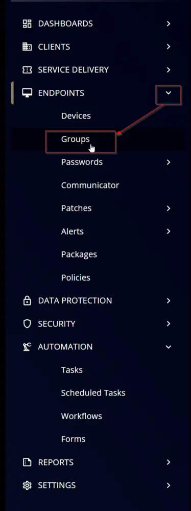
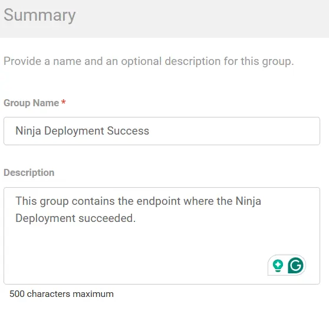
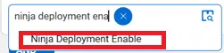
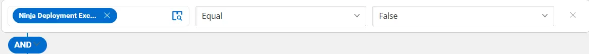
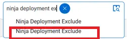
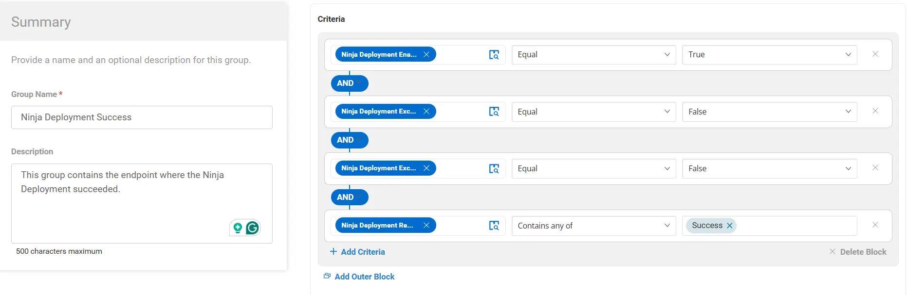
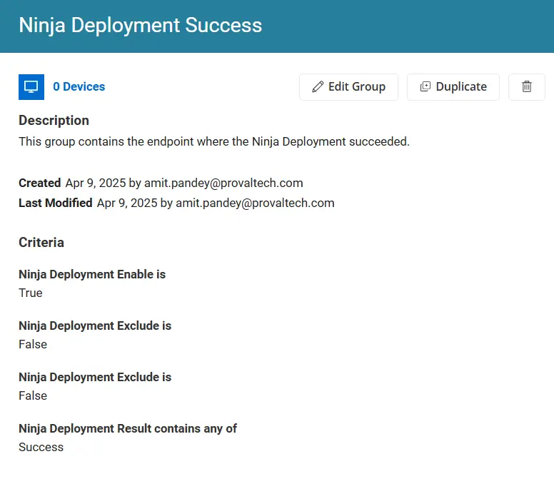

## Summary
This group contains the endpoint where the Ninja Deployment succeeded.

## Dependencies
[CW RMM - Ninja Migration Custom fields](/docs/1b41da88-5b9a-436f-997b-39c8f72615ae)

[Script - Ninja RMM Deployment - [Windows]](/docs/905f38b9-492e-43d8-b687-7b4df48c3b97)

[Script - Ninja RMM Deployment - [MAC]](/docs/2893ba48-9686-424e-ba32-0c799c38f9fd)

## Group Creation

### Step 1

Navigate to `ENDPOINTS` ➞ `Groups`  

### Step 2

Create a new dynamic group by clicking the `Dynamic Group` button.  

This page will appear after clicking on the `Dynamic Group` button:  

### Step 3

**Group Name:** `Ninja Deployment Success`  
**Description:** `This group contains the endpoint where the Ninja Deployment succeeded.`

### Step 4

Click the `+ Add Criteria` in the `Criteria` section of the group.  

This search box will appear:  

### Step 5

Search for `Ninja Deployment Enable` and select it and set it `Equal` to `True`

### Step 6

Click `Add Criteria`

Search for `Ninja Deployment Exclude` and select it and set it `Equal` to `False`.
Make sure to select the `Ninja Deployment Exclude` site level custom field.

### Step 7

Click `Add Criteria`

Search for `Ninja Deployment Exclude` and select it and set it `Equal` to `False`.
Make sure to select the `Ninja Deployment Exclude` endpoint level custom field.

### Step 8

Click `Add Criteria`

Search for `Ninja Deployment Result` and select it and set it `Contains any of` to `Success`

## Completed Group

