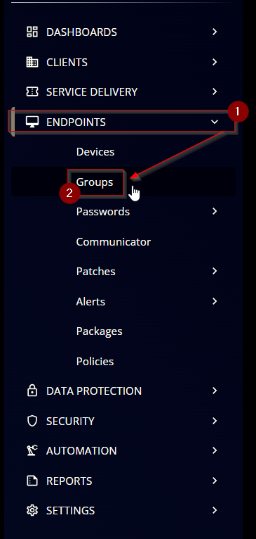
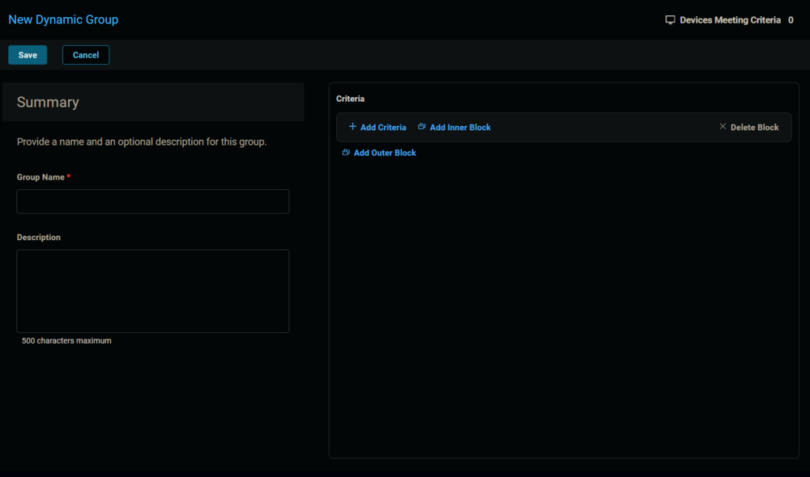
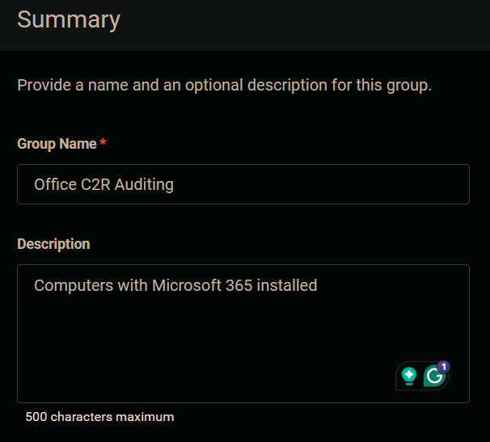
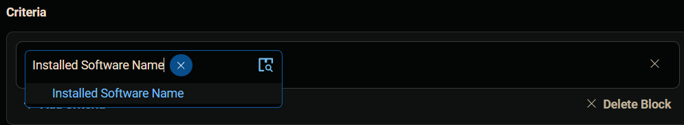
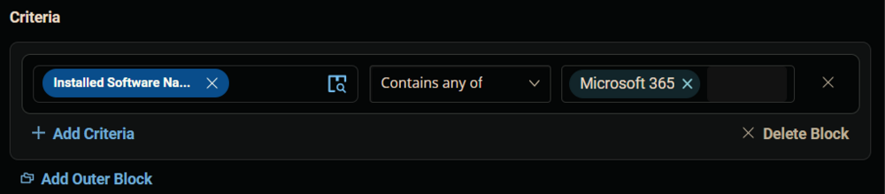
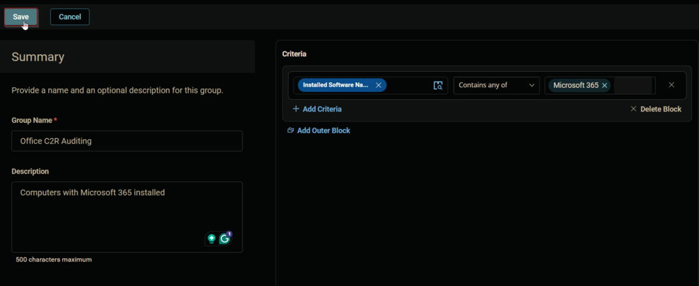
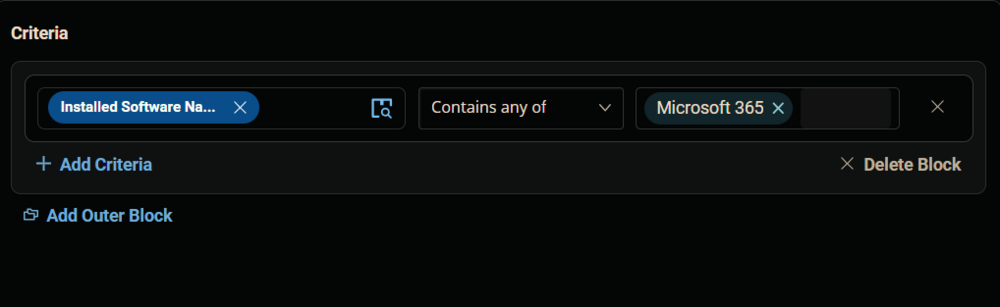
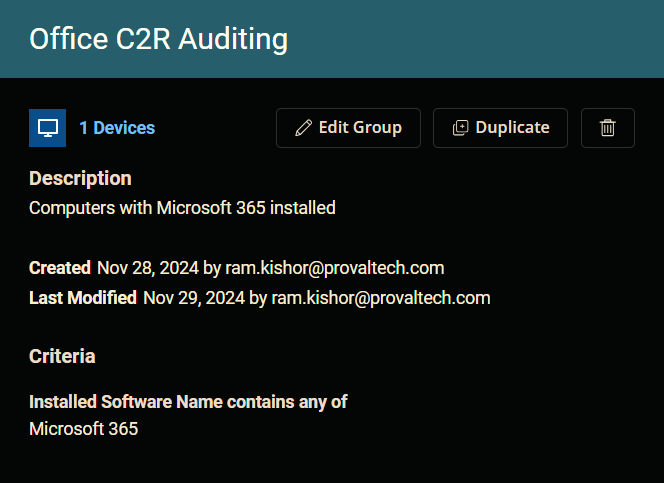

## Summary

This document outlines the process for creating a dynamic group for computers with Microsoft 365 installed.

## Group Creation

1. Navigate to `Endpoints` > `Groups`.
   

2. Create a new dynamic group by clicking the `Dynamic Group` button.  
     
   This page will appear after clicking on the `Dynamic Group` button:  
   

3. Set the group name to `Office C2R Auditing`.  
   Description: `Computers with Microsoft 365 installed`  
   

4. Click the `+ Add Criteria` in the `Criteria` section of the group.  
     
   This search box will appear.  
   

5. Search and select the `Installed Software Name` custom field from the search box.  
     
   Set the operator to `Contains any of` and enter `Microsoft 365` in the comparison condition.  
     
   **Condition:** `Installed Software Name` `Contains any of` `Microsoft 365`

6. Click the `Save` button to save/create the group.  
   

## Completed Group

  

