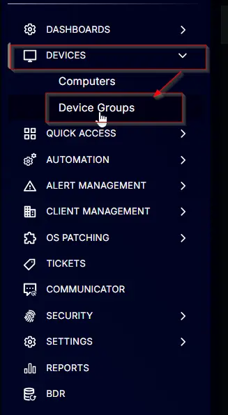
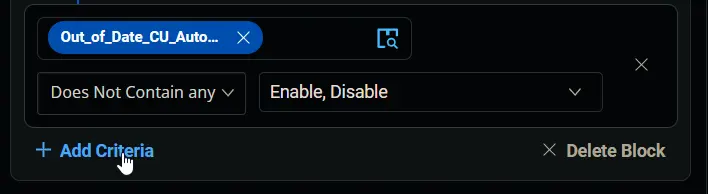

## Summary

The group will detect the computers where the Latest Cumulative Update Custom Field contains "failed," indicating that the machine has not installed a Cumulative Update in the past 75 days.

## Dependencies

- [CW RMM - Custom Field - Latest Cumulative Update](/docs/67416ac2-2311-43c4-8fbf-c5b0c9a48e71)
- [CW RMM - Custom Field - EndPoint - Out_of_Date_CU_Autofix_Result](/docs/2d24daab-16cb-4b2d-b7e6-0e757b4f2523)
- [CW RMM - Custom Field - Company - Out_of_Date_CU_Autofix](/docs/00c4b9c6-ded8-4cde-ba74-47437724d206)
- [CW RMM Custom Field - Site - Out_of_Date_CU_Autofix](/docs/7eb4d98b-4199-4f59-a28f-bfdf50f3e36a)
- [CW RMM - Custom Field - EndPoint - Out_of_Date_CU_Autofix](/docs/a9e84f5a-0afa-44ef-98b7-c5a70f6a25ea)

## Group Creation

### 1.
Navigate to `Devices` > `Device Groups`.  

### 2.
Create a new dynamic group by clicking the `Dynamic Group` button.  
  
This page will appear after clicking on the `Dynamic Group` button:  

### 3.
Set the group name to `Out of Date CU - Autofix Required`.  
Description: `The group will detect the computers where the Latest Cumulative Update Custom Field contains failed, indicating that the machine has not installed a Cumulative Update in the past 75 days.`  

### 4.
Click the `+ Add Criteria` in the `Criteria` section of the group.  
  
This search box will appear.  

### 5.
Search and select the `Latest Cumulative Update` custom field from the search box.  
  
Type `Failed` in the comparison condition and press `Enter`.  
  
**Condition:** `Latest Cumulative Update` `Contains any of` `Failed`

### 6.
Click the `+ Add Criteria` button.  
  
A new search box will appear.  
  
Search and select the `Out_of_Date_CU_Autofix_Result` custom field from the search box.  
  
Change the comparator to `Does Not Contain any of`.  
  
Type `Reboot Pending` and `Installed` in the comparison condition and press `Enter`.  
  
**Condition:** `Out_of_Date_CU_Autofix_Result` `Does Not Contain any of` `Reboot Pending`, `Installed`

### 7.
Click the `+ Add Criteria` button.  
  
A new search box will appear.  
  
Search and select the `Out_of_Date_CU_Autofix` custom field from the search box. Remember, there are three different `Out_of_Date_CU_Autofix` custom fields, and we are going to use all three of these one after another in the conditions.  
We are selecting the `company` level custom field in this step.  
  
Change the comparator to `Does Not Contain any of`.  
  
Select `Disable` in the comparison field.  
  
**Condition:** `Out_of_Date_CU_Autofix` `Does Not Contain any of` `Disable`

### 8.
Click the `+ Add Criteria` button.  
  
A new search box will appear.  
  
Search and select the `Out_of_Date_CU_Autofix` custom field from the search box. We are selecting the `site` level custom field in this step.  
  
Change the comparator to `Does Not Contain any of`.  
  
Select `Disable` in the comparison field.  
  
**Condition:** `Out_of_Date_CU_Autofix` `Does Not Contain any of` `Disable`

### 9.
Click the `+ Add Criteria` button.  
  
A new search box will appear.  
  
Search and select the `Out_of_Date_CU_Autofix` custom field from the search box. We are selecting the `Endpoint` level custom field in this step.  
  
Change the comparator to `Does Not Contain any of`.  
  
Select `Disable` in the comparison field.  
  
**Condition:** `Out_of_Date_CU_Autofix` `Does Not Contain any of` `Disable`

### 10.
Click the `+ Add Criteria` button.  
  
A new search box will appear.  
  
Search and select the `OS` criteria.  
  
Leave the comparator set to `Contain any of`.  
  
Select `Microsoft Windows`, `10`, and `11` in the comparison field.  
  
**Condition:** `OS` `Contains any of` `Microsoft Windows 10`, `Microsoft Windows 11`

### 11.
**From this step onward, we will work in an Outer Block.**  
Click the `Add Outer Block` button to create a new block.  
  
A new block will appear.  
  
Change the logical operator to `OR` from `AND`.  

### 12.
Click the `+ Add Criteria` in the newly added `Outer Block`.  
  
This search box will appear.  
  
Search and select the `Latest Cumulative Update` custom field from the search box.  
  
Type `Failed` in the comparison condition and press `Enter`.  
  
**Condition:** `Latest Cumulative Update` `Contains any of` `Failed`

### 13.
Click the `+ Add Criteria` button.  
  
A new search box will appear.  
  
Search and select the `Out_of_Date_CU_Autofix_Result` custom field from the search box.  
  
Change the comparator to `Does Not Contain any of`.  
  
Type `Reboot Pending` and `Installed` in the comparison condition and press `Enter`.  
  
**Condition:** `Out_of_Date_CU_Autofix_Result` `Does Not Contain any of` `Reboot Pending`, `Installed`

### 14.
Click the `+ Add Criteria` button.  
  
A new search box will appear.  
  
Search and select the `Out_of_Date_CU_Autofix` custom field from the search box.  
We are selecting the `company` level custom field in this step.  
  
Change the comparator to `Does Not Contain any of`.  
  
Select `Disable` and `Enable` in the comparison field.  
  
**Condition:** `Out_of_Date_CU_Autofix` `Does Not Contain any of` `Disable`, `Enable`

### 15.
Click the `+ Add Criteria` button.  
  
A new search box will appear.  
  
Search and select the `Out_of_Date_CU_Autofix` custom field from the search box.  
We are selecting the `site` level custom field in this step.  
  
Change the comparator to `Does Not Contain any of`.  
  
Select `Disable`, `Disable for Servers`, and `Enable` in the comparison field.  
  
**Condition:** `Out_of_Date_CU_Autofix` `Does Not Contain any of` `Disable`, `Disable for Servers`, `Enable`

### 16.
Click the `+ Add Criteria` button.  
  
A new search box will appear.  
  
Search and select the `Out_of_Date_CU_Autofix` custom field from the search box.  
We are selecting the `Endpoint` level custom field in this step.  
  
Change the comparator to `Does Not Contain any of`.  
  
Select `Disable` in the comparison field.  
  
**Condition:** `Out_of_Date_CU_Autofix` `Does Not Contain any of` `Disable`

### 17.
Click the `+ Add Criteria` button.  
  
A new search box will appear.  
  
Search and select the `OS` criteria.  
  
Leave the comparator set to `Contain any of`.  
  
Select `Microsoft Windows`, `Server`, `2016`, `2019`, and `2022` in the comparison field.  
  
**Condition:** `OS` `Contains any of` `Microsoft Windows Server 2016`, `Microsoft Windows Server 2019`, `Microsoft Windows Server 2022`

### 18.
Click the `Save` button to save/create the group.  

## Completed Group

