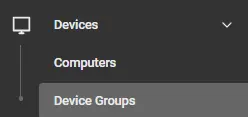
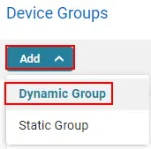

## Summary

There are three device groups related to the PowerShell version auditing solution. Please see the guide below to create the separate device groups.

## Dependencies

- [CW RMM - Custom Field - PowerShell Version](/docs/945d88e0-81a9-4253-8406-63fa7430d45a)  
- [CW RMM - Task - PowerShell Version Information](/docs/a8419e91-9e07-4f16-be4b-769c78f86f1b)  

## Create Device Groups

There are three device groups for this solution. To create device groups, please navigate to **Devices > Device Groups**.

  
Select **Add > Dynamic Group**  
  
Please repeat the above steps for each device group.

---

### Device Group Name: PowerShell Version Audit - Pending

  

**Description:** This group will look for any machines where the PS Version is pending.  
**Criteria:**  
  
When adding criteria, please search for the PowerShell Version custom field.  
- **Contains:** "Is Blank"  
- **Condition:** "True"  

This group holds all devices that have not had their PowerShell versions audited.

---

### Device Group Name: PowerShell Version < 5

  

**Description:** This group will look for any machines where the PS Version is not version 5 or higher.  
**Criteria:**  
  
When adding criteria, please search for the PowerShell Version custom field.  
- **Contains:** "Contains any of"  
- **Condition:** "Failure"  

This group holds all devices that are not on PowerShell version 5 or above.

---

### Device Group Name: PowerShell Version > 5

  

**Description:** This group will look for any machines where the PS version is 5 or higher.  
**Criteria:**  
  
When adding criteria, please search for the PowerShell Version custom field.  
- **Contains:** "Contains any of"  
- **Condition:** "Success"  

This group holds all devices that are on PowerShell version 5 or above.

