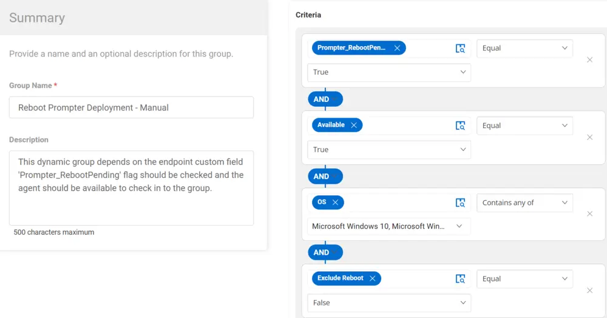

## Summary

This dynamic group depends on the endpoint custom field `Prompter_RebootPending`. The flag should be checked, and the agent should be available to check in to the group.

## Dependencies

- Custom field (Endpoint) - `Reboot_PendingReboot`  
- [CW RMM - Custom Fields - Reboot Prompter](/docs/7876f32c-a5ec-4b58-9f7e-b60b710e19d5)  
- [Solution - Reboot Prompter](/docs/5b376f62-e977-4feb-b523-b133d2ef5722) 

## Details

| Group Name                          | Group Type | Description                                                                                                                                                      |
|-------------------------------------|-----------------------------------------|------------------------------------------------------------------------------------------------------------------------------------------------------------------|
| Reboot Prompter Deployment - Manual | Dynamic Group                          | This dynamic group depends on the endpoint custom field 'Prompter_RebootPending'. The flag should be checked, and the agent should be available to check in to the group. |

## Group Creation 

1. Create Dynamic Groups:  
   

2. Reboot Prompter Deployment - Manual  
     

   Criteria:
   - `Prompter_RebootPending` custom field equals `True`.
   - The agent `Available` equals `True`.
   - The `OS` contains either `Windows 10` or `Windows 11`.
   - `Exclude Reboot` custom field equals `False`.