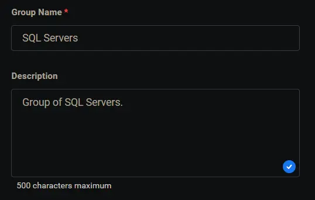
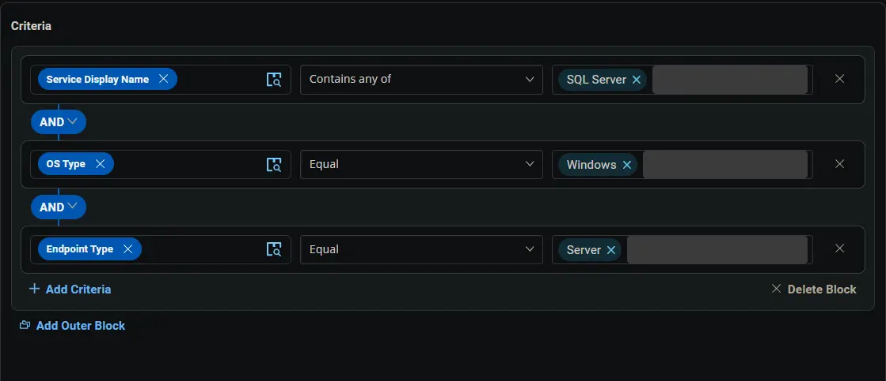
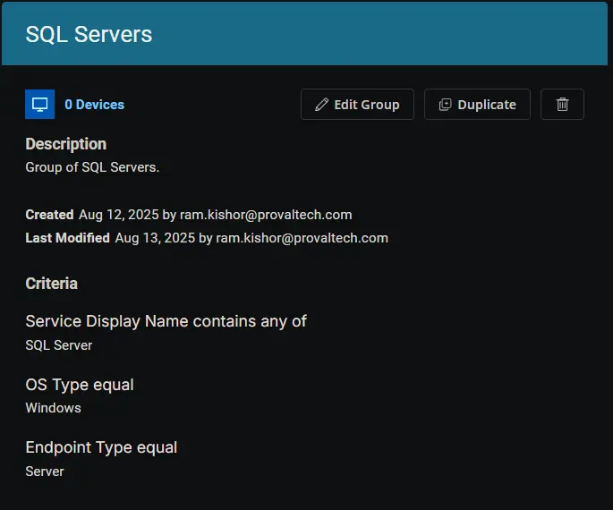

## Summary

Group of SQL Servers.

## Dependencies

- [New SQL Updates](/docs/08281245-9380-4946-b1a6-099aebfffd6f)

## Group Setup Location

**Group Path:** `ENDPOINTS` ➞ `Groups`  
**Group Type:** `Dynamic Group`

## Group Summary

**Group Name:** `SQL Servers`  
**Description:** `Group of SQL Servers.`

## Group Criteria

The group is defined by the following **conditions**, joined by an **AND** logic.

| Condition             | Operator        | Value(s)                                 |
|-----------------------|-----------------|------------------------------------------|
| Service Display Name  | Contains any of | `SQL Server` |
| OS Type               | Equal           | `Windows`    |
| Endpoint Type         | Equal           | `Server`     |

**Logic:** Detects Windows servers that have a service with a display name containing `SQL Server`.

## Completed Group

