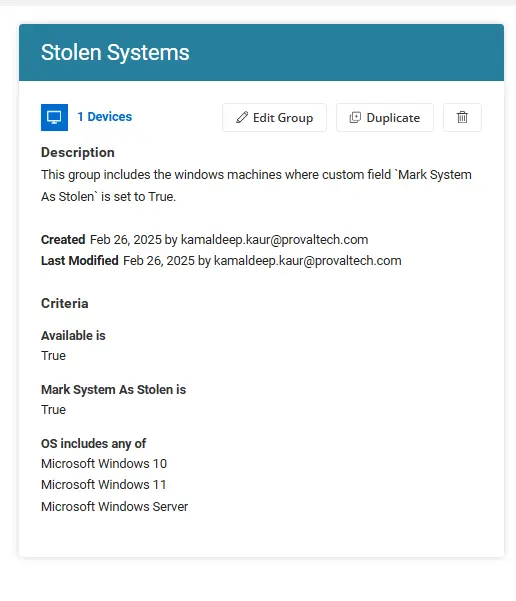

## Summary
This  group includes the windows machines where custom field `Mark System As Stolen` is set to True. This is the part of Lock Stolen System solution.

## Dependencies
[Stolen Systems](/docs/e9b29e34-d570-481f-99db-1a428763c5da)

[Custom Fields](/docs/ff056937-ea5b-48f4-b76d-74566b981da8)

## Group Overview

**Group Type:** Dynamic  
**Group Name:** Stolen Systems 
**Description:** This  group includes the windows machines where custom field  `Mark System As Stolen` is set to True.

## Criteria

- `Mark System As Stolen` should be equal to `True` 
- OS contains any of windows 10,windows 11 and server
- Available should be True.

## Saving the Group

Once the above criteria are met, click the Save button to save the group.

