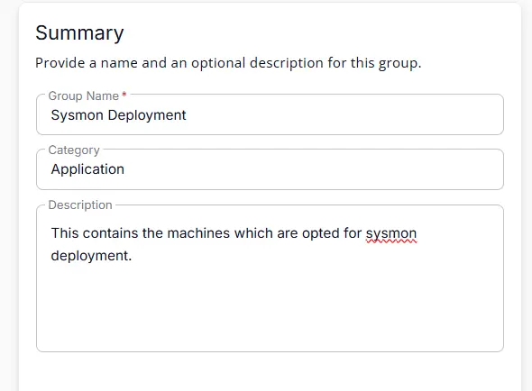
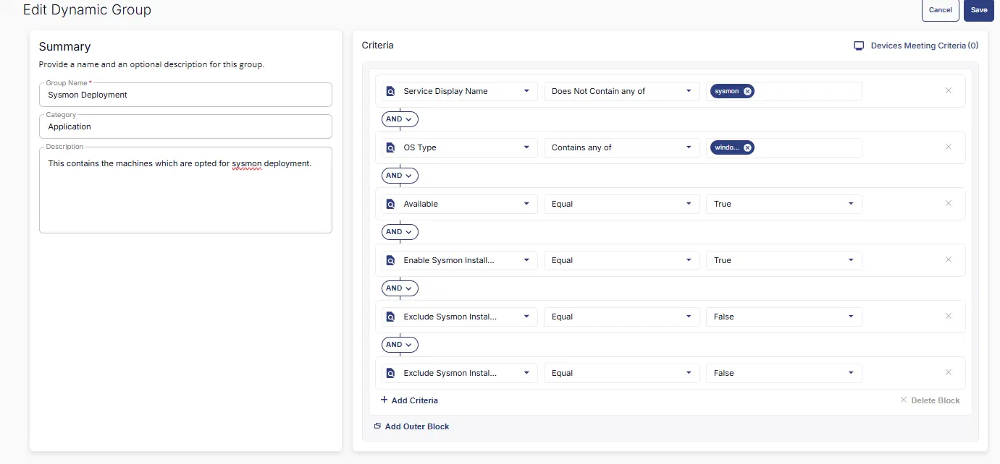

## Summary
Contains the machines which are opted for Sysmon deployment.

## Dependencies

- [Solution - Sysmon Solution ](/docs/2db51f41-1313-46c4-81f1-8c67ed578b73) 

## Group Setup Location

- **Group Path:** `ENDPOINTS` ➞ `Groups`  
- **Group Type:** `Dynamic Group`

## Group Summary

- **Group Name:** `Sysmon Deployment`  
- **Category:** `Application`  
- **Description:** `This contains the machines which are opted for sysmon deployment.`

## Group Criteria

The group is defined by the following **criteria** joined by `AND` condition.

| Criteria Name   | Operator   | Value(s)   |
|------------|--------|-----------|
| Available   | Equal    | `True` |
| OS Type  | Equal    | `Windows` |
| Service Display Name | Does Not Contain any of   | `Sysmon` |
| Enable Sysmon Installation | Does Not Contain any of   | `True` |
| Exclude Sysmon Installation (Site) | Does Not Contain any of   | `False` |
| Exclude Sysmon Installation (Endpoint) | Does Not Contain any of   | `False` |

## Completed Group

## Changelog

### 2026-03-26

- Initial version of the document