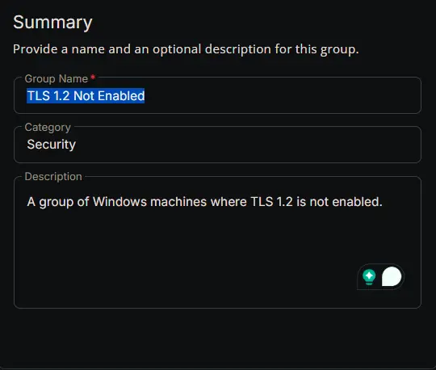
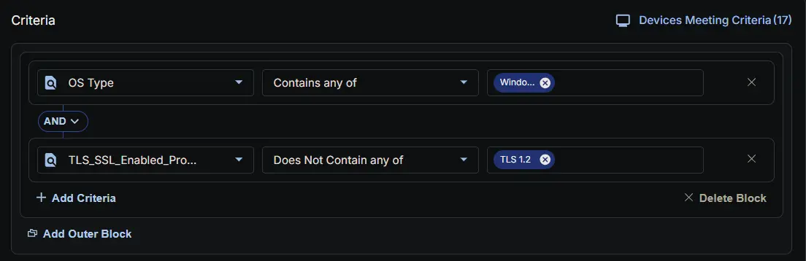
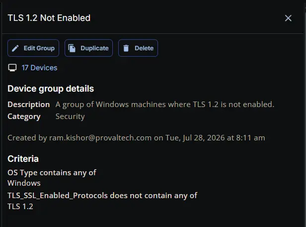

## Summary

A group of Windows machines where TLS 1.2 is not enabled.

## Dependencies

- [Custom Field: TLS_SSL_Enabled_Protocols](/docs/a90fed7d-ec54-429a-a7cf-14a1af8870bb)
- [Task: Enforce TLS/SSL Hardening (TLS 1.2 Upgrade)](/docs/79112007-ac74-4fde-97f5-59d56dbe0282)
- [Solution: TLS/SSL Security Hardening](/docs/13ac3912-863b-41fe-bb61-dfd681f06fa8)

## Group Setup Location

- **Group Path:** `ENDPOINTS` ➞ `Groups`  
- **Group Type:** `Dynamic Group`

## Group Summary

- **Group Name:** `TLS 1.2 Not Enabled`  
- **Category:** `Security`  
- **Description:** `A group of Windows machines where TLS 1.2 is not enabled.`

## Group Criteria

The group is defined by the following **criteria** joined by `AND` condition.

| Criteria Name          | Operator        | Value(s)                                 |
|-----------------------|-----------------|-------------------------------------------|
| OS Type  | Contains any of    | `Windows` |
| TLS_SSL_Enabled_Protocols | Does Not Contain any of | `TLS 1.2` |

## Completed Group

## Changelog

### 2026-07-28

- Initial version of the document
