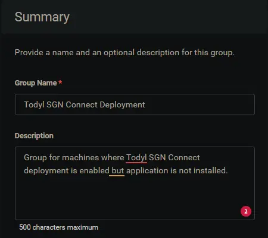
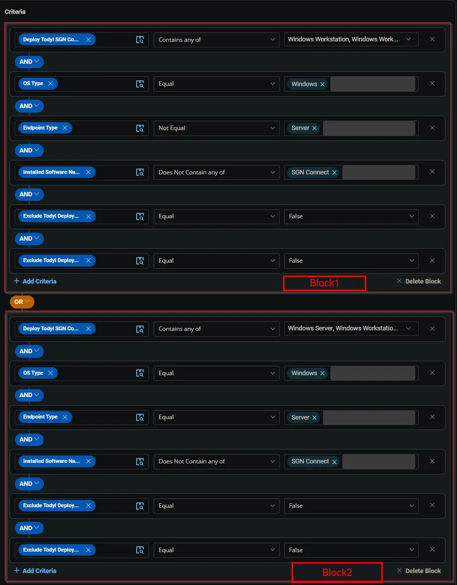
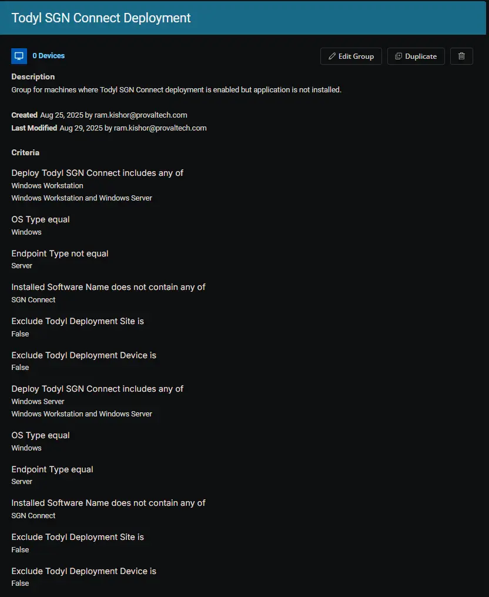

## Summary

Group for machines where Todyl SGN Connect deployment is enabled but application is not installed.

## Dependencies

- [Deploy Todyl SGN Connect](/docs/e21d58b1-9fd5-4888-9e1f-788420313237)
- [Exclude Todyl Deployment Device](/docs/ee6d7b42-0783-422a-a820-8ef36aab0713)
- [Exclude Todyl Deployment Site](/docs/b4d717f5-38fe-4eac-83d4-d1cb88e7fe9d)
- [Solution: Todyl SGN Connect Deployment](/docs/41308550-ea69-4cca-aa0d-9e6f02fcab43)

## Group Setup Location

- **Group Path:** `ENDPOINTS` ➞ `Groups`  
- **Group Type:** `Dynamic Group`

## Group Summary

- **Group Name:** `Todyl SGN Connect Deployment`  
- **Description:** `Group for machines where Todyl SGN Connect deployment is enabled but application is not installed.`  

## Group Criteria

The group is defined by the following **criteria blocks**, joined by an **OR**. Each block uses **AND** logic between its conditions.

| Block | Criteria Name          | Operator        | Value(s)                                 |
|-------|-----------------------|-----------------|-------------------------------------------|
| 1     | Deploy Todyl SGN Connect | Contains any of | `Windows Workstation`, `Windows Workstation and Windows Server` |
| 1     | OS Type                | Equal           | `Windows`                                   |
| 1     | Endpoint Type          | Not Equal       | `Server`                                    |
| 1     | Installed Software Name | Does Not Contain any of | `SGN Connect` |
| 1     | Exclude Todyl Deploy Device | Equal           | `False`                                     |
| 1     | Exclude Todyl Deploy Site | Equal           | `False`                                     |
| 2     | Deploy Todyl SGN Connect | Contains any of | `Windows Server`, `Windows Workstation and Windows Server` |
| 2     | OS Type                | Equal           | `Windows`                                   |
| 2     | Endpoint Type          | Equal           | `Server`                                    |
| 2     | Installed Software Name | Does Not Contain any of | `SGN Connect` |
| 2     | Exclude Todyl Deploy Device | Equal           | `False`                                     |
| 2     | Exclude Todyl Deploy Site | Equal           | `False`                                     |

- **Block 1:** Targets Windows Workstations (not servers)
- **Block 2:** Targets Windows Servers

**Logic:**  
A machine joins the group if it meets ALL criteria in Block 1 OR ALL criteria in Block 2.

## Completed Group

