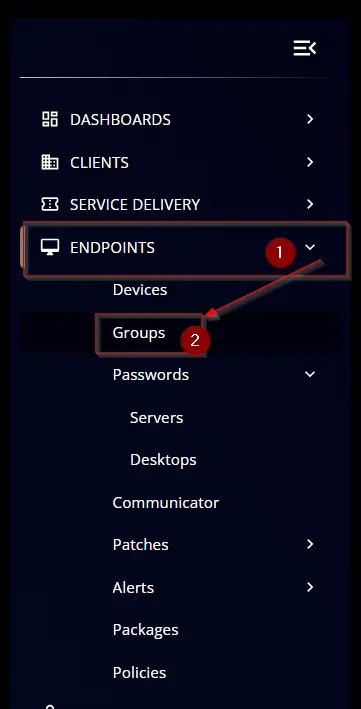
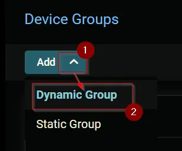
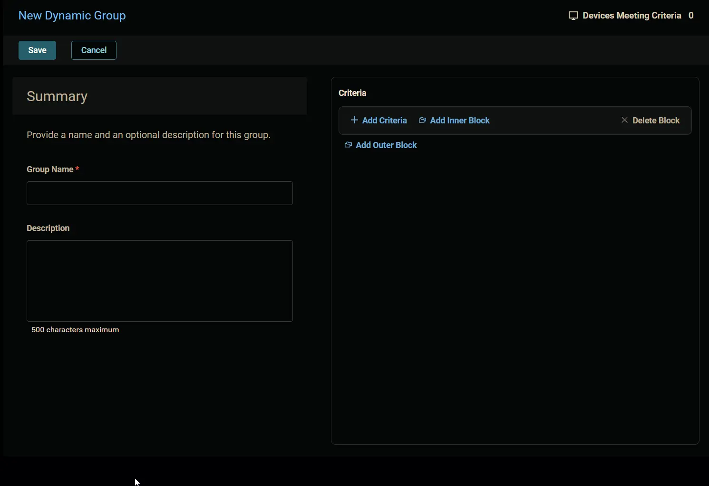
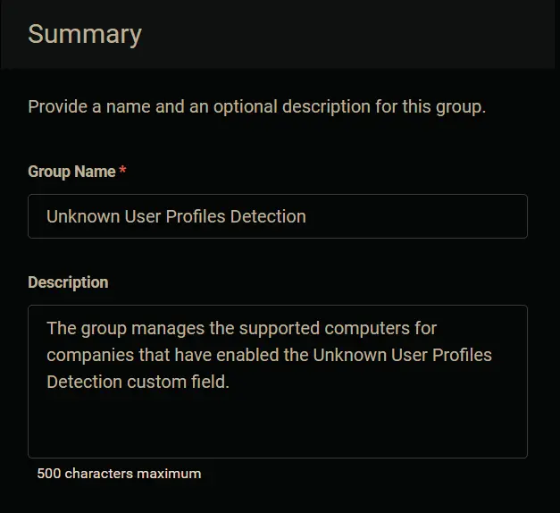
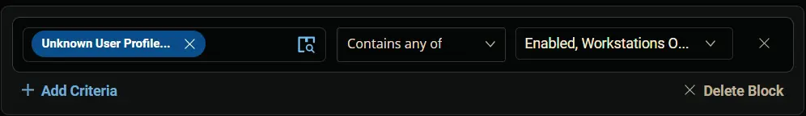
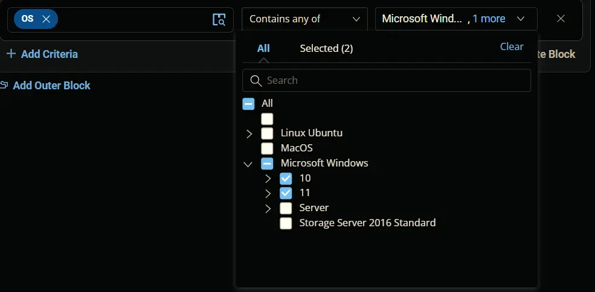
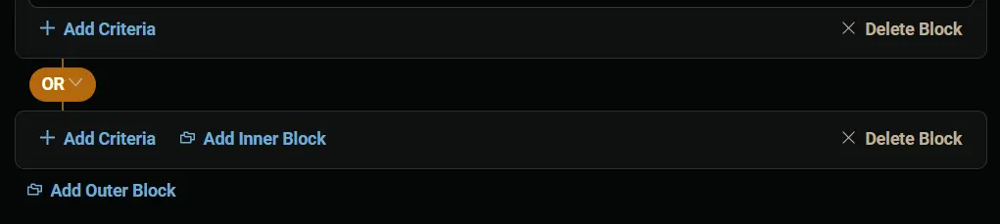
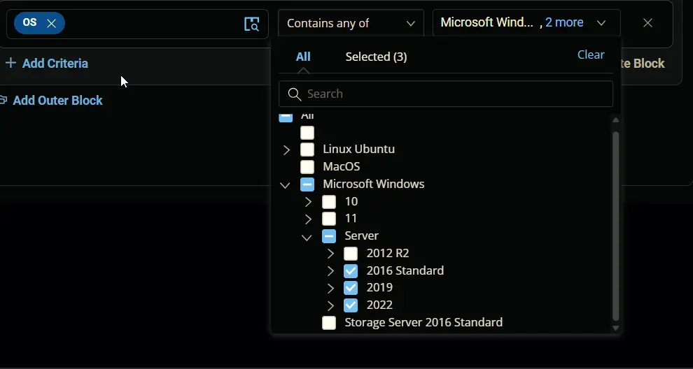
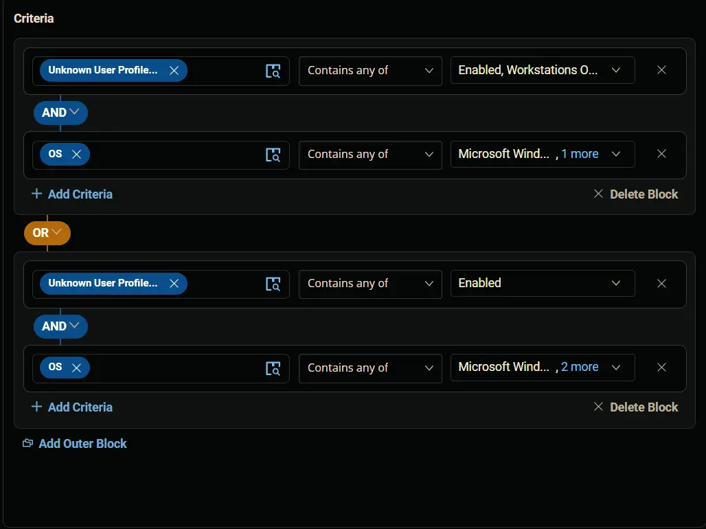
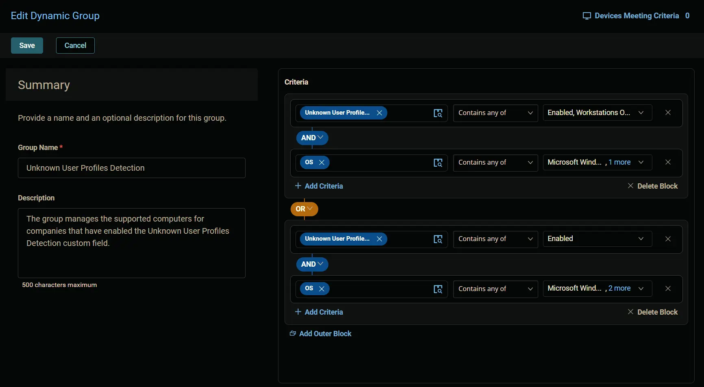

## Summary

The group manages the supported computers for companies that have enabled the [Unknown User Profiles Detection](/docs/a7ba6a52-18ae-4c71-8545-5a41999fa41b) custom field.

## Dependencies

[Unknown User Profiles Detection](/docs/a7ba6a52-18ae-4c71-8545-5a41999fa41b)

## Details

| Name | Type  | Description |
| ------ | ------ | ----------- |
| Unknown User Profiles Detection | Dynamic  | The group manages the supported computers for companies that have enabled the Unknown User Profiles Detection custom field. |

## Group Creation

### Step 1

Navigate to `Endpoints` > `Groups`

### Step 2

Click the `Add` button and select the `Dynamic Group` option.

The following screen will appear:

### Step 3

#### Summary

Fill in the summary as follows:

**Group Name:** `Unknown User Profiles Detection`

**Description:** `The group manages the supported computers for companies that have enabled the Unknown User Profiles Detection custom field.`

### Step 4

#### Criteria

**Condition 1:**

- Click the `+ Add Criteria` button.
- Search and select the `Unknown User Profiles Detection` custom field.
- Select the `Contains any of` operator.
- Select the `Enabled`, and `Workstations Only` options from the dropdown menu.

 **Condition:** `Unknown User Profiles Detection` `Contains any of` `Enabled`, `Workstations Only` 

**Condition 2:**

- Click the `+ Add Criteria` button.
- Search and select the `OS` condition.
- Select the `Contains any of` operator.
- Select `Microsoft Windows` **>>** `10`, and `11` from the dropdown menu.

 **Condition:** `OS` `Contains any of` `Microsoft Windows 10`, `Microsoft Windows 11` 

**Condition 3:**

- Click the `Add Outer Block` button.
- Change the comparator to `OR`.

**Condition 4:**

- Click the `+ Add Criteria` button inside the outer block.
- Search and select the `Unknown User Profiles Detection` custom field.
- Select the `Contains any of` operator.
- Select the `Enabled` option from the dropdown menu.

 **Condition:** `Unknown User Profiles Detection` `Contains any of` `Enabled` 

**Condition 5:**

- Click the `+ Add Criteria` button inside the outer block.
- Search and select the `OS` condition.
- Select the `Contains any of` operator.
- Select `Microsoft Windows` **>>** `Server` **>>** `2016`, `2019`, and `2022` from the dropdown menu.
- Select `2016` and newer servers.

 **Condition:** `OS` `Contains any of` `Microsoft Windows Server 2016`, `Microsoft Windows Server 2019`, `Microsoft Windows Server 2022`

### Step 5

Review the `Criteria` section. This is how the completed criteria section will look: 

### Step 6

Click the `Save` button to save the group.

## Completed Group

