## Summary

This document houses the computers where the Windows 11 Installer (Beta) task has been executed but have not rebooted since then.

## Dependencies

- [CW RMM - Custom Field - Company - Enable Windows 11 Installation](/docs/2567ed9c-49da-40f2-b566-9d6e8d2f87b8)
- [CW RMM - Custom Field - Site - Exclude Windows 11 Installation](/docs/bb84e821-38c5-4b39-ad4c-894eef47bf79)
- [CW RMM - Custom Field - Endpoint - Exclude Windows 11 Installation](/docs/c3f83443-09cb-43ef-9c21-501d7f13314e)
- [CW RMM - Custom Field - Endpoint - Windows 11 Compatible](/docs/99719e54-ce8f-4b76-93f4-cc832a3b88cf)
- [CW RMM - Task - Windows 11 Compatibility Validation](/docs/676de0c3-b6a2-4a82-bf87-6d00395a7dff)

## Group Creation

1. Navigate to `Devices` > `Device Groups`.  
   

2. Create a new dynamic group by clicking the `Dynamic Group` button.  
     

   This page will appear after clicking on the `Dynamic Group` button:  
   

3. Set the group name to `Upgrade Enabled Windows 11 Compatible Machines`.  
   Description: `A group of Windows 10 machines that are compatible with Windows 11 installation and upgrade has been enabled through the custom fields.`  
   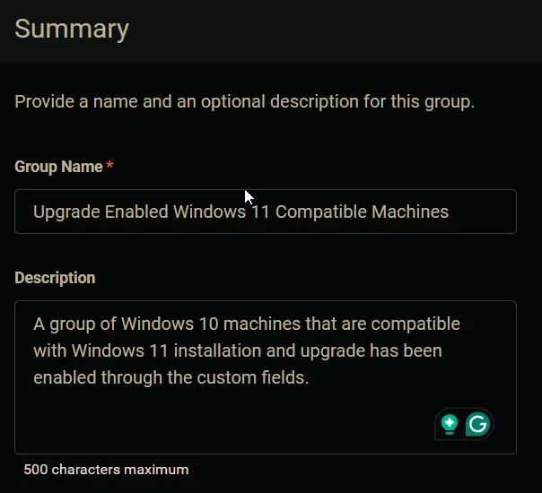

4. Click the `+ Add Criteria` in the `Criteria` section of the group.  
   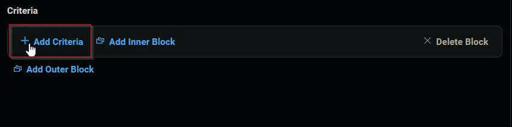  
   This search box will appear.  
   

5. Search and select the `Enable Windows 11 Installation` custom field from the search box.  
   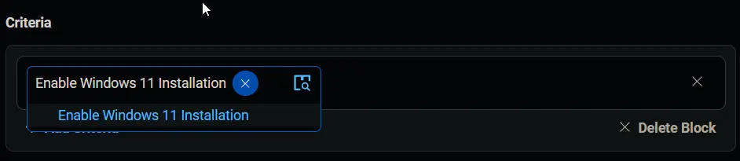  
   Set `True` in the comparison condition.  
   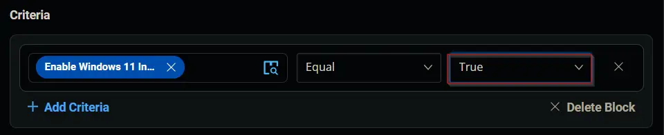  
   **Condition:** `Enable Windows 11 Installation` `Equal` `True`

6. Click the `+ Add Criteria` button.  
   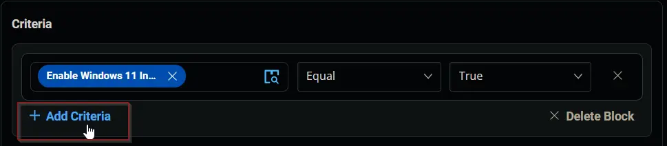  
   A new search box will appear.  
   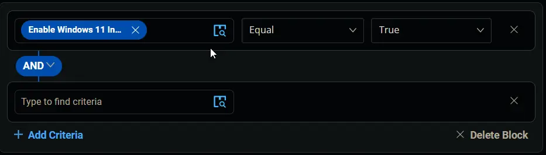  

   Search and select the `Exclude Windows 11 Installation` custom field from the search box. There are two custom fields with the same name. Select the site-level custom field in this step.  
   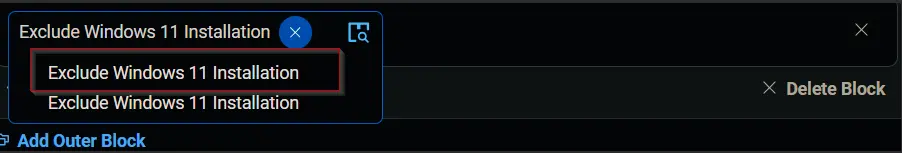  
   Set `False` in the comparison condition.  
   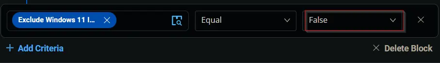  
   **Condition:** `Exclude Windows 11 Installation` `Equal` `False`

7. Click the `+ Add Criteria` button.  
     
   A new search box will appear.  
   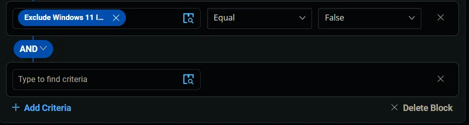  

   Search and select the `Exclude Windows 11 Installation` custom field from the search box. There are two custom fields with the same name. Select the computer-level custom field in this step.  
     
   Set `False` in the comparison condition.  
     
   **Condition:** `Exclude Windows 11 Installation` `Equal` `False`

8. Click the `+ Add Criteria` button.  
     
   A new search box will appear.  
     

   Search and select the `OS` criteria.  
   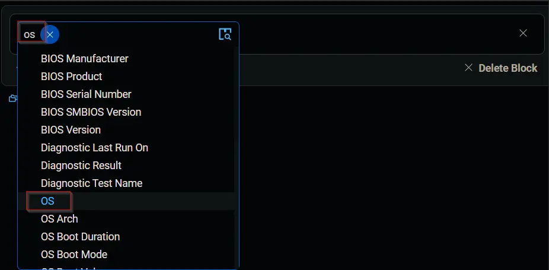  
   Select `Microsoft Windows 10` in the comparison condition.  
   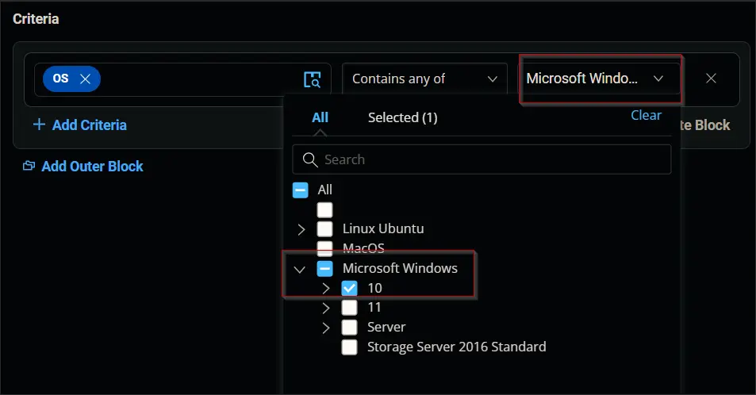  
   **Condition:** `OS` `Contains any of` `Microsoft Windows 10`

9. Click the `+ Add Criteria` button.  
   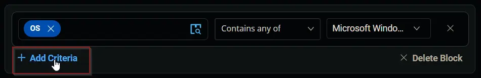  
   A new search box will appear.  
   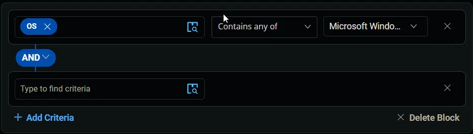  

   Search and select the `Windows 11 compatible` custom field from the search box.  
   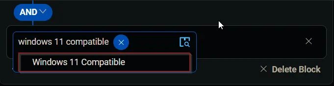  
   Set `Yes` in the comparison condition.  
   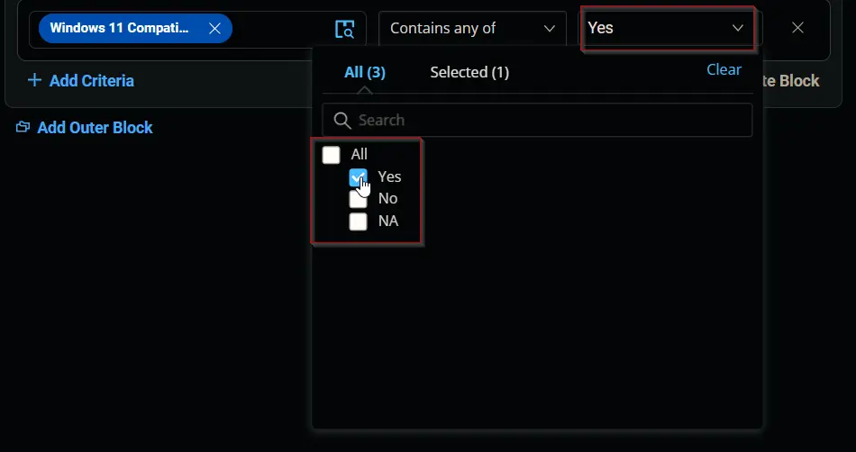  
   **Condition:** `Windows 11 Compatible` `Contains any of` `Yes`

10. Click the `Save` button to save/create the group.  
    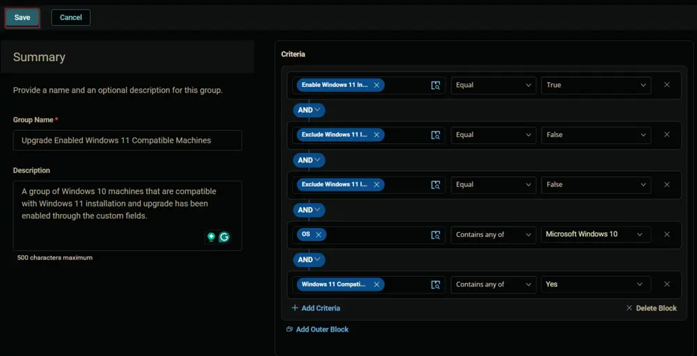

## Completed Group

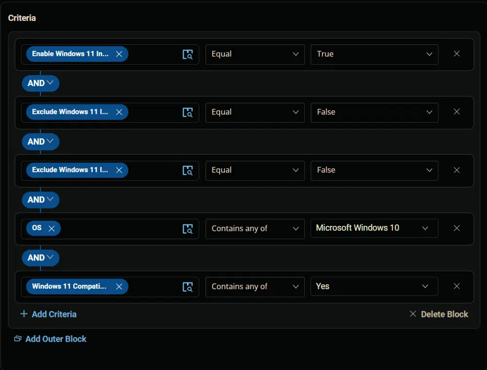  
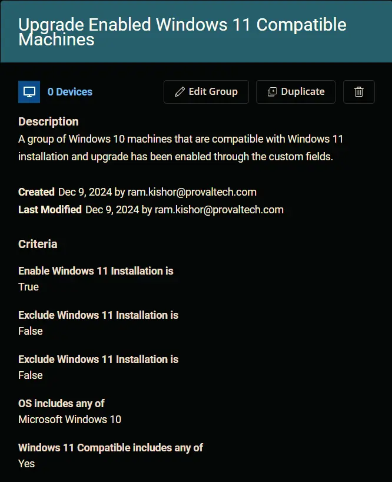