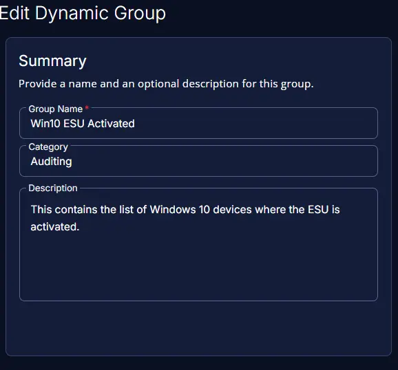
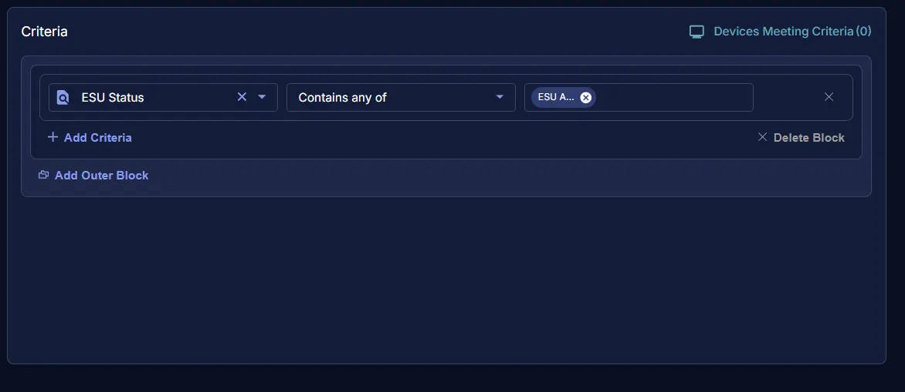
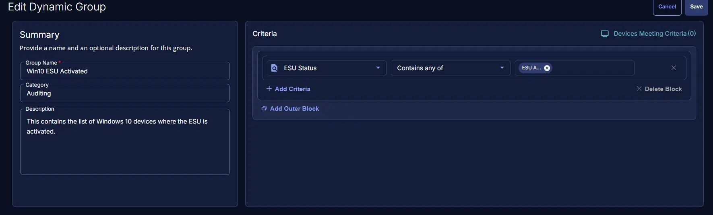

## Summary
This contains the list of Windows 10 devices where the ESU is activated.

## Dependencies

- [Task - ESU License Activation Detection](/docs/fad37673-34ab-46e9-8797-b87058f79faa) 
- [Solution - Windows 10 ESU Licensing and Auditing](/docs/a7e4073e-1f09-4772-aa5e-ee44cf9bf9e7)

## Group Creation

### Step 1

Navigate to `ENDPOINTS` ➞ `Groups`  

### Step 2

Create a new dynamic group by clicking the `Dynamic Group` button.  

This page will appear after clicking on the `Dynamic Group` button:  

### Step 3

- **Group Name:** `Win10 ESU Activated`   
- **Category:** `Auditing`  
- **Description:** `This contains the list of Windows 10 devices where the ESU is activated.`

### Step 4

Click the `+ Add Criteria` in the `Criteria` section of the group.  

This search box will appear:  

- `ESU Status` Contains any of `ESU Activated`

## Completed Group

## Changelog

### 2026-02-04

- Initial version of the document
