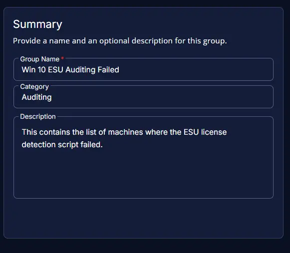
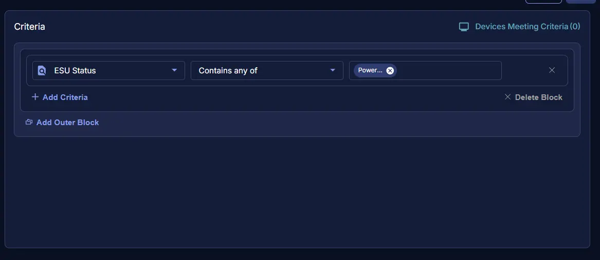
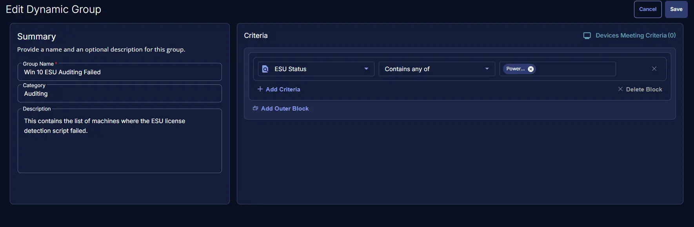

## Summary
This contains the list of machines where the ESU license detection script failed.

## Dependencies

- [Task : ESU License Activation Detection](/docs/fad37673-34ab-46e9-8797-b87058f79faa) 
- [Solution - Windows 10 ESU Licensing and Auditing](/docs/a7e4073e-1f09-4772-aa5e-ee44cf9bf9e7)

## Group Creation

### Step 1

Navigate to `ENDPOINTS` ➞ `Groups`  

### Step 2

Create a new dynamic group by clicking the `Dynamic Group` button.  

This page will appear after clicking on the `Dynamic Group` button:  

### Step 3

**Group Name:** `Win 10 ESU Auditing Failed`   
**Category:** `Auditing`  
**Description:** `This contains the list of machines where the ESU license detection script failed.`

### Step 4

Click the `+ Add Criteria` in the `Criteria` section of the group.  

This search box will appear:  

- `ESU Status` Contains any of `Powershell Failure`

## Completed Group

