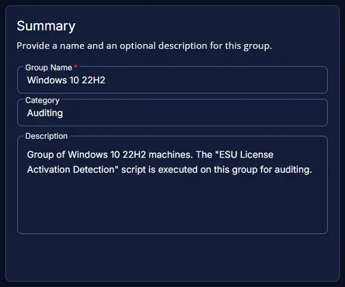
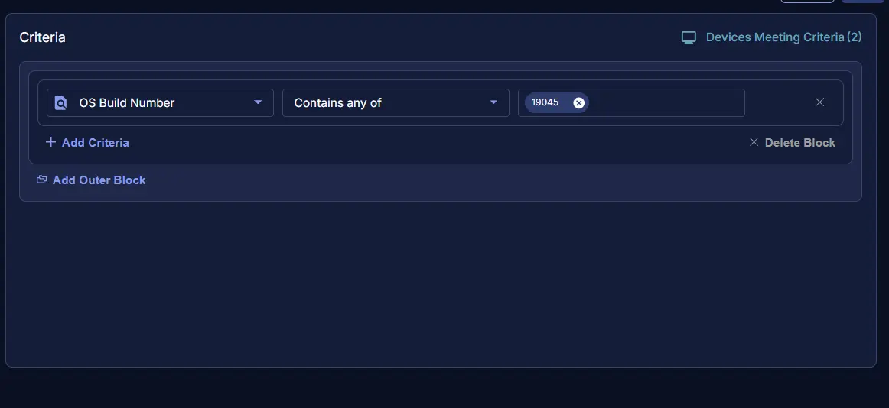
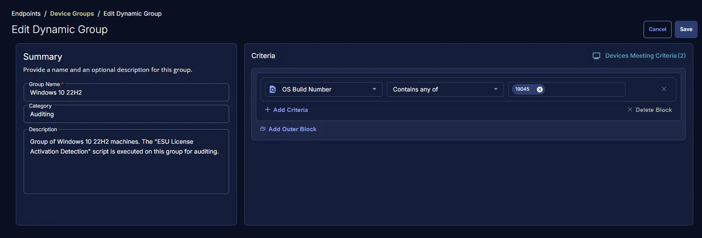

## Summary
This group contains Windows 10 22H2 machines. The [ESU License Activation Detection](/docs/fad37673-34ab-46e9-8797-b87058f79faa) script is executed on this group for auditing.

## Dependencies

- [Solution - Windows 10 ESU Licensing and Auditing](/docs/a7e4073e-1f09-4772-aa5e-ee44cf9bf9e7)

## Group Creation

### Step 1

Navigate to `ENDPOINTS` ➞ `Groups`  

### Step 2

Create a new dynamic group by clicking the `Dynamic Group` button.  

This page will appear after clicking on the `Dynamic Group` button:  

### Step 3

- **Group Name:** `Windows 10 22H2` 
- **Category:** `Auditing`  
- **Description:** `Group of Windows 10 22H2 machines. The "ESU License Activation Detection" script is executed on this group for auditing.`

### Step 4

Click the `+ Add Criteria` in the `Criteria` section of the group.  

This search box will appear:  

- `OS Build Number` Contains any of `19045`

## Completed Group

## Changelog

### 2026-02-04

- Initial version of the document
