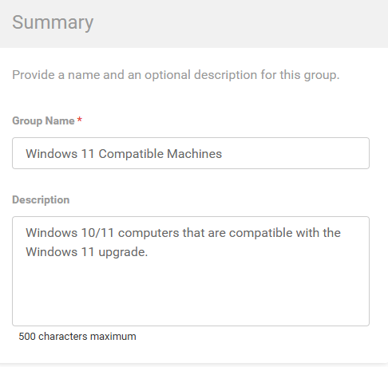
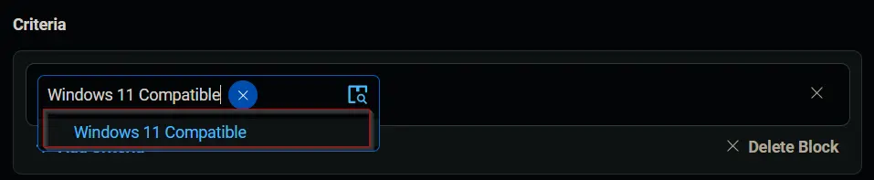
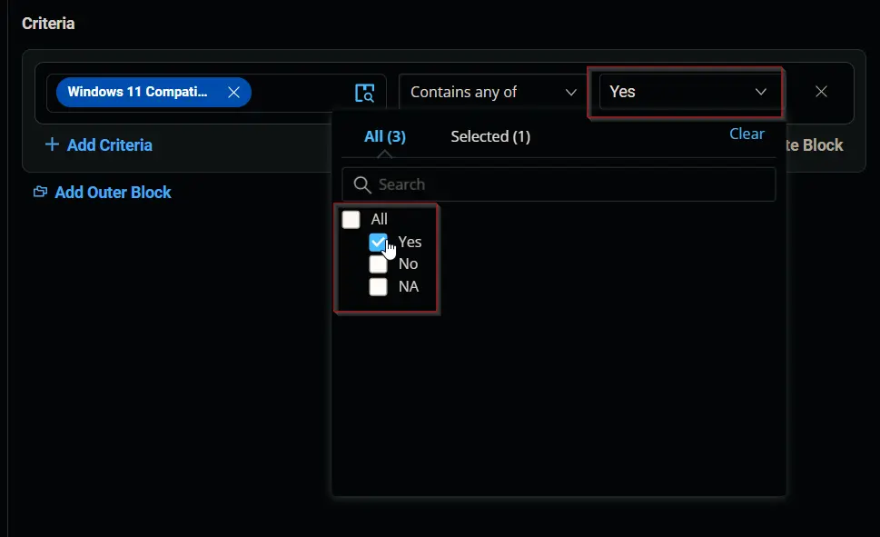
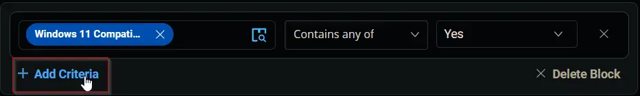
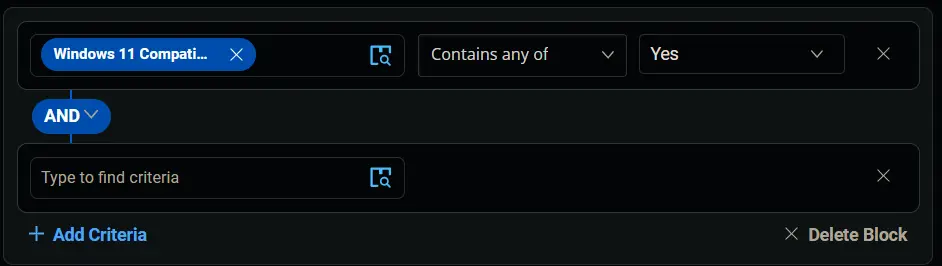
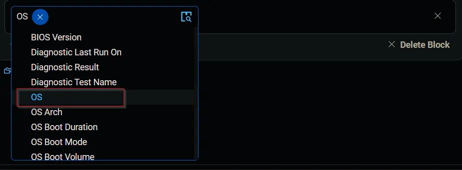
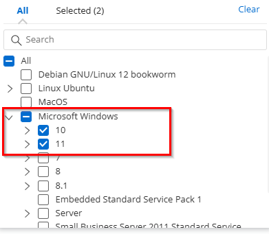
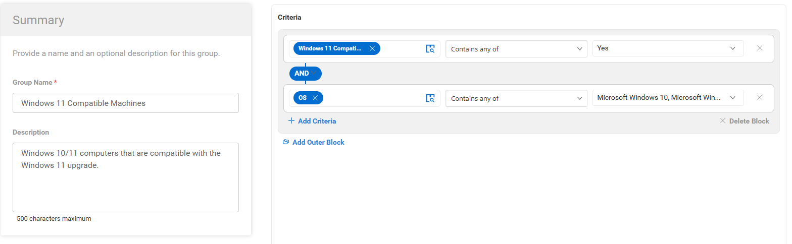
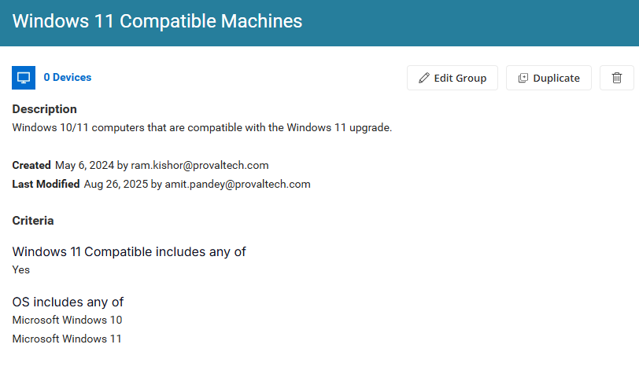

## Summary

This document describes how to identify Windows 10/11 computers that are compatible with the Windows 11 upgrade.

## Dependencies

[CW RMM - Custom Field - Endpoint - Windows 11 Compatible](/docs/99719e54-ce8f-4b76-93f4-cc832a3b88cf)

## Group Creation 

1. Navigate to `Devices` > `Device Groups`.
   
   

2. Create a new dynamic group by clicking the `Dynamic Group` button.  
     
   This page will appear after clicking the `Dynamic Group` button:  
   

3. Set Group Name and Description
   - Group name: `Windows 11 Compatible Machines`.  
   - Description:  `Windows 10/11 computers that are compatible with the Windows 11 upgrade.`  
   

4. Click the `+ Add Criteria` in the `Criteria` section of the group.  
     
   This search box will appear.  
   

5. Search and select the `Windows 11 compatible` custom field from the search box.  
     
   Set `Yes` in the comparison condition.  
     
   - **Condition:** `Enable Windows 11 Compatible` `Contains any of` `Yes`

6. Click the `+ Add Criteria` button.  
     

   A new search box will appear.  

     

   Search and select the `OS` criteria.  

    

   Select `Microsoft Windows 10` and `Microsoft Windows 11` in the comparison condition. 

    
  
   - **Condition:** `OS` `Contains any of` `Microsoft Windows 10` and `Microsoft Windows 11`

7. Click the `Save` button to save/create the group.  
   

## Completed Group 
 
