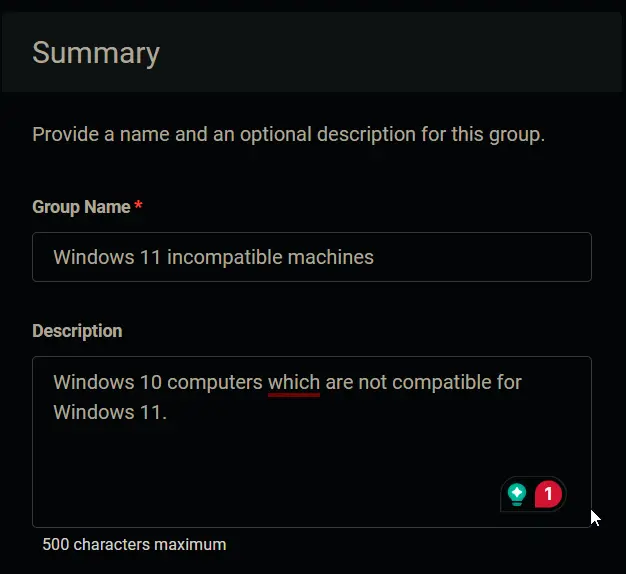
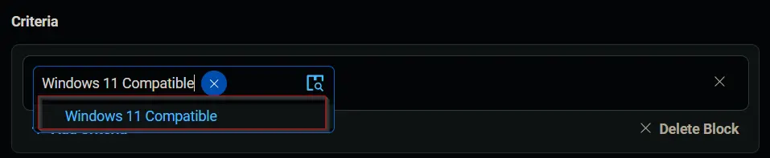
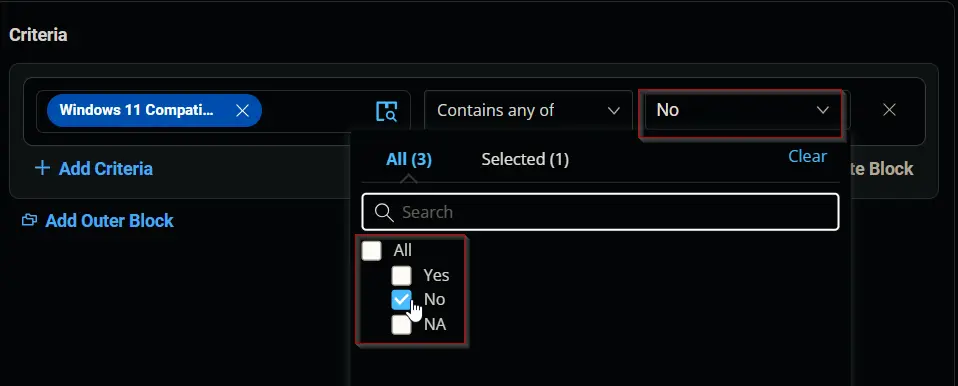
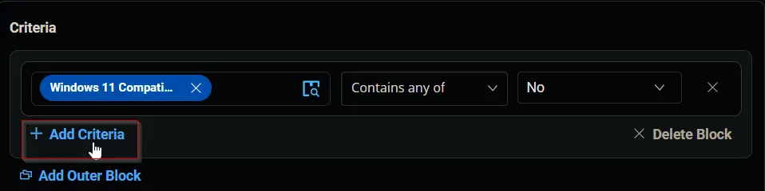
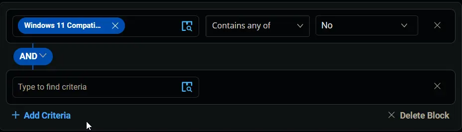
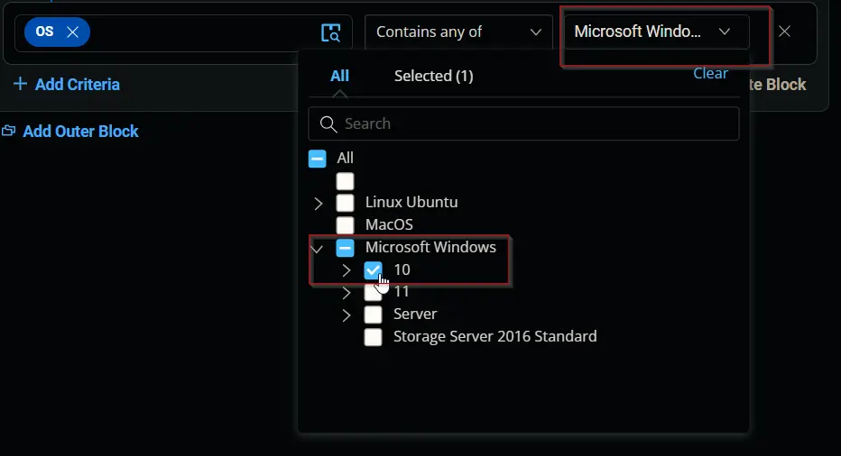
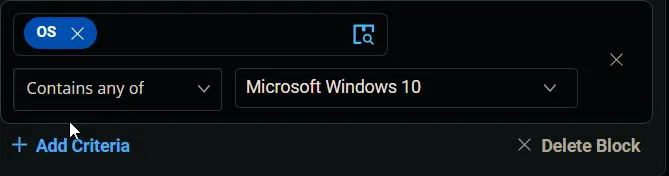
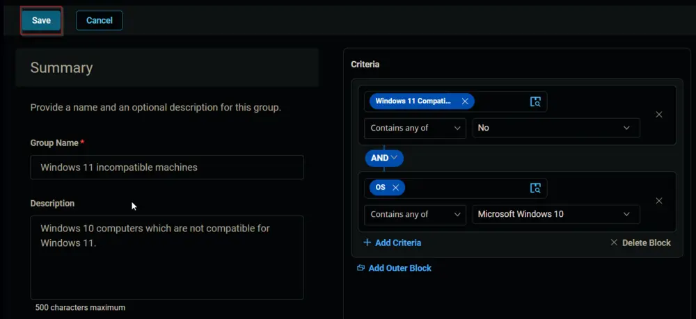
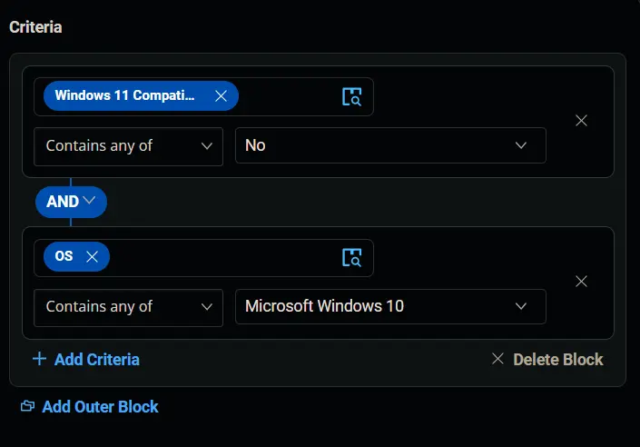
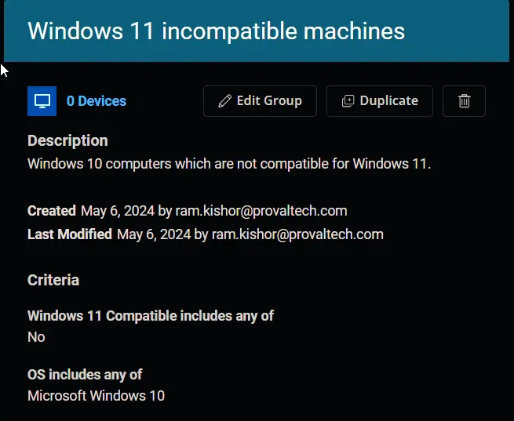

## Summary

This document describes how to identify Windows 10 computers that are not compatible with Windows 11.

## Dependencies

[CW RMM - Custom Field - Endpoint - Windows 11 Compatible](/docs/99719e54-ce8f-4b76-93f4-cc832a3b88cf)

## Group Creation

Navigate to `Devices` > `Device Groups`.

### 1. Create a Dynamic Group

Create a new dynamic group by clicking the `Dynamic Group` button.

This page will appear after clicking on the `Dynamic Group` button:

### 2. Set Group Name and Description

Set the group name to `Windows 11 incompatible machines`.  
Description: `Windows 10 computers which are not compatible with Windows 11.`

### 3. Add Criteria

Click the `+ Add Criteria` button in the `Criteria` section of the group.

This search box will appear.

### 4. Select Custom Field

Search and select the `Windows 11 compatible` custom field from the search box.

Set `No` in the comparison condition.

**Condition:** `Enable Windows 11 Compatible` `Contains any of` `No`

### 5. Add Additional Criteria

Click the `+ Add Criteria` button.

A new search box will appear.

Search and select the `OS` criteria.

Select `Microsoft Windows 10` in the comparison condition.

  

**Condition:** `OS` `Contains any of` `Microsoft Windows 10`

### 6. Save the Group

Click the `Save` button to save/create the group.

## Completed Group

  
