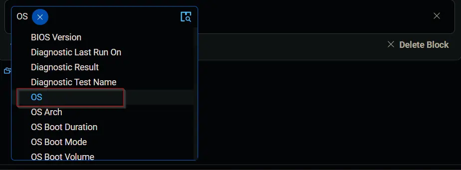

## Summary

This document outlines the process for creating a dynamic group specifically for Windows 11 machines.

## Group Creation

1. Navigate to `Devices` > `Device Groups`.
   
   

2. Create a new dynamic group by clicking the `Dynamic Group` button.  
     
   The following page will appear after clicking the `Dynamic Group` button:  
   

3. Set the group name to `Windows 11 Machines`.  
   Description: `Windows 11 Machines`  
  

4. Click the `+ Add Criteria` button in the `Criteria` section of the group.  
     
   The following search box will appear.  
   

5. Search for and select the `OS` criteria.  
     
   Select `Microsoft Windows 11` in the comparison condition.  
   
   
   **Condition:** `OS` `Contains any of` `Microsoft Windows 11`

   Click the `Save` button to save/create the group.  

## Completed Group

