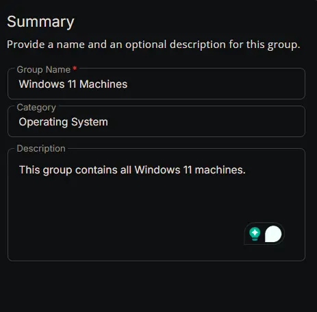
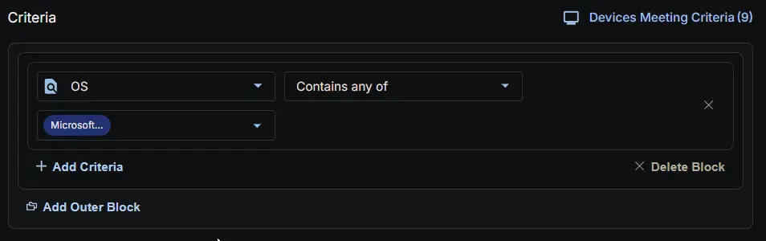
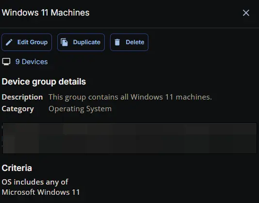

## Summary

This group contains all Windows 11 machines.

## Dependencies

- [Solution: Manage Feature Update Deferral](/docs/800f96cd-5e64-48dd-bb9a-f17822db38e8)

## Group Setup Location

- **Group Path:** `ENDPOINTS` ➞ `Groups`  
- **Group Type:** `Dynamic Group`

## Group Summary

- **Group Name:** `Windows 11 Machines`  
- **Category:** `Operating System`  
- **Description:** `This group contains all Windows 11 machines.`

## Group Criteria

The group is defined by the following **criteria block**. The block uses **AND** logic between its conditions.

| Block | Criteria Name          | Operator        | Value(s)                                 |
|-------|-----------------------|-----------------|-------------------------------------------|
| 1     | OS         | Contains any of | `Microsoft Windows 11` |

- **Block 1:** Targets Windows 11 machines where the company-level custom field "Days to Defer Feature Updates" is not empty.

**Logic:**  
A machine matches the group if it meets ALL criteria in Block 1.

## Completed Group

## Changelog

### 2026-03-11

- Initial version of the document
