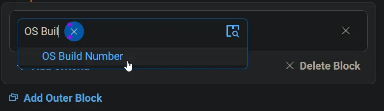
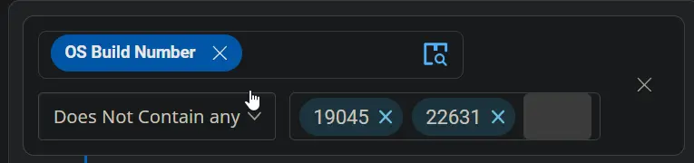
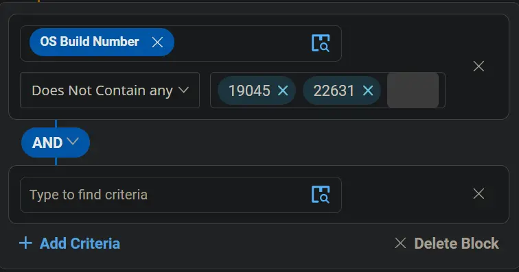
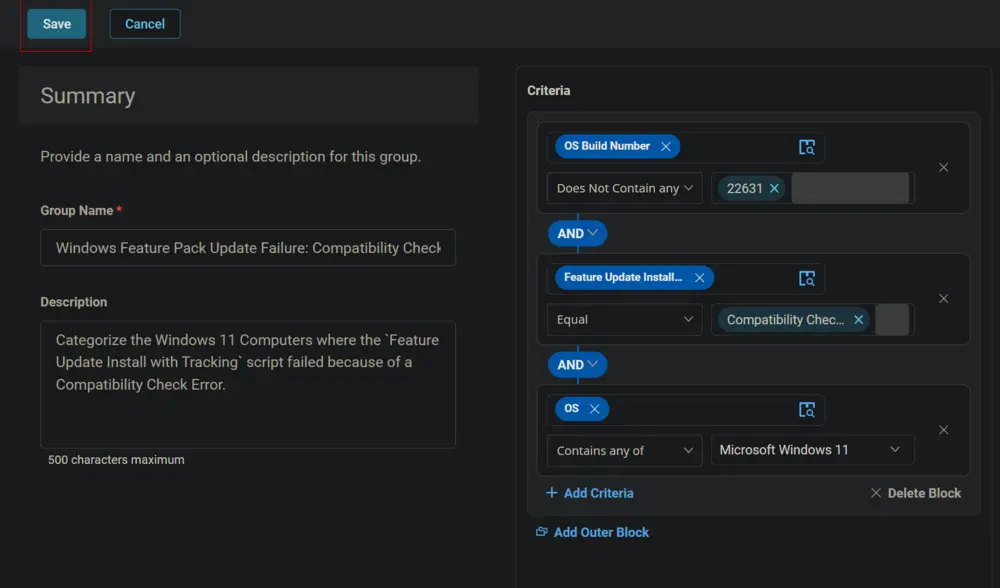
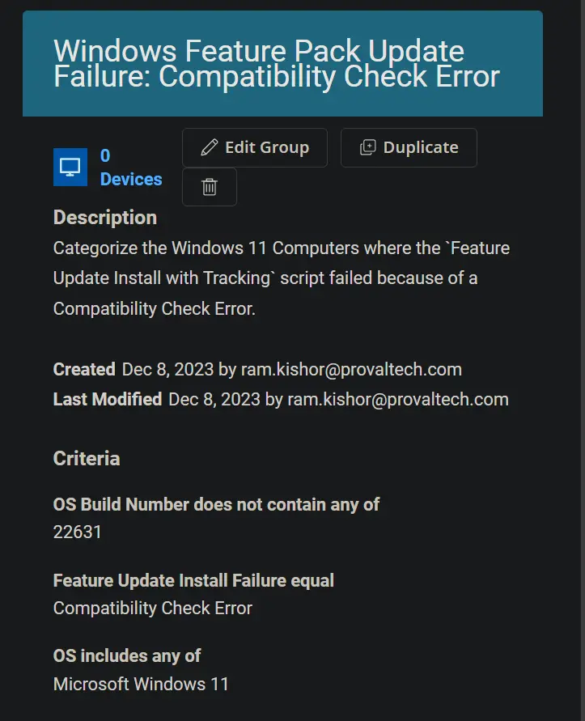

## Summary

This document categorizes Windows 11 computers where the `Feature Update Install with Tracking` script failed due to a Compatibility Check Error.

## Dependencies

- [CW RMM - Task - Feature Update Install With Tracking](/docs/5244ac77-6926-4902-a183-b4b2aac18e2b)
- [CW RMM - Custom Field - Feature Update Install Failure](/docs/1c9abaeb-17f0-4a3b-86ee-953b5b713dc3)

## Criteria

- Select `OS Build Number` for the Criteria `Does Not Contain any` for the comparator and type `22631` in the condition box.

    
    
    
  

- Click the `Add Criteria` button to add another criterion.

  

- Select the `Feature Update Install Failure` custom field for criteria, `Equal` for the comparator, and type `Compatibility Check Error` in the condition box.

## Group Type: Dynamic

## Group Name: Windows Feature Pack Update Failure: Compatibility Check Error

Click the `Save` button to save the group.

## Group

Click the `Save` button to save the group.

