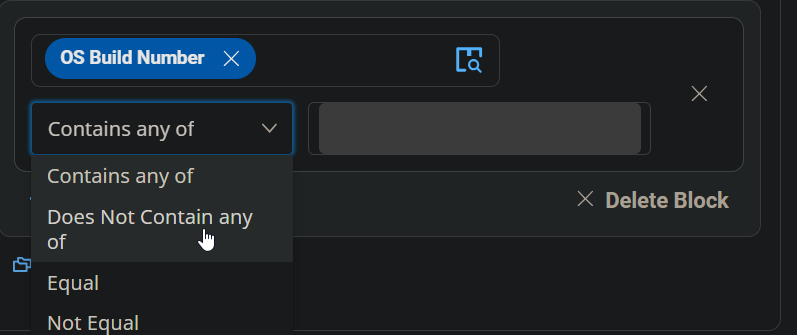
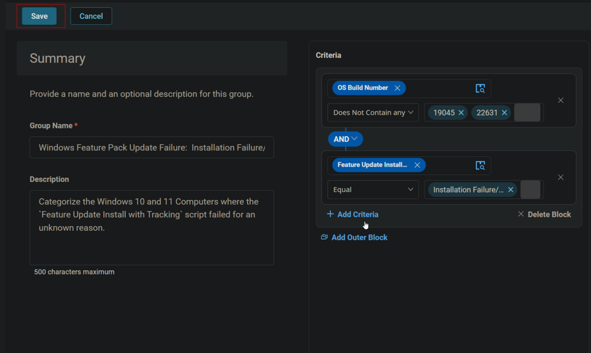

## Summary
This document categorizes Windows 10 and 11 computers where the `Feature Update Install with Tracking` script failed for an unknown reason.

## Dependencies
- [CW RMM - Task - Feature Update Install With Tracking](/docs/5244ac77-6926-4902-a183-b4b2aac18e2b)  
- [CW RMM - Custom Field - Feature Update Install Failure](/docs/1c9abaeb-17f0-4a3b-86ee-953b5b713dc3)

## Criteria
1. Select `OS Build Number` for the criteria, set the comparator to `Does Not Contain any`, and type `19045` and `22631` in the condition box.  
     
     
     
   

2. Click the `Add Criteria` button to add another criterion.  
   

3. Select the `Feature Update Install Failure` custom field for criteria, set the comparator to `Equal`, and type `Installation Failure/Error` in the condition box.

## Group
Click the `Save` button to save the group.  
  

