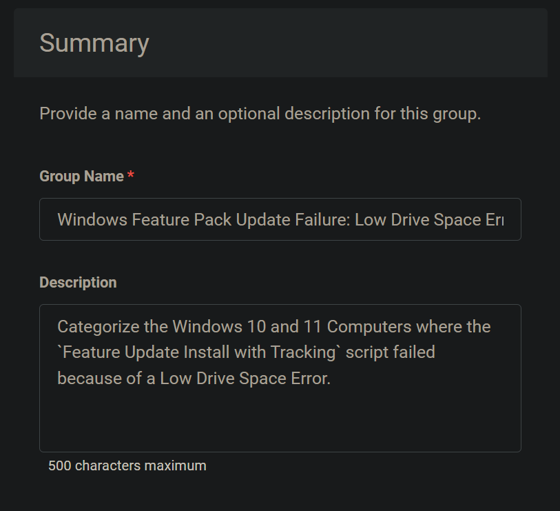
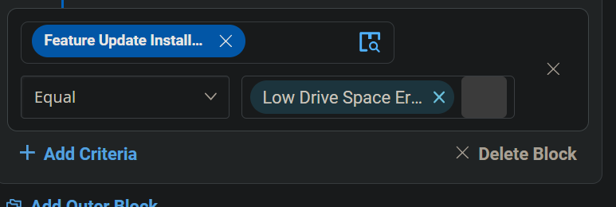
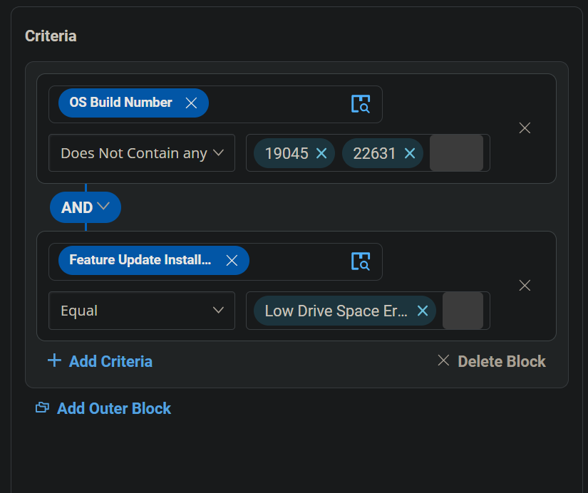
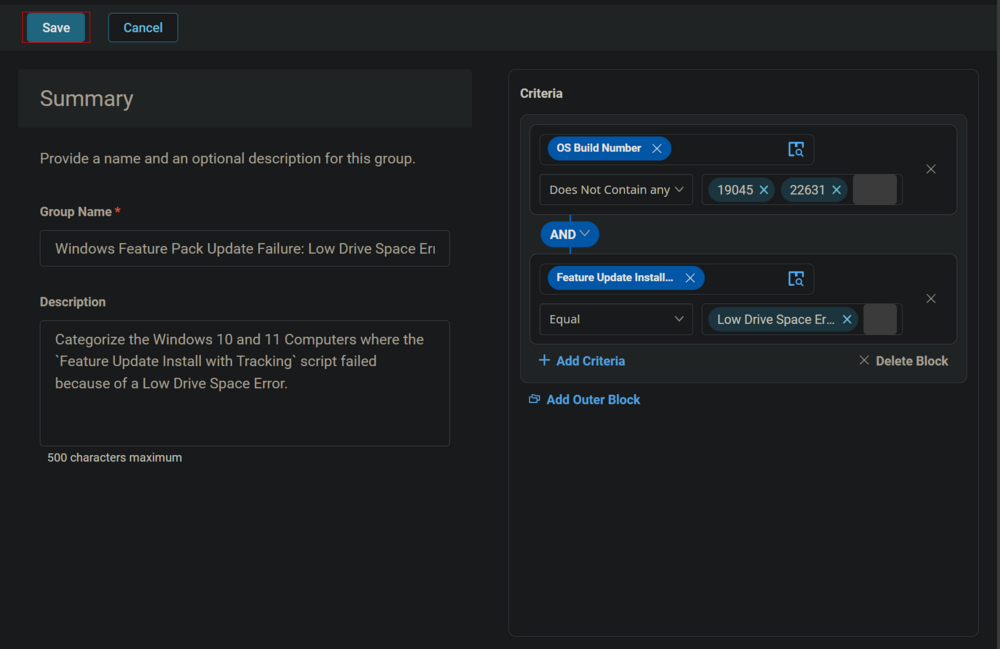
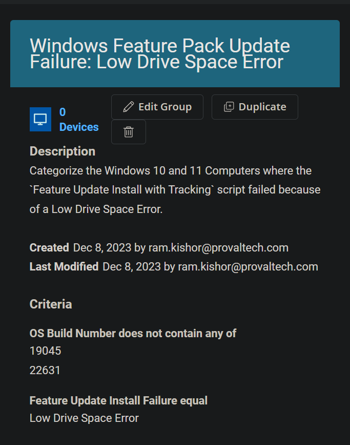

## Summary

This document categorizes Windows 10 and 11 computers where the `Feature Update Install with Tracking` script failed due to a Low Drive Space Error.

## Dependencies

- [CW RMM - Task - Feature Update Install With Tracking](/docs/5244ac77-6926-4902-a183-b4b2aac18e2b)  
- [CW RMM - Custom Field - Feature Update Install Failure](/docs/1c9abaeb-17f0-4a3b-86ee-953b5b713dc3)

## Summary

  
**Group Type:** Dynamic Group  
**Group Name:** Windows Feature Pack Update Failure: Low Drive Space Error  

**Description:**  
Categorize Windows 10 and 11 computers where the `Feature Update Install with Tracking` script failed due to a Low Drive Space Error.

## Criteria

1. Select `OS Build Number` for the criteria, choose `Does Not Contain any` for the comparator, and type `19045` and `22631` in the condition box.  
     
     
     
     

2. Click the `Add Criteria` button to add another criterion.  
     

3. Select the `Feature Update Install Failure` custom field for criteria, choose `Equal` for the comparator, and type `Low Drive Space Error` in the condition box.  
     
     

## Group

Click the `Save` button to save the group.  
  
  

