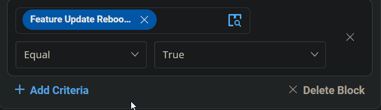
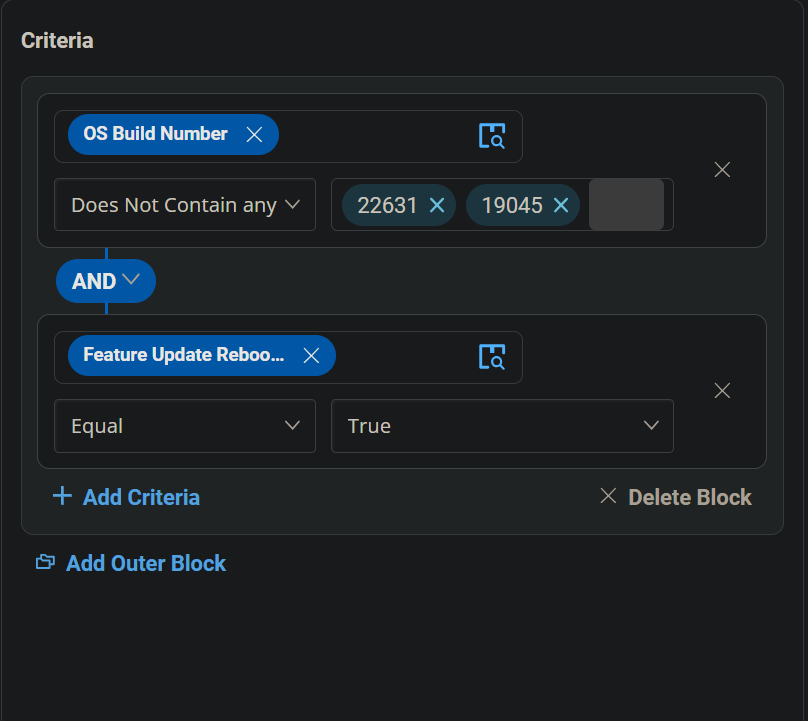
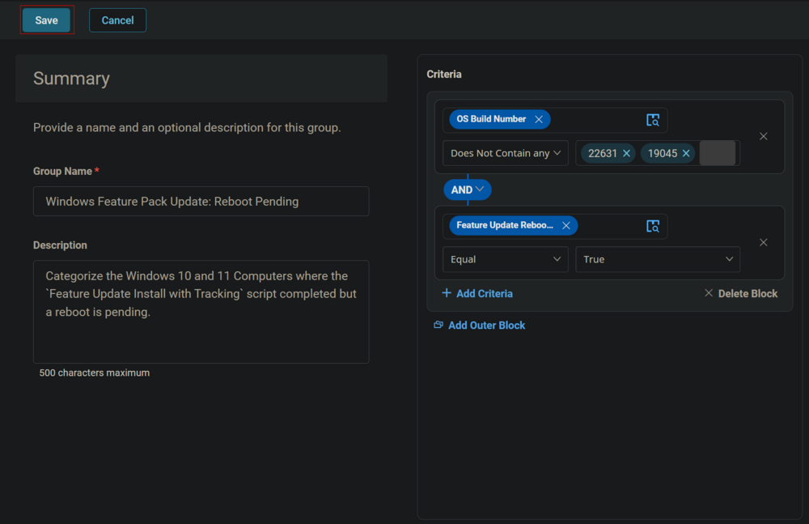
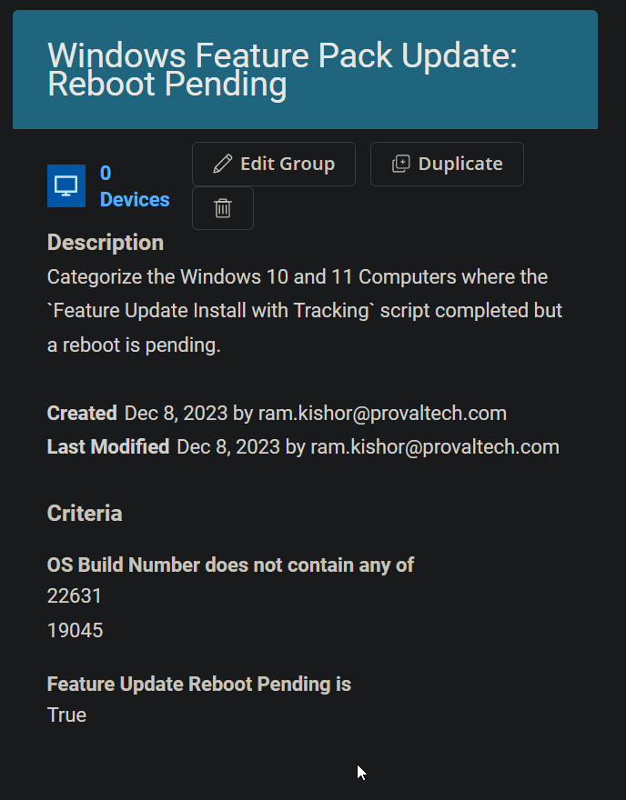

## Summary

Categorize the Windows 10 and 11 computers where the `Feature Update Install with Tracking` script is completed but a reboot is pending.

## Dependencies

- [CW RMM - Task - Feature Update Install With Tracking](/docs/5244ac77-6926-4902-a183-b4b2aac18e2b)  
- [CW RMM - Custom Field - Feature Update Reboot Pending](/docs/45e14854-ba83-4737-8264-b5cd809fca56)  
- [CW RMM - Task - Feature Update Install (Reboot Pending Machines Validation)](/docs/0c60dc74-ce8f-4332-b19c-d956287d66a7)  

## Group Overview

  
**Group Type:** Dynamic  
**Group Name:** Windows Feature Pack Update: Reboot Pending  
**Description:** Categorize the Windows 10 and 11 computers where the `Feature Update Install with Tracking` script is completed but a reboot is pending.

## Criteria

- Select `OS Build Number` for the criteria, use `Does Not Contain any` for the comparator, and type `19045` and `22631` in the condition box.  
  
  
  
  

- Click the `Add Criteria` button to add another criterion.  
  

- Select the `Feature Update Reboot Pending` custom field for criteria, use `Equal` for the comparator, and type `True` in the condition box.  
  
  

## Group Creation

Click the Save button to save the group.  
  
  

