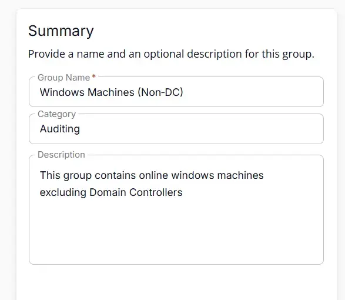
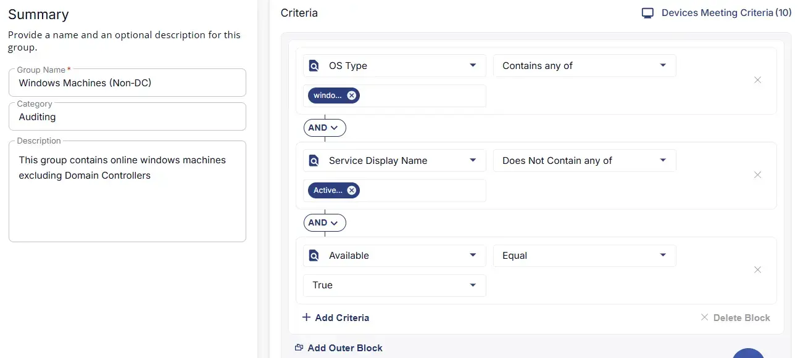

## Summary

This group contains online windows machines excluding Domain Controllers.

## Dependencies

- [Solution - Windows User Profiles](/docs/0ebb7e89-d2d8-40d4-ba1e-330ab20f86cd)

## Group Setup Location

- **Group Path:** `ENDPOINTS` ➞ `Groups`  
- **Group Type:** `Dynamic Group`

## Group Summary

- **Group Name:** `Windows Machines (Non‑DC)`  
- **Category:** `Auditing`  
- **Description:** `This group contains online windows machines excluding Domain Controllers`

## Group Criteria

The group is defined by the following **criteria** joined by `AND` condition.

| Criteria Name          | Operator        | Value(s)                                 |
|-----------------------|-----------------|-------------------------------------------|
| Service Display Name      | Does Not Contain any of   | `Active Directory Domain Services` |
| Available   | Equal    | `True` |
| OS Type  | Equal    | `Windows` |

## Completed Group

## Changelog

### 2026-03-11

- Initial version of the document