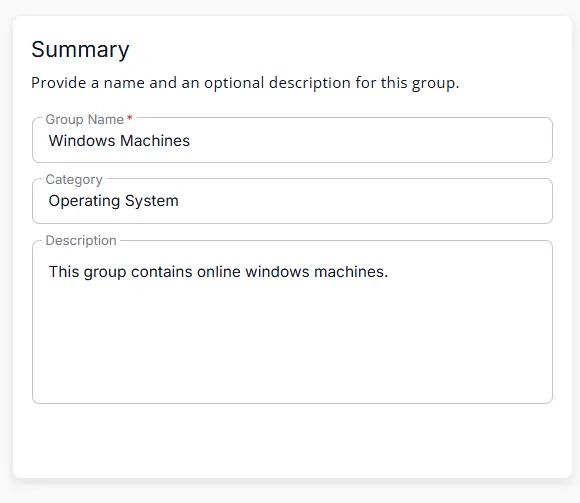
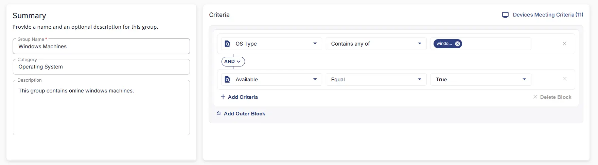

## Summary

This group contains online windows machines.

## Dependencies

- [Solution : Windows Secure Boot Audit](/docs/05b9e73a-64ae-43f6-8ed5-89c952a3aaec)  

## Group Setup Location

- **Group Path:** `ENDPOINTS` ➞ `Groups`  
- **Group Type:** `Dynamic Group`

## Group Summary

- **Group Name:** `Windows Machines`  
- **Category:** `Operating System`  
- **Description:** `This group contains online windows machines.`

## Group Criteria

The group is defined by the following **criteria** joined by `AND` condition.

| Criteria Name          | Operator        | Value(s)                                 |
|-----------------------|-----------------|-------------------------------------------|
| Available   | Equal    | `True` |
| OS Type  | Equal    | `Windows` |

## Completed Group

## Changelog

### 2026-03-23

- Initial version of the document