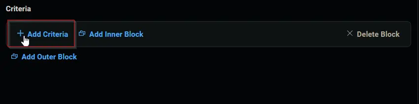
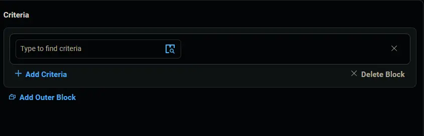

## Summary

This group detects Windows 10 and 11 computers where Winget Update All [System] and Winget Update All [Logged on User] tasks are missing and are opted into the Winget Update All Scheduled task creation solution.

## Dependencies

- [CW RMM - Custom Field - Company - WingetUpdateAll_Task_Create](/docs/40e64c1d-ca29-4c85-9a72-a48b1082b8e1)
- [CW RMM - Custom Field - Company - WingetUpdateAll_Task_Delete](/docs/a398be5b-5709-4ab5-ac33-7feca8fbc00a)
- [CW RMM - Custom Field - EndPoint - WingetUpdateAll_Task_Exclude](/docs/91965ea0-f912-4f5d-8e42-c9ee546293a9)
- [CW RMM - Custom Field - Site - WingetUpdateAll_Task_Exclude](/docs/0c299d28-5fcb-4a1e-a341-1c5e78f74cfb)
- [CW RMM - Custom Field - EndPoint - WingetUpdateAll_Task_Result](/docs/a6ff85ad-b8e9-4e0f-9e2f-db964d483e5f)

## Group Creation

1. Navigate to `Devices` > `Device Groups`.
   

2. Create a new dynamic group by clicking the `Dynamic Group` button.  
     
   This page will appear after clicking on the `Dynamic Group` button:  
   

3. Set the group name to `Winget Update All (Task Create)`  
   

4. Click the `+ Add Criteria` in the `Criteria` section of the group.  
     
   This search box will appear.  
   

5. Search and select the `WingetUpdateAll_Task_Delete` custom field from the search box.  
     
   Set `False` in the comparison condition.  
     
   **Condition:** `WingetUpdateAll_Task_Delete` `Equals` `False`

6. Click the `+ Add Criteria` button.  
     
   A new search box will appear.  
     
   Search and select the `WingetUpdateAll_Task_Exclude` custom field from the search box.  
     
   Set `False` in the comparison condition.  
     
   **Condition:** `WingetUpdateAll_Task_Exclude` `Equals` `False`

7. Click the `+ Add Criteria` button.  
     
   A new search box will appear.  
     
   Search and select the `WingetUpdateAll_Task_Exclude` custom field from the search box. Both Site and computer-level custom fields have the same name, so ensure you select both fields. You have selected one in the previous step; select the other one in this step.  
     
   Set `False` in the comparison condition.  
     
   **Condition:** `WingetUpdateAll_Task_Exclude` `Equals` `False`

8. Click the `+ Add Criteria` button.  
     
   A new search box will appear.  
     
   Search and select the `WingetUpdateAll_Task_Create` custom field from the search box.  
     
   Set `True` in the comparison condition.  
     
   **Condition:** `WingetUpdateAll_Task_Create` `Equals` `True`

9. Click the `+ Add Criteria` button.  
     
   A new search box will appear.  
     
   Search and select the `WingetUpdateAll_Task_Result` custom field from the search box.  
     
   Select `Does Not Contain any of` for the comparator and set `Task Created` in the comparison condition.  
     
   **Condition:** `WingetUpdateAll_Task_Result` `Does Not Contain any of` `Task Created`

10. Click the `+ Add Criteria` button.  
      
    A new search box will appear.  
      
    Search and select the `OS` criteria from the search box.  
      
    Select `Contains any of` for the comparator and select `Microsoft Windows 10 and 11` for the comparison field.  
      
    **Condition:** `OS` `Contains any of` `Microsoft Windows` `10` `11`

11. Click the `Save` button to save/create the group.  
    

## Completed Group

  

