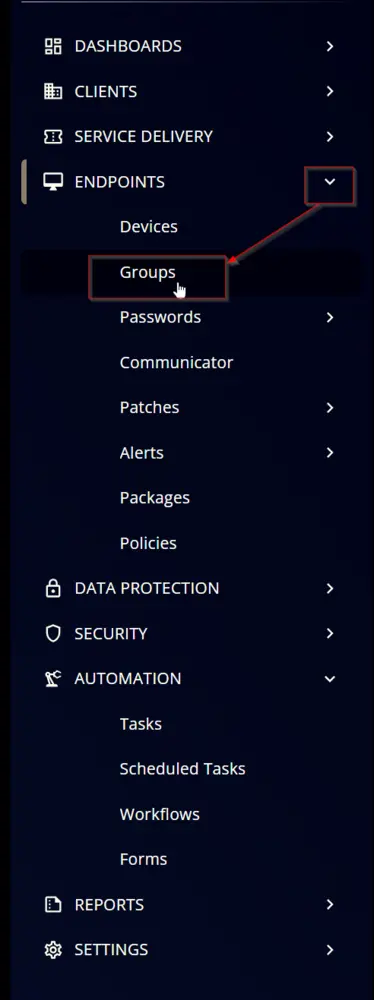
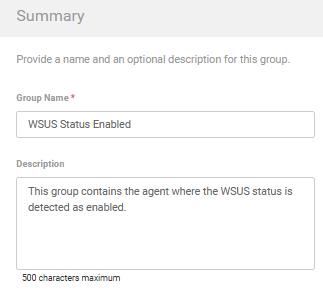
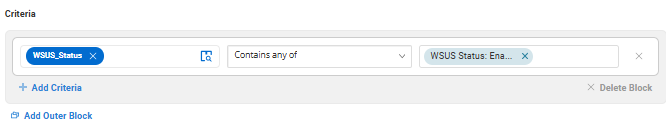
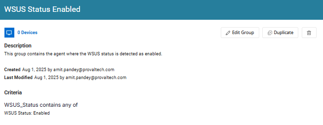

## Summary
This group contains the agent where the WSUS status is detected as enabled.

## Dependencies
[CustomField - WSUS_Status](/docs/2ca7feb0-b811-4486-8ff1-fd93d08056c8)

## Group Creation

### Step 1

Navigate to `ENDPOINTS` ➞ `Groups`  

### Step 2

Create a new dynamic group by clicking the `Dynamic Group` button.  

This page will appear after clicking on the `Dynamic Group` button:  

### Step 3

**Group Name:** `WSUS Status Enabled`  
**Description:** `This group contains the agent where the WSUS status is detected as enabled.`

### Step 4

Click the `+ Add Criteria` in the `Criteria` section of the group.  

This search box will appear:  

Search for `WSUS_Status` and check for `Contains any of` and put the value as `WSUS Status: Disabled`

## Completed Group

