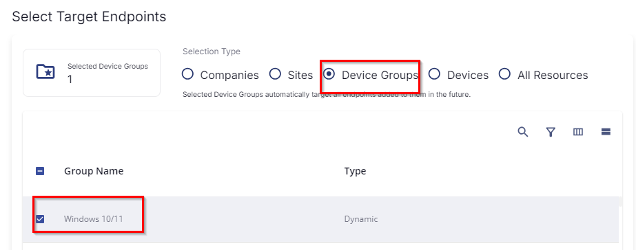
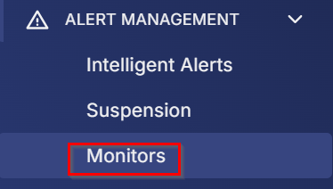
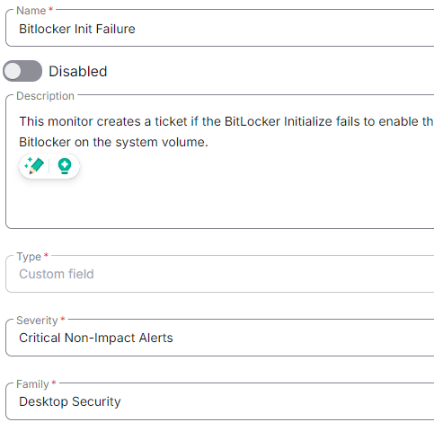
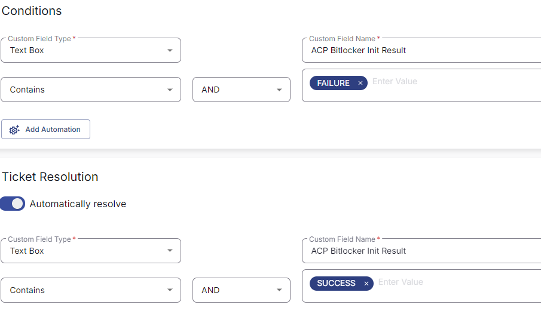

## Summary

This monitor creates a ticket if the BitLocker initialization fails to enable BitLocker on the system volume.

## Dependencies

[CW RMM Script - BitLocker Initialize C Volume](<../tasks/CW RMM Script - BitLocker Initialize C Volume.md>)

## Target

Windows Workstations.  
This should target the group 'Windows 10/11' as shown below:

## Implementation

1. From the left bar, select Alert Management -> Monitor  

     

   Then click 'Create Monitor'  

   

2. Fill in the mandatory columns on the left side.  
   - **Name**: BitLocker Init Failure  
   - **Description**: This monitor creates a ticket if the BitLocker initialization fails to enable BitLocker on the system volume.  
   - **Type**: Custom Field  
   - **Severity**: Critical Non-Impact Alerts  
   - **Family**: Desktop Security  

   

3. Fill in the condition on the right side.  
   Follow the screenshot:  

   

4. Select the target.  
   Click on Select Target:  

     

   Then click on Device Group, search for the word "reboot," and select the 'Windows 10/11' group as shown below:  

   

## Ticketing

**Subject**  
The custom field failed on %computername%

**Body**  
The custom field failed on %computername%

