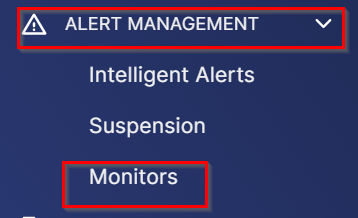
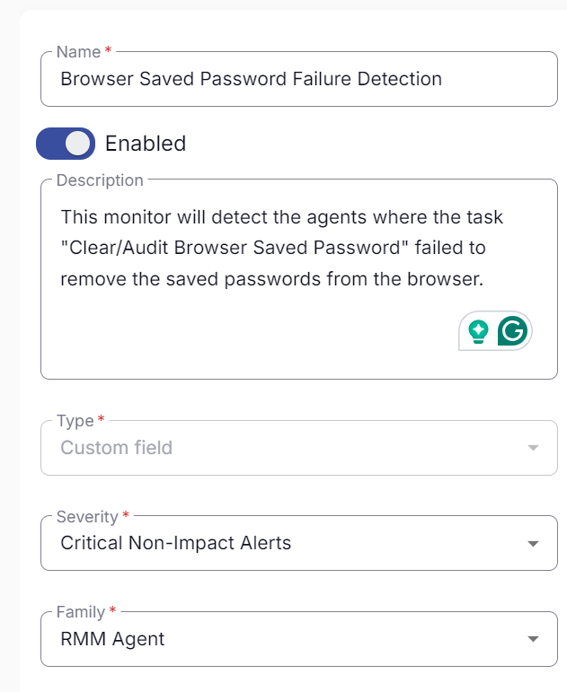
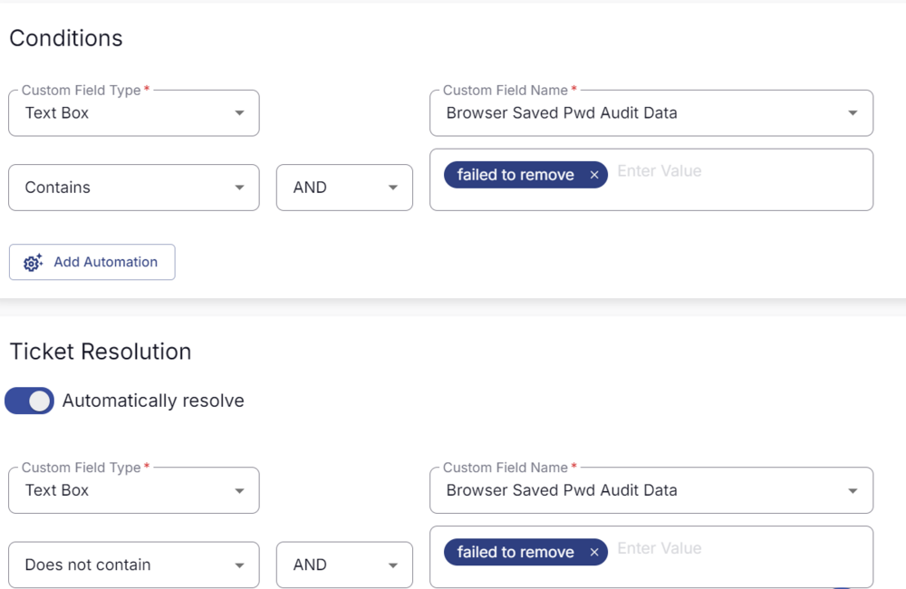
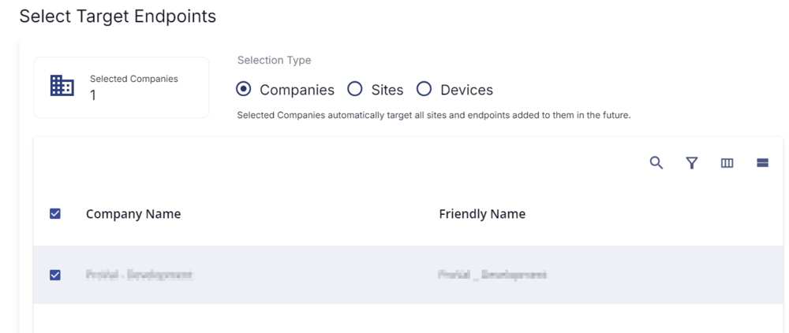

## Summary

This monitor is designed to create a ticket for the failure of the [Task - Clear/Audit - Browser Saved Password](https://proval.itglue.com/DOC-5078775-17309286) in removing the browser-saved passwords.

## Create and Implement Monitor

- Click on **Alert Management** -> **Monitors** -> **Create Monitor**  
    
    

- **Name**: Browser Saved Password Failure Detection  
  **Description**: This monitor will detect the agents where the [Task - Clear/Audit - Browser Saved Password](https://proval.itglue.com/DOC-5078775-17309286) failed to remove the saved passwords from the browser.  
  **Type**: Custom Field  
  **Severity**: Critical Non-Impact Alerts  
  **Family**: RMM Agent  
    

- Set the Conditions as shown below:  
    

- Set a Target to the companies for which you would like to monitor the failure.  
  **Note**: The monitor does not allow the application of the target to a custom group.  
    

- Once all is done, click **Save**. The monitor will be created, and the ticket creation will be set.

